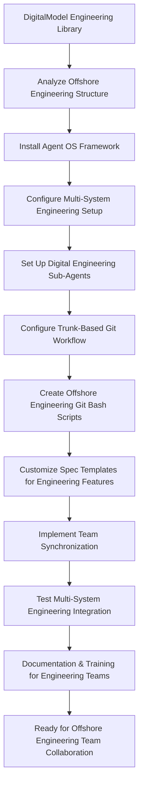

# Spec Requirements Document

> Spec: Agent OS Integration for DigitalModel Engineering Library
> Created: 2025-07-30
> Status: Planning

## Executive Summary

**Prompt for Future Reuse:**
```
Set up buildermethods Agent OS (https://github.com/buildermethods/agent-os) for this Python-based digital engineering modeling library with comprehensive team collaboration features. Execute the following implementation with logical task dependency ordering:

TASK DEPENDENCY ORDERING STANDARD:
- All implementation tasks must follow logical dependency ordering where prior tasks are always applicable (if logical) to subsequent tasks
- Each task builds upon the achievements of previous tasks
- Task dependencies must be explicitly documented
- Foundation tasks (like system installation) come before dependent tasks (like analysis or configuration)
- This ordering minimizes errors, reduces rework, and ensures consistent implementation success across different team members and environments

IMPLEMENTATION STEPS:

1. INSTALL AGENT OS WITH MULTI-SYSTEM CONFIGURATION:
   Prerequisites: None - Foundation task
   - Install the framework at system level for Windows, Linux, macOS, or Unix
   - Configure system-level paths, environment variables, and shell integration
   - Set up cross-platform compatibility and OS-specific shell integration
   - Validate system installation with cross-platform compatibility tests

2. ANALYZE EXISTING DIGITAL ENGINEERING LIBRARY:
   Depends on: Task 1 - System installation required to run @analyze-product
   - Run: @analyze-product "I want to install Agent OS in this existing Python digital engineering modeling library"
   - Document current offshore engineering structure, CAD integration modules, and analytical modeling workflow
   - Identify integration points for the framework with digital engineering context including OrcaFlex and ANSYS integration
   - Create comprehensive analysis report for engineering modeling repository integration

3. REPOSITORY INTEGRATION AND CONFIGURATION:
   Depends on: Task 2 - Analysis results guide repository configuration
   - Install and configure the framework in this digital engineering repository based on analysis results
   - Create .agent-os directory structure with sub-agents folder for engineering modeling workflow
   - Configure repository-level settings for multi-system team synchronization with offshore engineering context
   - Always use /create-spec for specs and user stories related to digital modeling and analytical calculations

4. PROJECT SUB-AGENTS CONFIGURATION:
   Depends on: Task 3 - Repository structure and settings required for sub-agents
   - development-agent.md: Python digital engineering development and CAD modeling workflows for this engineering library
   - testing-agent.md: Automated testing for engineering models, FEA validation, and digital twin verification using offshore engineering approaches
   - deployment-agent.md: Engineering model deployment and digital asset distribution process with OrcaFlex/ANSYS integration
   - Configure sub-agents for cross-system synchronization with digital engineering focus

5. TRUNK-BASED GIT DEVELOPMENT WORKFLOW:
   Depends on: Task 4 - Sub-agents provide the automation foundation for git workflows
   - Configure trunk-based git development workflow for each spec with digital engineering context
   - Set up automated branching and merge workflows for engineering model features and analytical calculation modules
   - Implement feature flags for continuous integration support with digital engineering pipeline

6. OS-SPECIFIC GIT BASH AUTOMATION SCRIPTS:
   Depends on: Task 5 - Git workflow structure required before creating automation scripts
   - create-spec-branch.sh: Automated spec branch management for digital engineering features
   - sync-team-state.sh: Cross-system project synchronization for offshore engineering development
   - merge-spec-completion.sh: Automated spec completion workflows for engineering modeling features
   - Create OS-specific versions for Windows PowerShell, Linux/Unix bash, and macOS zsh/bash
   - development-tasks.sh: Common digital engineering task automation (environment setup, model validation, FEA execution, etc.)

7. ENHANCED SPEC TEMPLATES:
   Depends on: Task 6 - Automation scripts inform template workflow integration
   - Store all specs in .agent-os/specs/ folder with date-based naming for digital engineering features
   - Include executive summary in every spec with original prompt and mermaid flowcharts for offshore engineering workflows
   - Modify spec templates to include reusable prompt capture for digital modeling library development
   - Ensure prompt completeness and self-containment for any offshore engineering development team

8. TEAM SYNCHRONIZATION FEATURES:
   Depends on: Task 7 - Templates and workflows must be established before team synchronization
   - Configure project-level and user-level settings for offshore engineering development teams
   - Implement cross-system state synchronization for digital engineering environments
   - Enable consistent behavior across different development environments with Python engineering modeling context
   - Support distributed team collaboration with trunk-based development for digital engineering library

9. TESTING AND VALIDATION:
   Depends on: Task 8 - All components must be implemented before comprehensive testing
   - Write comprehensive tests for system-level installation across all supported operating systems
   - Test OS-specific installation scenarios (Windows, Linux, macOS, Unix) with offshore engineering tools
   - Test complete multi-system workflow from spec creation to completion for digital engineering features
   - Validate team synchronization and sub-agent functionality across different offshore engineering environments

10. DOCUMENTATION AND TEAM TRAINING:
    Depends on: Task 9 - System must be tested and validated before documentation and training
    - Document system-level installation procedures for all supported operating systems with offshore engineering context
    - Update documentation with comprehensive workflow instructions for this digital engineering library
    - Create team training documentation for new trunk-based development workflow with CAD modeling and FEA focus
    - Provide multi-system setup guide for distributed offshore engineering team members
    - Create reusable implementation guide that can be applied to other Python/digital engineering repositories

DELIVERABLES:
- Fully integrated Agent OS system with multi-platform support for Python/digital engineering development
- Custom spec templates with executive summaries and mermaid flowcharts for offshore engineering workflows
- Cross-platform git bash automation scripts optimized for digital modeling and analytical engineering development
- Multi-system team synchronization capabilities for offshore engineering teams
- Comprehensive documentation and training materials for digital engineering workflows
- Established task dependency ordering framework for future offshore engineering implementations

This setup enables your offshore engineering team to use Agent OS for structured, synchronized, and automated development workflows across multiple systems and team members with logical task dependencies that ensure implementation success for Python digital engineering applications and offshore modeling libraries.
```

**Process Flow:**


## Overview

Integrate Agent OS development framework into this Python-based digital engineering modeling library repository to enable multi-system team collaboration with trunk-based development, automated git bash workflows, and synchronized sub-agents. This integration will provide structured spec creation, task management, and standardized documentation processes optimized for distributed offshore engineering teams working on digital models, CAD integration, analytical calculations, and computational modeling applications.

## User Stories

### Multi-System Offshore Engineering Team Collaboration

As an offshore engineering developer working on this digital modeling library across multiple systems, I want to use Agent OS with trunk-based development and automated git bash scripts, so that I can collaborate seamlessly with team members while maintaining consistent workflows and synchronized states for both engineering model development and FEA validation tasks.

**Detailed Workflow:**
1. Developer creates new offshore engineering spec using `/create-spec` command
2. The system automatically creates trunk-based git branch for this digital engineering spec
3. Sub-agents are configured in .agent-os folder for offshore engineering team synchronization
4. Git bash scripts automate Python engineering tasks, model validation, and FEA execution
5. All team members work on main branch with feature flags and continuous integration for engineering features
6. Spec completion automatically merges changes and updates the digital engineering library state

### System-Level Agent OS Installation for Digital Engineering

As an offshore engineering team member setting up this digital modeling project on my system, I want Agent OS to be properly installed at the system level for my operating system, so that I can use the framework consistently for Python digital engineering and CAD modeling work regardless of whether I'm on Windows, Linux, macOS, or Unix, with all commands and tools properly configured for offshore engineering environments.

**Detailed Workflow:**
1. System detects current operating system (Windows, Linux, macOS, Unix)
2. Downloads and installs appropriate Agent OS system components for the OS with offshore engineering support
3. Configures system-level paths, environment variables, and shell integration for Python digital engineering development
4. Sets up OS-specific git bash environment and permissions for offshore engineering workflows
5. Validates installation with cross-platform compatibility tests including CAD and FEA tools
6. Enables seamless `/create-spec` and other Agent OS commands for digital engineering features

### Digital Engineering Library Management

As a manager of this Python offshore engineering library project, I want Agent OS to provide multi-system synchronization with standardized spec creation for both digital modeling features and FEA validation tasks, so that distributed team members can work consistently on offshore engineering regardless of their development environment while maintaining full traceability of engineering requirements and technical decisions.

**Detailed Workflow:**
1. Team member creates offshore engineering spec using standardized `/create-spec` process
2. Executive summary captures original prompt for future reference in digital engineering context
3. Mermaid flowcharts visualize offshore engineering process flows and CAD modeling workflows
4. Sub-agents ensure consistent behavior across all team systems for Python digital engineering development
5. Trunk-based development enables continuous integration without branch conflicts for engineering features
6. Git bash automation handles routine Python environment setup, model validation, and offshore engineering deployment tasks

## Spec Scope

1. **Task Dependency Ordering Requirement** - All implementation tasks must follow logical dependency ordering where prior tasks are always applicable (if logical) to subsequent tasks, ensuring each step builds upon previous achievements for offshore engineering workflows
2. **System-Level Agent OS Installation** - Install and configure the framework at system level for Windows, Linux, macOS, and Unix environments with digital engineering tool support
3. **Repository Integration** - Install and configure the framework in this Python offshore engineering repository using @analyze-product approach (depends on system installation)
4. **Digital Engineering Sub-Agents Configuration** - Set up repository sub-agents in .agent-os folder for team synchronization using Python digital modeling and offshore engineering technology stack (depends on repository integration)
5. **Trunk-Based Git Development** - Configure trunk-based development workflow for each spec with automated branching for offshore engineering features (depends on sub-agents)
6. **Cross-Platform Digital Engineering Git Bash Automation** - Create OS-specific git bash scripts for Python development, CAD modeling, FEA execution, and engineering model deployment (depends on git workflow)
7. **Multi-System Team Synchronization** - Implement system-level configurations for consistent team collaboration across different operating systems for offshore engineering (depends on automation scripts)
8. **Enhanced Spec Templates** - Modify templates to include executive summary with prompt capture and mermaid diagrams for digital engineering workflows (depends on synchronization setup)

## Out of Scope

- Modification of existing engineering calculation algorithms or CAD modeling approaches
- Changes to the current offshore engineering methodologies or FEA analysis approaches
- Integration with external engineering software beyond Agent OS (OrcaFlex/ANSYS integration maintained)
- Custom features beyond the specified Agent OS customizations
- Python-specific implementations (the solution should work with current digital engineering stack)

## Expected Deliverable

1. **Fully Integrated System** - Agent OS framework successfully installed and configured in this Python digital engineering repository
2. **Custom Offshore Engineering Spec Templates** - Modified templates that automatically include executive summary sections with reusable prompts and mermaid flowcharts for digital modeling and offshore engineering workflows
3. **Updated Engineering Development Workflow** - Team can use `/create-spec` command to generate structured specifications that work with Python digital engineering and offshore modeling technology stack
4. **Logical Task Dependency Framework** - Established pattern of task ordering where each step builds upon previous achievements for maximum efficiency and reduced errors in offshore engineering development
5. **Reusable Implementation Guide** - Complete documentation that enables this setup to be replicated in other Python/offshore engineering repositories

## Future Spec Requirements

**Executive Summary Prompt Completeness Standard**: All specs created using Agent OS must include a complete, self-contained "Prompt for Future Reuse" in the executive summary that:
- Contains all necessary information for any offshore engineering project team to implement without external references
- Includes the Task Dependency Ordering Standard as defined below
- Documents all implementation steps with explicit dependencies for Python/digital engineering development
- Lists all expected deliverables and outcomes for offshore engineering workflows
- Uses generic language (pronouns, common nouns) for repository adaptability across digital engineering projects
- Provides sufficient context for successful implementation across different offshore engineering environments

**Task Dependency Ordering Standard**: All future specs created using Agent OS must follow the logical dependency ordering principle established in this specification, where:
- Prior tasks are always applicable (if logical) to subsequent tasks in offshore engineering workflows
- Each task builds upon the achievements of previous tasks for Python digital engineering and CAD modeling development
- Task dependencies are explicitly documented in both the prompt and task sections
- Foundation tasks (like system installation) come before dependent tasks (like Python environment configuration or FEA tool setup)
- This ordering minimizes errors, reduces rework, and ensures consistent implementation success across different offshore engineering team members and environments

## Spec Documentation

- Tasks: @.agent-os/specs/2025-07-30-agent-os-integration/tasks.md
- Technical Specification: @.agent-os/specs/2025-07-30-agent-os-integration/sub-specs/technical-spec.md
- Tests Specification: @.agent-os/specs/2025-07-30-agent-os-integration/sub-specs/tests.md