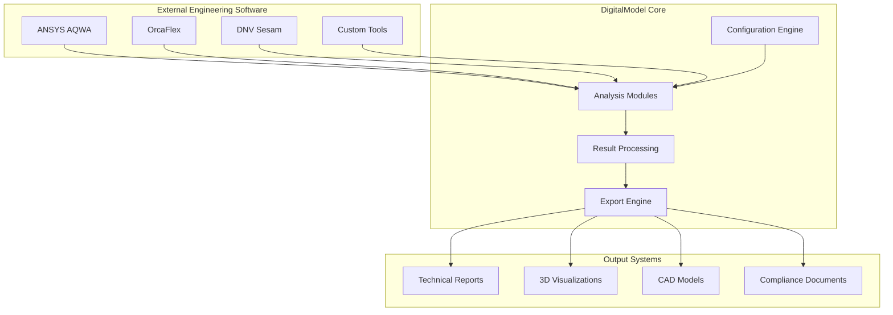

# System Overview

## Purpose
This directory provides comprehensive system mapping and tool documentation for the digitalmodel project, giving AI assistants complete context about the technical ecosystem.

## Directory Contents

### `devops-tools.md`
Complete mapping of DevOps toolchain including:
- Build systems and automation
- Deployment pipelines and strategies
- Monitoring and observability tools
- Infrastructure management and provisioning

### `build-pipeline.md`
Detailed build system documentation covering:
- Build process stages and dependencies
- Quality gates and validation steps
- Artifact generation and management
- Performance optimization and caching

### `deployment-strategy.md`
Deployment processes and environments:
- Environment topology and configuration
- Release management and rollback procedures
- Configuration management and secrets
- Zero-downtime deployment strategies

### `testing-framework.md`
Testing infrastructure and methodologies:
- Test frameworks and tools used
- Testing levels (unit, integration, e2e)
- Test data management and mocking strategies
- Coverage requirements and reporting

### `architecture-diagram.md`
System architecture visualization and documentation:
- Component architecture and interactions
- Data flow and integration patterns
- Technology stack and dependencies
- Security and compliance considerations

## System Context

### Engineering Domain Focus
The digitalmodel system is specifically designed for offshore and marine engineering:
- **Analytical Models**: Complex engineering calculations and simulations
- **Configuration-Driven**: YAML-based configuration for analysis parameters
- **Integration-Heavy**: Multiple external engineering software integrations
- **Compliance-Critical**: Regulatory compliance and audit trail requirements

### Technical Architecture Principles
- **Single Source of Truth**: ASCII configuration drives all analysis
- **Modularity**: Domain-specific modules with clear interfaces
- **Extensibility**: Plugin architecture for new analysis types
- **Reliability**: High reliability for critical engineering calculations

### Integration Ecosystem

## Technology Stack Overview

### Core Technologies
- **Python 3.8+**: Primary development language
- **YAML**: Configuration and data definition
- **Pandas/NumPy**: Data processing and numerical computation
- **Matplotlib/Plotly**: Visualization and reporting
- **Pytest**: Testing framework

### Engineering Software Integration
- **OrcaFlex API**: Marine analysis software integration
- **ANSYS Workbench**: Finite element analysis integration
- **Custom APIs**: Integration with specialized engineering tools
- **Mock Systems**: Testing infrastructure for licensed software

### Development Tools
- **uv**: Package management and dependency resolution
- **Black/isort/ruff**: Code formatting and linting
- **mypy**: Static type checking
- **Git**: Version control with conventional commits

### Infrastructure and Deployment
- **GitHub Actions**: CI/CD pipeline automation
- **Docker**: Containerization for consistent environments
- **Documentation**: Sphinx for API docs, Markdown for guides
- **Monitoring**: Logging and error tracking for production systems

## Quality Standards

### Code Quality
- **Type Safety**: Full type hints for public APIs
- **Test Coverage**: Minimum 80% coverage for new code
- **Documentation**: Comprehensive docstrings and user guides
- **Performance**: Benchmarking for engineering calculations

### Engineering Standards
- **Accuracy**: Validation against verified benchmarks
- **Traceability**: Clear audit trail for all calculations
- **Compliance**: Adherence to industry codes and standards
- **Reliability**: Robust error handling and recovery

### Integration Standards
- **API Contracts**: Well-defined interfaces between components
- **Configuration Validation**: Schema validation for all YAML configs
- **Error Handling**: Graceful degradation when external systems unavailable
- **Testing**: Comprehensive mocking for external dependencies

## AI Assistant Context

### System Understanding
AI assistants working with this system should understand:
- **Domain Complexity**: Offshore engineering requires deep technical knowledge
- **Integration Challenges**: External software licensing and availability
- **Quality Requirements**: High reliability and accuracy standards
- **Regulatory Context**: Compliance and audit trail requirements

### Development Considerations
When working with this system, consider:
- **Configuration First**: Changes often start with YAML configuration
- **Mock-First Testing**: External dependencies require comprehensive mocking
- **Documentation Critical**: Complex domain requires excellent documentation
- **Validation Essential**: Engineering calculations must be thoroughly validated

### Tool Awareness
Key tools and their purposes:
- **OrcaFlex**: Marine analysis (may require license)
- **ANSYS**: Finite element analysis (may require license)
- **Python Ecosystem**: Core development environment
- **YAML Configuration**: Primary interface for analysis setup

## Operational Context

### Deployment Environments
- **Development**: Local development with mocked external systems
- **Testing**: Automated testing environment with full mock suite
- **Staging**: Production-like environment for integration testing
- **Production**: Customer-facing environment with licensed software

### Monitoring and Observability
- **Application Monitoring**: Performance and error tracking
- **Business Metrics**: Analysis success rates and user engagement
- **Infrastructure Monitoring**: System health and resource utilization
- **Compliance Monitoring**: Audit trail and regulatory compliance tracking

### Support and Maintenance
- **User Support**: Technical support for engineering users
- **System Maintenance**: Regular updates and security patches
- **License Management**: Coordination of external software licenses
- **Knowledge Transfer**: Documentation and training for team members