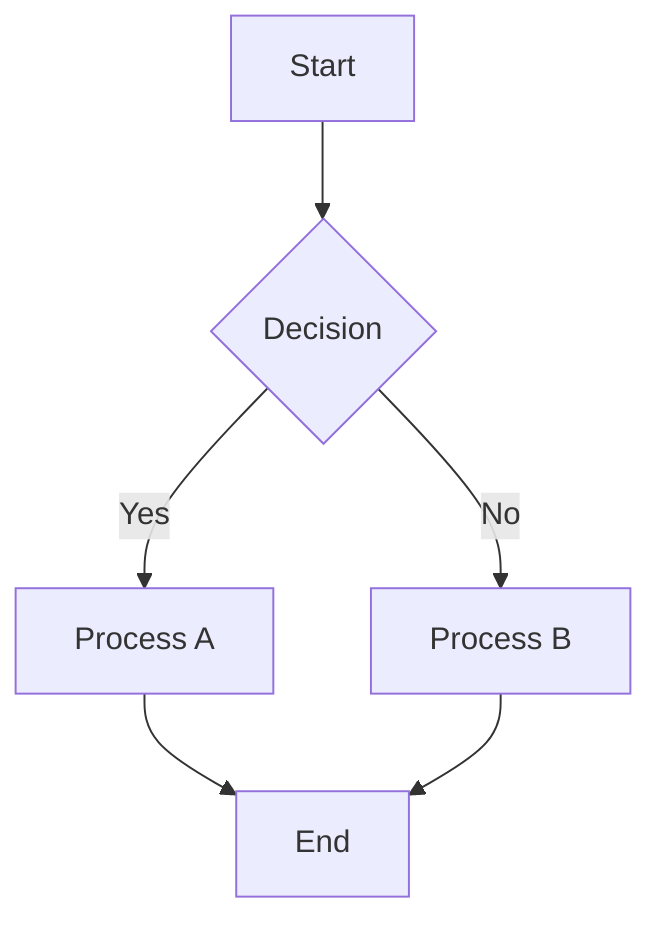
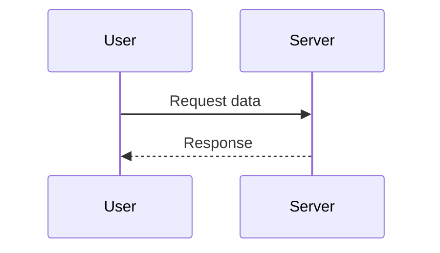

# Marp Presentation Skill

Create professional slide presentations using Markdown with Marp (Markdown Presentation Ecosystem). This skill covers everything from basic slides to advanced theming and multi-format export.

## When to Use This Skill

### USE When

- Creating presentations from Markdown content
- Need quick slide creation without design overhead
- Want version-controlled presentations (Git-friendly)
- Require multiple output formats (PDF, HTML, PPTX)
- Building automated presentation pipelines
- Need consistent branding across presentations
- Creating technical presentations with code
- Need math equations in slides

### DON'T USE When

- Need complex animations and transitions (use PowerPoint/Keynote)
- Require real-time collaboration (use Google Slides)
- Building interactive web applications (use reveal.js directly)
- Need embedded videos with playback controls
- Building documentation websites (use MkDocs or Docusaurus)

## Prerequisites

### Installation

```bash
# Using npm (recommended)
npm install -g @marp-team/marp-cli

# Using npx (no installation needed)
npx @marp-team/marp-cli --version

# Using Homebrew (macOS)
brew install marp-cli

# Using Docker
docker pull marpteam/marp-cli

# Verify installation
marp --version
```

### VS Code Extension

```bash
# Install from VS Code marketplace
# Search: "Marp for VS Code"
# Extension ID: marp-team.marp-vscode

code --install-extension marp-team.marp-vscode
```

## Core Capabilities

### 1. Basic Slide Creation

```markdown
<!-- slides.md -->
---
marp: true
---

# Welcome to My Presentation

A subtitle for the first slide

---

## Slide 2: Key Points

- First important point
- Second important point
- Third important point

---

## Slide 3: Code Example

```python
def hello(name: str) -> str:
    return f"Hello, {name}!"
```

---

# Thank You!

Questions?
```

### 2. Frontmatter Configuration

```markdown
---
marp: true
title: Project Presentation
description: Quarterly review for Q4 2025
author: Your Name
theme: default
paginate: true
header: 'Company Name'
footer: 'Confidential - Internal Use Only'
size: 16:9
math: katex
style: |
  section {
    background-color: #fefefe;
  }
---

# First Slide

Content here...
```

### 3. Themes and Styling

```markdown
---
marp: true
theme: default
---

<!-- Available built-in themes: default, gaia, uncover -->

# Default Theme

Clean and professional

---

<!-- Switching themes mid-presentation -->
<!-- _theme: gaia -->

# Gaia Theme

Bold and colorful

---

<!-- Custom background color -->
<!-- _backgroundColor: #1e3a5f -->
<!-- _color: white -->

# Dark Background

With light text
```

### 4. Custom CSS Theme

```css
/* themes/custom.css */

/* @theme custom-theme */
@import 'default';

section {
  background: linear-gradient(135deg, #667eea 0%, #764ba2 100%);
  color: white;
  font-family: 'Inter', sans-serif;
}

section h1 {
  color: #ffffff;
  font-size: 2.5em;
  text-shadow: 2px 2px 4px rgba(0, 0, 0, 0.3);
}

section h2 {
  color: #e0e7ff;
  border-bottom: 2px solid rgba(255, 255, 255, 0.3);
}

section.lead {
  display: flex;
  flex-direction: column;
  justify-content: center;
  text-align: center;
}

section.invert {
  background: #1f2937;
  color: #f3f4f6;
}
```

### 5. Directives and Classes

```markdown
---
marp: true
---

<!-- Local directive (applies to current slide only) -->
<!-- _class: lead -->
<!-- _backgroundColor: #2563eb -->
<!-- _color: white -->

# Title Slide

Subtitle here

---

<!-- _paginate: false -->
<!-- _header: '' -->

# Clean Slide

No pagination or headers

---

<!-- Scoped styling -->
<style scoped>
h1 { color: #dc2626; }
ul li { font-size: 1.2em; }
</style>

# Scoped Styles

- Custom styling for this slide only
```

### 6. Speaker Notes

```markdown
---
marp: true
---

# Presentation Title

Overview of topics

<!--
Speaker notes go here.

Key points to mention:
1. Welcome the audience
2. Introduce yourself
3. Preview the agenda

Time: ~2 minutes
-->

---

## Code Example

```python
def process_data(data):
    return [x * 2 for x in data]
```

<!--
Code walkthrough:
1. Explain the function signature
2. Discuss list comprehension

Demo: Run this in the terminal
-->
```

### 7. Images and Backgrounds

```markdown
---
marp: true
---

<!-- Full background image -->


# Full Background

Text over image

---

<!-- Background with opacity -->


# Semi-transparent Background

---

<!-- Split layout -->


# Split Layout

Image on the right side, content on the left

---

<!-- Background with gradient -->
)

# Gradient Background

---

<!-- Inline images with sizing -->
## Product Features

 
```

### 8. Math Equations

```markdown
---
marp: true
math: katex
---

# Mathematical Equations

## Inline Math

The quadratic formula is $x = \frac{-b \pm \sqrt{b^2-4ac}}{2a}$

---

## Block Math

$$
\int_{-\infty}^{\infty} e^{-x^2} dx = \sqrt{\pi}
$$

$$
\sum_{n=1}^{\infty} \frac{1}{n^2} = \frac{\pi^2}{6}
$$
```

### 9. Mermaid Diagrams

```markdown
---
marp: true
---

# Diagrams

## Flowchart



---

## Sequence Diagram


```

### 10. CLI Usage

```bash
# Convert to HTML
marp slides.md -o slides.html

# Convert to PDF
marp slides.md -o slides.pdf

# Convert to PPTX
marp slides.md -o slides.pptx

# Watch mode
marp -w slides.md -o slides.html

# Server mode with live preview
marp -s slides.md

# Use custom theme
marp slides.md --theme ./themes/custom.css -o slides.pdf

# Allow local file access
marp slides.md --allow-local-files -o slides.pdf

# PDF with speaker notes
marp slides.md -o slides.pdf --pdf-notes
```

### 11. Configuration File

```yaml
# .marprc.yml
html: true
allowLocalFiles: true
output: "./dist"
theme: "./themes/corporate.css"

pdf: true
pdfNotes: true

watch: false
server: false
serverPort: 8080
```

### 12. VS Code Settings

```json
// .vscode/settings.json
{
  "markdown.marp.enableHtml": true,
  "markdown.marp.themes": [
    "./themes/custom.css"
  ],
  "markdown.marp.mathTypesetting": "katex",
  "markdown.marp.exportType": "pdf"
}
```

### 13. GitHub Actions Workflow

```yaml
# .github/workflows/presentations.yml
name: Build Presentations

on:
  push:
    branches: [main]
    paths: ['presentations/**']

jobs:
  build:
    runs-on: ubuntu-latest
    steps:
      - uses: actions/checkout@v4

      - uses: actions/setup-node@v4
        with:
          node-version: '20'

      - name: Install Marp CLI
        run: npm install -g @marp-team/marp-cli

      - name: Build presentations
        run: |
          mkdir -p dist
          for file in presentations/*.md; do
            filename=$(basename "$file" .md)
            marp "$file" --allow-local-files -o "dist/${filename}.pdf"
          done

      - uses: actions/upload-artifact@v4
        with:
          name: presentations
          path: dist/
```

### 14. Docker Usage

```bash
# Build with Docker
docker run --rm -v $(pwd):/app marpteam/marp-cli \
  /app/slides.md -o /app/slides.pdf

# Run server
docker run --rm -p 8080:8080 -v $(pwd):/app marpteam/marp-cli \
  -s /app/slides.md
```

### 15. Advanced Layouts

```markdown
---
marp: true
---

<style>
.columns { display: grid; grid-template-columns: 1fr 1fr; gap: 2em; }
.centered { display: flex; flex-direction: column; justify-content: center; align-items: center; }
</style>

---

# Two Column Layout

<div class="columns">
<div>

## Left Column

- Point 1
- Point 2

</div>
<div>

## Right Column


</div>
</div>
```

## Integration Examples

### Integration with npm Project

```json
// package.json
{
  "scripts": {
    "start": "marp -s ./slides",
    "watch": "marp -w ./slides -o ./dist",
    "build": "marp ./slides --output ./dist",
    "build:pdf": "marp ./slides -o ./dist --pdf"
  },
  "devDependencies": {
    "@marp-team/marp-cli": "^3.0.0"
  }
}
```

### Integration with Makefile

```makefile
SLIDES_DIR = slides
OUTPUT_DIR = dist

.PHONY: html pdf clean serve

html:
	marp $(SLIDES_DIR)/*.md --output $(OUTPUT_DIR)

pdf:
	marp $(SLIDES_DIR)/*.md --output $(OUTPUT_DIR) --pdf --allow-local-files

clean:
	rm -rf $(OUTPUT_DIR)

serve:
	marp -s $(SLIDES_DIR)
```

## Best Practices

### 1. Project Structure

```
presentations/
├── slides/
│   ├── quarterly-review.md
│   └── product-demo.md
├── themes/
│   └── corporate.css
├── images/
├── dist/
├── .marprc.yml
└── package.json
```

### 2. Slide Template

```markdown
---
marp: true
theme: corporate
paginate: true
header: 'Company | Title'
footer: '2026'
---

<!-- _class: title -->
<!-- _paginate: false -->

# Presentation Title

**Presenter Name** | *Date*

---

# Agenda

1. Topic One
2. Topic Two
3. Q&A

---

<!-- _class: section -->

# Section 1

---

## Content Slide

- Key point
- Another point

---

<!-- _class: title -->

# Thank You

Questions?
```

### 3. Image Guidelines

```markdown
<!-- Use consistent sizing -->


<!-- Use relative paths -->


<!-- Include alt text -->

```

## Troubleshooting

### PDF Export Fails

```bash
# Specify Chrome path
marp slides.md -o slides.pdf --chrome-path /usr/bin/chromium-browser

# Use Chrome arguments for headless environments
marp slides.md -o slides.pdf \
  --chrome-arg=--no-sandbox \
  --chrome-arg=--disable-setuid-sandbox
```

### Images Not Loading

```bash
# Enable local file access
marp slides.md -o slides.pdf --allow-local-files

# Use relative paths from markdown file location

```

### Custom Theme Not Applied

```bash
# Specify theme file path
marp slides.md --theme ./themes/custom.css -o slides.html

# Ensure theme has correct header comment
# /* @theme custom-theme */
```

### Debug Mode

```bash
marp slides.md -o slides.pdf --debug
marp --version
```

## Version History

### v1.0.0 (2026-01-17)

- Initial skill creation
- Basic slide creation with Markdown
- Theme customization
- Speaker notes and presenter view
- Image and background handling
- Math equations with KaTeX
- Mermaid diagram integration
- CLI usage and configuration
- VS Code extension setup
- GitHub Actions workflow
- Best practices and troubleshooting

## Related Resources

- [Marp Official Documentation](https://marp.app/)
- [Marp CLI GitHub](https://github.com/marp-team/marp-cli)
- [Marp VS Code Extension](https://marketplace.visualstudio.com/items?itemName=marp-team.marp-vscode)
- [KaTeX Documentation](https://katex.org/docs/supported.html)
- [Mermaid Diagrams](https://mermaid.js.org/)

---

*Create professional presentations from Markdown with powerful theming and multi-format export.*
