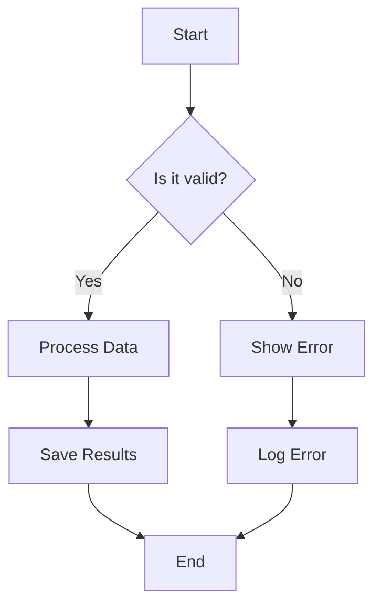
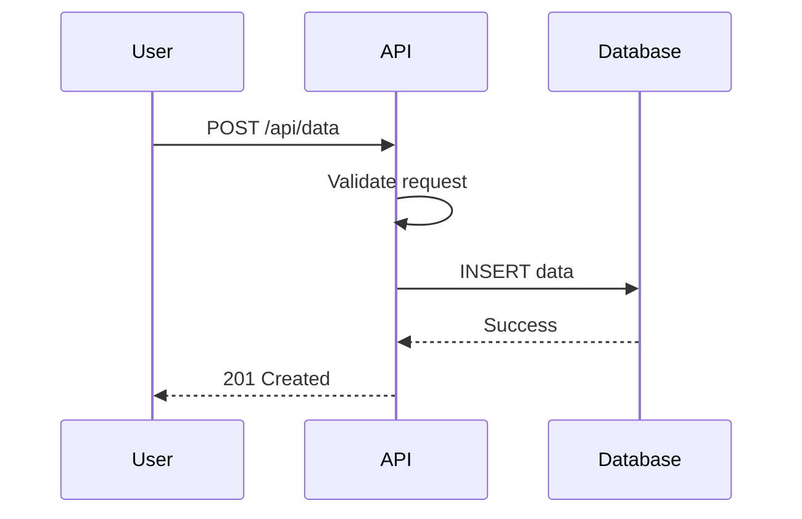
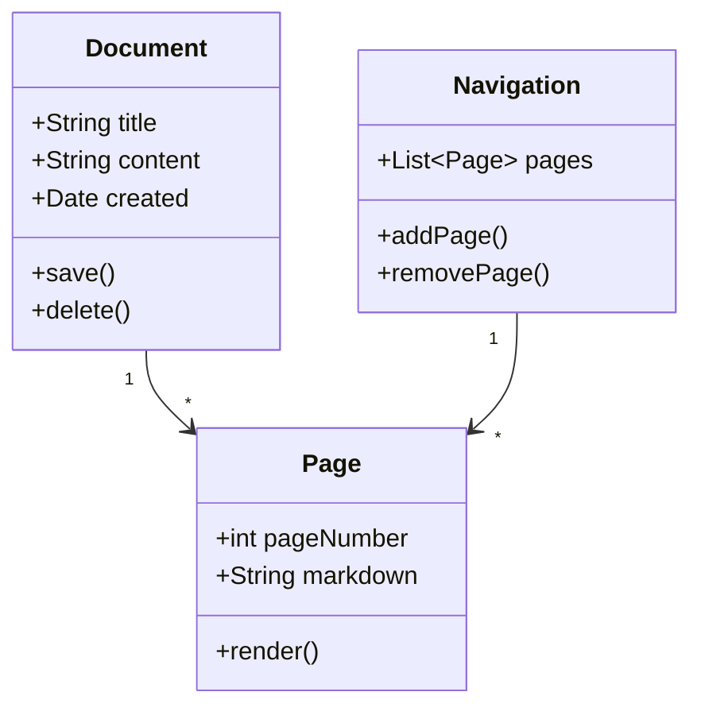
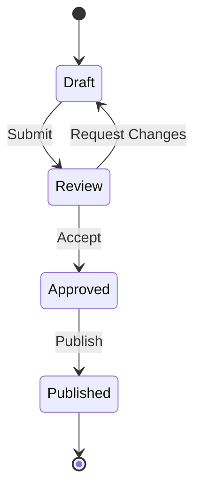
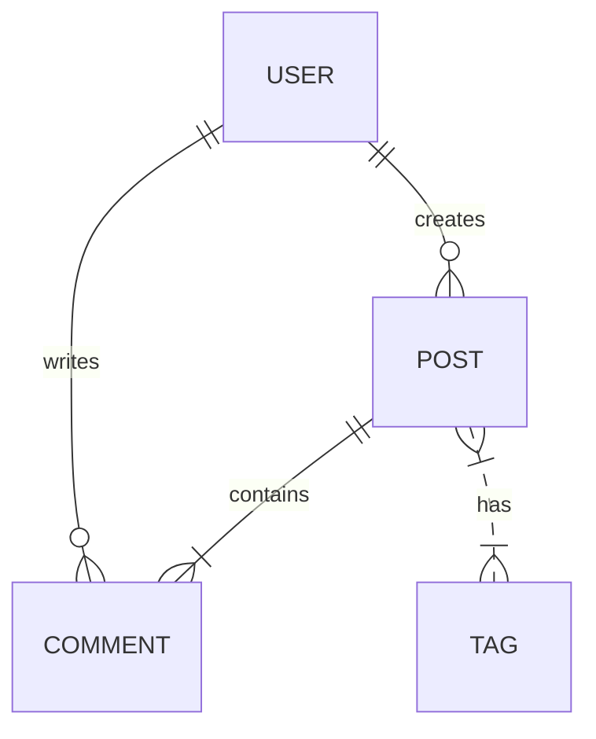
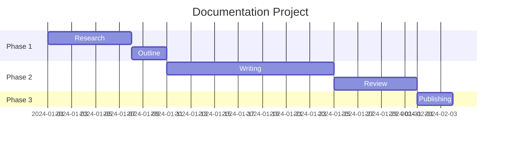

# MkDocs Documentation Skill

Build fast, beautiful project documentation with MkDocs and Material for MkDocs theme. This skill covers everything from basic setup to advanced deployment pipelines with versioning.

## When to Use This Skill

### USE When

- Building project documentation for open source or internal projects
- Need a fast, searchable static documentation site
- Want beautiful Material Design without custom CSS
- Require multi-version documentation (v1.x, v2.x, etc.)
- Deploying documentation to GitHub Pages, GitLab Pages, or Netlify
- Working with Python projects that need docs alongside code
- Need admonitions, code tabs, and content formatting
- Want simple Markdown-based documentation workflow
- Require offline-capable documentation
- Building API documentation alongside guides

### DON'T USE When

- Need complex React components in docs (use Docusaurus)
- Require auto-generated Python API docs (use Sphinx)
- Building single-page documentation (use simple HTML)
- Need document format conversion (use Pandoc)
- Require collaborative real-time editing (use GitBook)
- Building slide presentations (use Marp)

## Prerequisites

### Installation

```bash
# Using pip
pip install mkdocs mkdocs-material

# Using uv (recommended)
uv pip install mkdocs mkdocs-material

# With common plugins
pip install mkdocs mkdocs-material \
    mkdocs-minify-plugin \
    mkdocs-git-revision-date-localized-plugin \
    mkdocs-macros-plugin \
    mkdocs-glightbox \
    mike

# Verify installation
mkdocs --version
```

### System Requirements

- Python 3.8 or higher
- pip or uv package manager
- Git (for git-revision plugin and mike)
- Node.js (optional, for social cards)

## Core Capabilities

### 1. Project Initialization

```bash
# Create new documentation project
mkdocs new my-project-docs
cd my-project-docs

# Project structure
# my-project-docs/
# ├── docs/
# │   └── index.md
# └── mkdocs.yml

# Or initialize in existing project
mkdir -p docs
touch docs/index.md
touch mkdocs.yml
```

### 2. Basic Configuration (mkdocs.yml)

```yaml
# mkdocs.yml - Minimal configuration
site_name: My Project Documentation
site_url: https://example.com/docs/
site_description: Comprehensive documentation for My Project
site_author: Your Name

# Repository
repo_name: username/my-project
repo_url: https://github.com/username/my-project
edit_uri: edit/main/docs/

# Theme
theme:
  name: material
  palette:
    - scheme: default
      primary: indigo
      accent: indigo
      toggle:
        icon: material/brightness-7
        name: Switch to dark mode
    - scheme: slate
      primary: indigo
      accent: indigo
      toggle:
        icon: material/brightness-4
        name: Switch to light mode
  font:
    text: Roboto
    code: Roboto Mono
  features:
    - navigation.instant
    - navigation.tracking
    - navigation.tabs
    - navigation.sections
    - navigation.expand
    - navigation.top
    - search.suggest
    - search.highlight
    - content.tabs.link
    - content.code.copy
    - content.code.annotate

# Navigation
nav:
  - Home: index.md
  - Getting Started:
      - Installation: getting-started/installation.md
      - Quick Start: getting-started/quickstart.md
      - Configuration: getting-started/configuration.md
  - User Guide:
      - Overview: guide/overview.md
      - Basic Usage: guide/basic-usage.md
      - Advanced: guide/advanced.md
  - API Reference: api/reference.md
  - FAQ: faq.md
  - Changelog: changelog.md

# Plugins
plugins:
  - search:
      lang: en
      separator: '[\s\-,:!=\[\]()"/]+|(?!\b)(?=[A-Z][a-z])|\.(?!\d)|&[lg]t;'
  - minify:
      minify_html: true

# Markdown extensions
markdown_extensions:
  - abbr
  - admonition
  - attr_list
  - def_list
  - footnotes
  - md_in_html
  - toc:
      permalink: true
      toc_depth: 3
  - pymdownx.arithmatex:
      generic: true
  - pymdownx.betterem:
      smart_enable: all
  - pymdownx.caret
  - pymdownx.details
  - pymdownx.emoji:
      emoji_index: !!python/name:material.extensions.emoji.twemoji
      emoji_generator: !!python/name:material.extensions.emoji.to_svg
  - pymdownx.highlight:
      anchor_linenums: true
      line_spans: __span
      pygments_lang_class: true
  - pymdownx.inlinehilite
  - pymdownx.keys
  - pymdownx.magiclink:
      repo_url_shorthand: true
      user: username
      repo: my-project
  - pymdownx.mark
  - pymdownx.smartsymbols
  - pymdownx.superfences:
      custom_fences:
        - name: mermaid
          class: mermaid
          format: !!python/name:pymdownx.superfences.fence_code_format
  - pymdownx.tabbed:
      alternate_style: true
  - pymdownx.tasklist:
      custom_checkbox: true
  - pymdownx.tilde

# Extra
extra:
  social:
    - icon: fontawesome/brands/github
      link: https://github.com/username
    - icon: fontawesome/brands/twitter
      link: https://twitter.com/username
  generator: false
  version:
    provider: mike

# Copyright
copyright: Copyright &copy; 2024-2026 Your Name
```

### 3. Navigation Structure

```yaml
# mkdocs.yml - Advanced navigation
nav:
  - Home: index.md
  - Getting Started:
      - getting-started/index.md
      - Installation:
          - Linux: getting-started/install-linux.md
          - macOS: getting-started/install-macos.md
          - Windows: getting-started/install-windows.md
          - Docker: getting-started/install-docker.md
      - Quick Start: getting-started/quickstart.md
      - Configuration: getting-started/configuration.md
  - User Guide:
      - guide/index.md
      - Core Concepts:
          - Architecture: guide/architecture.md
          - Components: guide/components.md
          - Data Flow: guide/data-flow.md
      - Tutorials:
          - Basic Tutorial: guide/tutorials/basic.md
          - Advanced Tutorial: guide/tutorials/advanced.md
          - Integration: guide/tutorials/integration.md
      - Best Practices: guide/best-practices.md
  - API Reference:
      - api/index.md
      - REST API: api/rest.md
      - Python SDK: api/python-sdk.md
      - CLI Reference: api/cli.md
  - Examples:
      - examples/index.md
      - Basic Examples: examples/basic.md
      - Advanced Examples: examples/advanced.md
  - Contributing: contributing.md
  - Changelog: changelog.md
  - License: license.md
```

### 4. Material Theme Features

```yaml
# mkdocs.yml - Theme customization
theme:
  name: material
  custom_dir: docs/overrides  # Custom templates
  logo: assets/logo.png
  favicon: assets/favicon.ico
  icon:
    repo: fontawesome/brands/github
    admonition:
      note: octicons/tag-16
      warning: octicons/alert-16
      danger: octicons/zap-16
      tip: octicons/light-bulb-16
      example: octicons/beaker-16

  palette:
    # Light mode
    - media: "(prefers-color-scheme: light)"
      scheme: default
      primary: deep purple
      accent: deep purple
      toggle:
        icon: material/weather-sunny
        name: Switch to dark mode
    # Dark mode
    - media: "(prefers-color-scheme: dark)"
      scheme: slate
      primary: deep purple
      accent: deep purple
      toggle:
        icon: material/weather-night
        name: Switch to light mode

  features:
    # Navigation
    - navigation.instant
    - navigation.instant.progress
    - navigation.tracking
    - navigation.tabs
    - navigation.tabs.sticky
    - navigation.sections
    - navigation.expand
    - navigation.path
    - navigation.prune
    - navigation.indexes
    - navigation.top
    - navigation.footer
    # Table of contents
    - toc.follow
    - toc.integrate
    # Search
    - search.suggest
    - search.highlight
    - search.share
    # Header
    - header.autohide
    # Content
    - content.tabs.link
    - content.code.copy
    - content.code.select
    - content.code.annotate
    - content.tooltips
    # Announce
    - announce.dismiss
```

### 5. Admonitions and Call-outs

```markdown
<!-- docs/guide/admonitions.md -->

# Using Admonitions

MkDocs Material supports various admonition types for highlighting content.

## Note

!!! note "Important Note"
    This is a note admonition. Use it for general information
    that readers should pay attention to.

## Tip

!!! tip "Pro Tip"
    Use tips to share best practices and helpful suggestions
    that improve the reader's experience.

## Warning

!!! warning "Caution"
    Warnings alert readers to potential issues or important
    considerations they should be aware of.

## Danger

!!! danger "Critical Warning"
    Use danger for critical warnings about actions that could
    cause data loss or security issues.

## Example

!!! example "Code Example"
    ```python
    def greet(name: str) -> str:
        """Return a greeting message."""
        return f"Hello, {name}!"
    ```

## Info

!!! info "Additional Information"
    Info admonitions provide supplementary details that
    enhance understanding.

## Success

!!! success "Completed Successfully"
    Use success to indicate completed actions or
    successful outcomes.

## Question

!!! question "FAQ"
    Use question admonitions for frequently asked
    questions sections.

## Quote

!!! quote "Notable Quote"
    "Documentation is a love letter that you write to your
    future self." - Damian Conway

## Collapsible Admonitions

??? note "Click to expand"
    This admonition is collapsed by default.
    Click the title to expand it.

???+ tip "Expanded by default"
    This admonition uses `???+` to be expanded by default
    but can be collapsed by the reader.

## Inline Admonitions

!!! info inline "Inline Left"
    This appears inline on the left.

!!! tip inline end "Inline Right"
    This appears inline on the right.
```

### 6. Code Blocks with Features

```markdown
<!-- docs/guide/code-blocks.md -->

# Code Block Features

## Basic Code Block

```python
def hello_world():
    print("Hello, World!")
```

## With Title

```python title="hello.py"
def hello_world():
    print("Hello, World!")
```

## Line Numbers

```python linenums="1"
def fibonacci(n):
    if n <= 1:
        return n
    return fibonacci(n - 1) + fibonacci(n - 2)
```

## Line Highlighting

```python hl_lines="2 4"
def process_data(data):
    validated = validate(data)  # highlighted
    transformed = transform(validated)
    return save(transformed)  # highlighted
```

## Line Number Start

```python linenums="42"
# This code block starts at line 42
def answer():
    return 42
```

## Code Annotations

```python
def calculate_area(radius: float) -> float:  # (1)!
    """Calculate the area of a circle."""
    import math  # (2)!
    return math.pi * radius ** 2  # (3)!
```

1. Type hints improve code readability
2. Import inside function for demonstration
3. Uses the formula: A = pi * r^2

## Tabbed Code Blocks

=== "Python"
    ```python
    def greet(name):
        return f"Hello, {name}!"
    ```

=== "JavaScript"
    ```javascript
    function greet(name) {
        return `Hello, ${name}!`;
    }
    ```

=== "Go"
    ```go
    func greet(name string) string {
        return fmt.Sprintf("Hello, %s!", name)
    }
    ```

=== "Rust"
    ```rust
    fn greet(name: &str) -> String {
        format!("Hello, {}!", name)
    }
    ```

## Inline Code

Use `pip install mkdocs` to install MkDocs.

The `#!python print()` function outputs text to the console.
```

### 7. Mermaid Diagrams

```markdown
<!-- docs/guide/diagrams.md -->

# Diagrams with Mermaid

## Flowchart



## Sequence Diagram



## Class Diagram



## State Diagram



## Entity Relationship



## Gantt Chart


```

### 8. Plugin Configuration

```yaml
# mkdocs.yml - Comprehensive plugin setup
plugins:
  # Built-in search
  - search:
      lang: en
      separator: '[\s\-,:!=\[\]()"/]+|(?!\b)(?=[A-Z][a-z])|\.(?!\d)|&[lg]t;'
      pipeline:
        - stemmer
        - stopWordFilter
        - trimmer

  # Minification
  - minify:
      minify_html: true
      minify_js: true
      minify_css: true
      htmlmin_opts:
        remove_comments: true

  # Git revision date
  - git-revision-date-localized:
      type: timeago
      timezone: UTC
      locale: en
      fallback_to_build_date: true
      enable_creation_date: true

  # Macros for variables and templating
  - macros:
      include_dir: docs/includes
      module_name: docs/macros

  # Image lightbox
  - glightbox:
      touchNavigation: true
      loop: false
      effect: zoom
      width: 100%
      height: auto
      zoomable: true
      draggable: true

  # Social cards (requires dependencies)
  - social:
      cards_layout: default

  # Tags
  - tags:
      tags_file: tags.md

  # Blog (Material Insiders)
  # - blog:
  #     blog_dir: blog
  #     post_date_format: long
```

### 9. Versioning with Mike

```bash
# Install mike
pip install mike

# Initialize versioning
mike deploy --push --update-aliases 1.0 latest

# Deploy a new version
mike deploy --push --update-aliases 2.0 latest

# Set default version
mike set-default --push latest

# Delete a version
mike delete --push 1.0

# List versions
mike list

# Serve versioned docs locally
mike serve
```

```yaml
# mkdocs.yml - Mike configuration
extra:
  version:
    provider: mike
    default: latest
```

### 10. Custom CSS and JavaScript

```yaml
# mkdocs.yml
extra_css:
  - stylesheets/extra.css
extra_javascript:
  - javascripts/extra.js
  - javascripts/mathjax.js
  - https://polyfill.io/v3/polyfill.min.js?features=es6
  - https://cdn.jsdelivr.net/npm/mathjax@3/es5/tex-mml-chtml.js
```

```css
/* docs/stylesheets/extra.css */

/* Custom color scheme */
:root {
  --md-primary-fg-color: #6200ea;
  --md-primary-fg-color--light: #9d46ff;
  --md-primary-fg-color--dark: #0a00b6;
  --md-accent-fg-color: #ff6d00;
}

/* Custom admonition */
:root {
  --md-admonition-icon--custom: url('data:image/svg+xml;charset=utf-8,<svg xmlns="http://www.w3.org/2000/svg" viewBox="0 0 24 24"><path d="M12 2L2 7l10 5 10-5-10-5zM2 17l10 5 10-5M2 12l10 5 10-5"/></svg>');
}

.md-typeset .admonition.custom,
.md-typeset details.custom {
  border-color: #6200ea;
}

.md-typeset .custom > .admonition-title,
.md-typeset .custom > summary {
  background-color: rgba(98, 0, 234, 0.1);
}

.md-typeset .custom > .admonition-title::before,
.md-typeset .custom > summary::before {
  background-color: #6200ea;
  -webkit-mask-image: var(--md-admonition-icon--custom);
  mask-image: var(--md-admonition-icon--custom);
}

/* Code block styling */
.md-typeset code {
  border-radius: 4px;
}

/* Navigation tweaks */
.md-nav__link {
  font-size: 0.75rem;
}

/* Table styling */
.md-typeset table:not([class]) {
  font-size: 0.8rem;
}

.md-typeset table:not([class]) th {
  background-color: var(--md-primary-fg-color);
  color: white;
}
```

```javascript
// docs/javascripts/extra.js

// Add copy button feedback
document.addEventListener('DOMContentLoaded', function() {
  document.querySelectorAll('.md-clipboard').forEach(function(button) {
    button.addEventListener('click', function() {
      const originalText = this.getAttribute('data-clipboard-text');
      console.log('Copied:', originalText.substring(0, 50) + '...');
    });
  });
});

// Custom analytics event
function trackDocSection(section) {
  if (typeof gtag !== 'undefined') {
    gtag('event', 'view_section', {
      'section_name': section
    });
  }
}

// Smooth scroll enhancement
document.querySelectorAll('a[href^="#"]').forEach(anchor => {
  anchor.addEventListener('click', function(e) {
    e.preventDefault();
    document.querySelector(this.getAttribute('href')).scrollIntoView({
      behavior: 'smooth'
    });
  });
});
```

### 11. GitHub Pages Deployment

```yaml
# .github/workflows/docs.yml
name: Deploy Documentation

on:
  push:
    branches:
      - main
    paths:
      - 'docs/**'
      - 'mkdocs.yml'
      - '.github/workflows/docs.yml'
  workflow_dispatch:

permissions:
  contents: write
  pages: write
  id-token: write

jobs:
  build:
    runs-on: ubuntu-latest
    steps:
      - name: Checkout repository
        uses: actions/checkout@v4
        with:
          fetch-depth: 0  # Required for git-revision-date plugin

      - name: Setup Python
        uses: actions/setup-python@v5
        with:
          python-version: '3.11'

      - name: Cache dependencies
        uses: actions/cache@v4
        with:
          path: ~/.cache/pip
          key: ${{ runner.os }}-pip-${{ hashFiles('requirements-docs.txt') }}
          restore-keys: |
            ${{ runner.os }}-pip-

      - name: Install dependencies
        run: |
          pip install -r requirements-docs.txt

      - name: Build documentation
        run: mkdocs build --strict

      - name: Deploy to GitHub Pages
        uses: peaceiris/actions-gh-pages@v4
        with:
          github_token: ${{ secrets.GITHUB_TOKEN }}
          publish_dir: ./site
          cname: docs.example.com  # Optional custom domain
```

```text
# requirements-docs.txt
mkdocs>=1.5.0
mkdocs-material>=9.5.0
mkdocs-minify-plugin>=0.7.0
mkdocs-git-revision-date-localized-plugin>=1.2.0
mkdocs-glightbox>=0.3.0
pymdown-extensions>=10.0
pillow>=10.0.0
cairosvg>=2.7.0
mike>=2.0.0
```

### 12. Versioned Deployment with Mike

```yaml
# .github/workflows/docs-versioned.yml
name: Deploy Versioned Docs

on:
  push:
    tags:
      - 'v*'
  workflow_dispatch:
    inputs:
      version:
        description: 'Version to deploy (e.g., 1.0)'
        required: true
      alias:
        description: 'Alias (e.g., latest)'
        required: false
        default: 'latest'

jobs:
  deploy:
    runs-on: ubuntu-latest
    steps:
      - uses: actions/checkout@v4
        with:
          fetch-depth: 0

      - uses: actions/setup-python@v5
        with:
          python-version: '3.11'

      - name: Install dependencies
        run: pip install -r requirements-docs.txt

      - name: Configure Git
        run: |
          git config user.name "github-actions[bot]"
          git config user.email "github-actions[bot]@users.noreply.github.com"

      - name: Get version from tag
        id: version
        run: |
          if [ "${{ github.event_name }}" == "workflow_dispatch" ]; then
            echo "VERSION=${{ github.event.inputs.version }}" >> $GITHUB_OUTPUT
            echo "ALIAS=${{ github.event.inputs.alias }}" >> $GITHUB_OUTPUT
          else
            VERSION=${GITHUB_REF#refs/tags/v}
            MAJOR_MINOR=$(echo $VERSION | cut -d. -f1,2)
            echo "VERSION=$MAJOR_MINOR" >> $GITHUB_OUTPUT
            echo "ALIAS=latest" >> $GITHUB_OUTPUT
          fi

      - name: Deploy with mike
        run: |
          mike deploy --push --update-aliases \
            ${{ steps.version.outputs.VERSION }} \
            ${{ steps.version.outputs.ALIAS }}
          mike set-default --push latest
```

## Integration Examples

### Integration with Python Package

```
my-python-package/
├── src/
│   └── mypackage/
│       ├── __init__.py
│       └── core.py
├── docs/
│   ├── index.md
│   ├── getting-started/
│   ├── api/
│   └── assets/
├── tests/
├── mkdocs.yml
├── pyproject.toml
└── README.md
```

```yaml
# mkdocs.yml for Python package
site_name: MyPackage
site_url: https://username.github.io/mypackage/

theme:
  name: material
  features:
    - content.code.copy

plugins:
  - search
  - mkdocstrings:
      handlers:
        python:
          paths: [src]
          options:
            docstring_style: google
            show_source: true

nav:
  - Home: index.md
  - Getting Started: getting-started.md
  - API Reference:
      - api/index.md
      - Core Module: api/core.md
  - Changelog: changelog.md
```

### Integration with Monorepo

```yaml
# mkdocs.yml for monorepo
site_name: Monorepo Documentation

nav:
  - Home: index.md
  - Packages:
      - Package A: packages/package-a/README.md
      - Package B: packages/package-b/README.md
  - Shared:
      - Contributing: CONTRIBUTING.md
      - Code of Conduct: CODE_OF_CONDUCT.md

plugins:
  - search
  - monorepo

# Reference files outside docs/
docs_dir: .
```

### Integration with CI Testing

```yaml
# .github/workflows/test-docs.yml
name: Test Documentation

on:
  pull_request:
    paths:
      - 'docs/**'
      - 'mkdocs.yml'

jobs:
  test:
    runs-on: ubuntu-latest
    steps:
      - uses: actions/checkout@v4

      - uses: actions/setup-python@v5
        with:
          python-version: '3.11'

      - name: Install dependencies
        run: pip install -r requirements-docs.txt

      - name: Build documentation (strict mode)
        run: mkdocs build --strict

      - name: Check links
        run: |
          pip install linkchecker
          mkdocs serve &
          sleep 5
          linkchecker http://127.0.0.1:8000 --check-extern

      - name: Lint Markdown
        run: |
          npm install -g markdownlint-cli
          markdownlint docs/**/*.md
```

## Best Practices

### 1. Documentation Structure

```
docs/
├── index.md                    # Landing page
├── getting-started/
│   ├── index.md               # Section overview
│   ├── installation.md
│   ├── quickstart.md
│   └── configuration.md
├── user-guide/
│   ├── index.md
│   ├── concepts.md
│   ├── tutorials/
│   │   ├── basic.md
│   │   └── advanced.md
│   └── best-practices.md
├── api/
│   ├── index.md
│   └── reference.md
├── contributing/
│   ├── index.md
│   ├── development.md
│   └── style-guide.md
├── changelog.md
├── assets/
│   ├── images/
│   ├── stylesheets/
│   └── javascripts/
└── includes/                   # Reusable snippets
    └── abbreviations.md
```

### 2. Page Template

```markdown
---
title: Page Title
description: Brief description for SEO and social sharing
---

# Page Title

Brief introduction explaining what this page covers.

## Prerequisites

- Prerequisite 1
- Prerequisite 2

## Section 1

Content with examples...

### Subsection 1.1

More details...

## Section 2

Additional content...

## Examples

!!! example "Example Title"
    ```python
    # Code example
    pass
    ```

## See Also

- [Related Page 1](./related1.md)
- [Related Page 2](./related2.md)
```

### 3. Abbreviations

```markdown
<!-- docs/includes/abbreviations.md -->
*[HTML]: Hyper Text Markup Language
*[API]: Application Programming Interface
*[CLI]: Command Line Interface
*[CSS]: Cascading Style Sheets
*[JSON]: JavaScript Object Notation
*[YAML]: YAML Ain't Markup Language
*[REST]: Representational State Transfer
*[SDK]: Software Development Kit
*[URL]: Uniform Resource Locator
*[CI]: Continuous Integration
*[CD]: Continuous Deployment
```

```yaml
# mkdocs.yml
markdown_extensions:
  - abbr
  - pymdownx.snippets:
      auto_append:
        - docs/includes/abbreviations.md
```

### 4. SEO Optimization

```yaml
# mkdocs.yml
plugins:
  - search
  - social
  - meta

extra:
  social:
    - icon: fontawesome/brands/twitter
      link: https://twitter.com/username
  analytics:
    provider: google
    property: G-XXXXXXXXXX
```

### 5. Performance Optimization

```yaml
# mkdocs.yml - Performance settings
theme:
  features:
    - navigation.instant  # Preload pages
    - navigation.prune    # Reduce navigation size

plugins:
  - minify:
      minify_html: true
      minify_js: true
      minify_css: true
  - optimize:
      enabled: true
```

## Troubleshooting

### Common Issues

#### Build Fails with "Page not in nav"

```yaml
# mkdocs.yml - Allow pages not in nav
validation:
  nav:
    omitted_files: info
    not_found: warn
    absolute_links: info
```

#### Mermaid Diagrams Not Rendering

```yaml
# Ensure superfences is configured correctly
markdown_extensions:
  - pymdownx.superfences:
      custom_fences:
        - name: mermaid
          class: mermaid
          format: !!python/name:pymdownx.superfences.fence_code_format
```

#### Search Not Working

```yaml
# Check search configuration
plugins:
  - search:
      lang: en
      prebuild_index: true  # Build search index at build time
```

#### Git Revision Plugin Fails

```bash
# Ensure git history is available
git fetch --unshallow  # In CI environments

# Or disable in mkdocs.yml for local testing
plugins:
  - git-revision-date-localized:
      fallback_to_build_date: true
```

#### Social Cards Generation Fails

```bash
# Install required dependencies
pip install pillow cairosvg

# On Ubuntu
apt-get install libcairo2-dev libffi-dev

# On macOS
brew install cairo
```

### Debug Mode

```bash
# Verbose build output
mkdocs build --verbose

# Serve with debug info
mkdocs serve --verbose --dev-addr 0.0.0.0:8000

# Strict mode catches warnings as errors
mkdocs build --strict
```

## Version History

### v1.0.0 (2026-01-17)

- Initial skill creation
- Material for MkDocs theme configuration
- Plugin ecosystem documentation
- GitHub Pages deployment workflows
- Versioning with mike
- Mermaid diagrams integration
- Custom CSS/JS extensions
- Best practices and troubleshooting

## Related Resources

- [MkDocs Documentation](https://www.mkdocs.org/)
- [Material for MkDocs](https://squidfunk.github.io/mkdocs-material/)
- [Mike - Versioning](https://github.com/jimporter/mike)
- [PyMdown Extensions](https://facelessuser.github.io/pymdown-extensions/)
- [MkDocs Plugins Catalog](https://github.com/mkdocs/catalog)

---

*Build beautiful, searchable documentation sites with MkDocs and deploy them anywhere.*
