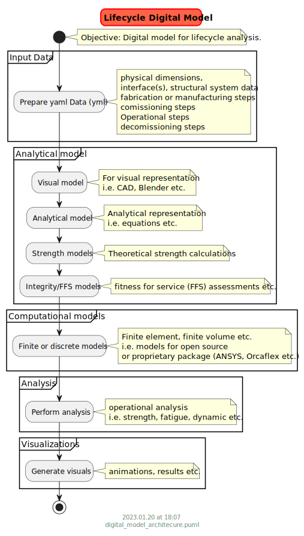

# Introduction

Sustainable Digital models for engineering assets built with sustainable engineering processes and solutions. The objective of digital models is to utilize a single source of ascii inputs (promoting single source of truth) to generate equivalent analytical models to encompass lifecycle operations of a product. 

These operations include (and not limited to) the following:
- Analytical calculations
- Computational analysis
- 3D CAD models
    - 3D animations
    - Drawing automation

Dedicated to my idol and a lifelong chief engineer, **Mark Cerkovnik**. His insights shaped major portions of my life and this repository.

# Summary

- High level vision proposed:

The library is intended to get traction from stretched engineering teams. Teams using this can take away some good ideas generated from leading/mentoring over 200 SURF engineers over 20 years of hands-on engineering experience. The main objectives of the library are:
- Single ascii data source of truth: generate fe models, analytical calculations, 3d cad models, 3d animations, drawings using a single source of truth
- Modularity : engineering assets can be imported into sofware using .yml files
- Standardize naming conventions: for cross-team/company collaboration
- Reusability of components: do once, use many times
- Analytical QA: If certain tasks can be done analytically, verify the outputs from analytical calculations vs. Orcaflex outputs. eg: Weights of components expected vs. model
- A major impact will be in the QA of the work for the end users as well as the responsible leads. 
- Avoid excel to eliminate manual steps. Helps in automation of tasks and no/less room for error.

# Usage

A quick way to running code is:
    - Create a virtual environment:
        - Use [conda yaml file](https://raw.githubusercontent.com/vamseeachanta/digitalmodel/master/dev_tools/environment.yml) to create a new environment
        - (or) by installing [digitalmodel]((https://github.com/vamseeachanta/digitalmodel)) package in an environment
- Run the following batch files
    - Download this [digitalmodel repository](https://github.com/vamseeachanta/digitalmodel)
    - activate environment
    - Change command line to "digitalmodel" (outside not in src) folder
        - Run the following python files in tests:
            - python src\digitalmodel\tests\ {change_to_relevant}.py
            - i.e. for catenary riser, python src\digitalmodel\tests\test_catenary_riser.py
        - (or) Run the following batch files in tests:
            - python src\digitalmodel\tests\ {change_to_relevant}.bat
            - i.e. for catenary riser, python src\digitalmodel\tests\test_catenary_riser.bat

## Assets

### SALM

SALM (Single Anchor Line Mooring)

Relevant files:
- python src\digitalmodel\tests\test_fea_model_salm_buoy_01.py
- python src\digitalmodel\tests\test_fea_model_salm_buoy_02.py

### Ships or vessels

Light Service Vessels
Intervention vessels

### Risers

#### Catenary Risers (SCR, SLWR)

SCR - Simple Catenary Riser
SLWR - Simple Lazy Wave Riser

Relevant files:
- python src\digitalmodel\tests\test_catenary_riser.py
- python src\digitalmodel\tests\test_catenary_riser.bat

### Pipelines

### Flexibles or Umbilicals

### Umbilicals

### Rigid Jumpers

## Example Software Runs

### OrcaFlex

Relevant files:
- python src\digitalmodel\tests\test_orcaflex_analysis.py

## Calculations

### Time Series 

Statics
- Fast Fourier Transform analysis as follows:
    - FFT
    - iFFT
    - Peak energy frequency
    - Perform signal integration

## References

### Manufacturing/Fabrication

[ProdSim python packages](https://github.com/FuchsTom/ProdSim)
[ProdSim Background: An Open-source Python Package for Generating High-resolution Synthetic Manufacturing Data on Product, Machine and Shop-Floor Levels](https://www.sciencedirect.com/science/article/pii/S2212827122004395)
