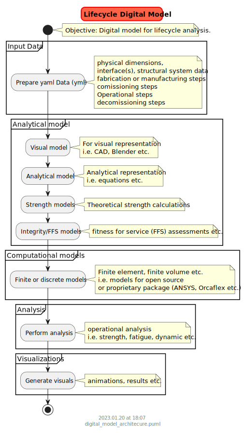

# Digital Model - Engineering Asset Lifecycle Management

[](https://www.python.org/)
[](LICENSE)
[](https://github.com/vamseeachanta/digitalmodel)

Sustainable digital models for engineering assets built with sustainable engineering processes and solutions. Single source of truth for offshore, subsea, and marine engineering analysis.

**Dedicated to Mark Cerkovnik** - Chief Engineer, mentor, and inspiration.

---

## 🔍 Capabilities Snapshot
- **Lifecycle coverage**: fatigue, stress, hydrodynamics, riser & mooring, metocean, vessel systems.
- **Digital thread**: ASCII-first configs drive FE models, CAD/animations, reports, and QA workflows.
- **Data procurement**: structured spec library for supplier intelligence across offshore domains.
- **Automation ready**: modular APIs, CLI tooling, and integration hooks for pipelines & dashboards.
- **Validation tooling**: cross-check analytical vs. numerical results with repeatable benchmarking.

---

## 🎯 Vision

Utilize a single source of ASCII inputs (promoting single source of truth) to generate equivalent analytical models encompassing the complete lifecycle operations of engineering assets:

- **Analytical Calculations** - Fatigue, stress, hydrodynamics, structural capacity
- **Computational Analysis** - FEA models, time-domain simulations, frequency analysis
- **3D CAD Models** - Automated geometry generation
- **3D Animations** - Visual representations of designs
- **Drawing Automation** - Engineering documentation



---

## 📊 Repository Overview

| Category | Count | Description |
|----------|-------|-------------|
| **Python Modules** | 704+ | Core engineering libraries |
| **Test Files** | 1,971+ | Comprehensive test coverage |
| **Examples** | 12+ | Working demonstrations |
| **Documentation** | 352+ | Technical guides and references |
| **Commits** | 305+ | Active development history |

---

## ⚡ Power Generation Controls & Data Center Infrastructure

Engineering modules for power generation controls, microgrid systems, and mission-critical data center infrastructure — spanning generator sequencing, SCADA/EPMS protocol integration, and commissioning validation.

### Generator Sequencing & Paralleling Logic
Deterministic state-machine for multi-generator paralleling per IEEE 1547 / NFPA 110.
- Generator state machine: OFFLINE → CRANKING → IDLE → RATED → SYNCHRONIZED → ONLINE
- Synchronization checker: voltage/frequency/phase-angle match within configurable tolerances
- Parallel bus controller: load sharing computation, priority-based load-shed execution
- Black-start sequencer: critical load definition, NFPA 110 compliance validation

**Source:** [`src/digitalmodel/power/controls/`](src/digitalmodel/power/controls/) | **Tests:** [`tests/power/controls/`](tests/power/controls/)

### SCADA & Protocol Integration
Protocol simulation and data-mapping toolkit for Modbus TCP/RTU, DNP3, OPC UA, and EPMS/BMS integration.
- Modbus register map: CSV import, raw-to-engineering scaling, consistency validation
- DNP3 point list: analog/binary inputs, SEL RTAC-compatible config export
- OPC UA node model: device tree → namespace builder, XML export (Ignition/Wonderware)
- EPMS data model: generator/switchgear/BMS points, template compliance, Excel-ready I/O list

**Source:** [`src/digitalmodel/power/protocols/`](src/digitalmodel/power/protocols/) | **Tests:** [`tests/power/protocols/`](tests/power/protocols/)

### Microgrid Energy Management System
Rule-based microgrid EMS for grid-connected and island-mode operation per IEEE 1547.4.
- Merit-order DER dispatch (PV → BESS → genset)
- BESS controller: SOC management with derating bands and island-mode reserve
- Island detection: ROCOF via linear regression, vector shift detection
- Mode transitions: grid-connected ↔ islanded ↔ black-start

**Source:** [`src/digitalmodel/power/microgrid/`](src/digitalmodel/power/microgrid/) | **Tests:** [`tests/power/microgrid/`](tests/power/microgrid/) — 29 tests

### Data Center Power Topology
UPS/STS/N+1 redundancy modeling with single-point-of-failure detection and Uptime Institute Tier I–IV classification.
- Redundancy schemes: N, N+1, 2N, 2N+1
- Cascaded power path: utility → MV switchgear → transformer → UPS → STS → PDU → rack
- SPOF detection across multiple power paths
- Tier classification with availability computation

**Source:** [`src/digitalmodel/power/datacenter/`](src/digitalmodel/power/datacenter/) | **Tests:** [`tests/power/datacenter/`](tests/power/datacenter/) — 42 tests

### Commissioning Validation (FAT/SAT/IST)
Test procedure generator and results validator for generator and switchgear commissioning.
- Phase-specific templates: FAT (insulation, hi-pot, relay, breaker, control logic), SAT (cable megger, grounding, phase rotation, protection, interlocks), IST (load test, failover, SCADA, e-stop, performance)
- Test results validation against generated sequences
- Punch list export with severity classification (critical/major/minor)

**Source:** [`src/digitalmodel/power/commissioning/`](src/digitalmodel/power/commissioning/) | **Tests:** [`tests/power/commissioning/`](tests/power/commissioning/) — 32 tests

### Protection Relay Coordination
IEEE C37.112 inverse-time relay curve modeling for overcurrent and differential protection coordination.
- Overcurrent relay types: 50 (instantaneous), 51 (time-overcurrent)
- Differential relay (87) with slope and minimum operate current settings
- Curve types: moderately inverse, very inverse, extremely inverse, definite time
- Coordination checker: upstream/downstream grading margin validation
- Time-current intersection calculator for relay curves

**Source:** [`src/digitalmodel/power/protection/`](src/digitalmodel/power/protection/) | **Tests:** [`tests/power/protection/`](tests/power/protection/) — 23 tests

### IEC 61850 GOOSE Messaging
IEC 61850-8-1 GOOSE publisher/subscriber model with SCL structure generation and logical node mapping.
- Logical node types: XCBR, XSWI, CSWI, PTOC, PDIF, MMXU, CILO
- GOOSE control block, dataset, and data attribute models
- Publisher/subscriber binding validation
- SCL-compatible structure output (IED → AccessPoint → LDevice → LN0)

**Source:** [`src/digitalmodel/power/protocols/iec61850_goose.py`](src/digitalmodel/power/protocols/iec61850_goose.py) | **Tests:** [`tests/power/protocols/`](tests/power/protocols/) — 25 tests

### Power Flow / Load Flow Calculator
Newton-Raphson power flow solver for radial and simple-loop distribution networks.
- Bus types: slack (reference), PV (generator), PQ (load)
- Y-bus (admittance matrix) assembly with transformer tap ratio support
- Jacobian-based Newton-Raphson iterative solver
- Results: bus voltages/angles, branch active/reactive flows, system losses

**Source:** [`src/digitalmodel/power/analysis/`](src/digitalmodel/power/analysis/) | **Tests:** [`tests/power/analysis/`](tests/power/analysis/) — 32 tests

### Droop Control Simulator
Frequency/voltage droop response modeling for parallel generator load sharing.
- Governor droop: frequency→power output with configurable droop percentage
- AVR droop: voltage→reactive power mapping
- N-generator parallel load sharing solver (bisection method)
- Isochronous + droop mix support
- Droop setting recommender for target load split ratios

**Source:** [`src/digitalmodel/power/microgrid/droop_control.py`](src/digitalmodel/power/microgrid/droop_control.py) | **Tests:** [`tests/power/microgrid/test_droop_control.py`](tests/power/microgrid/test_droop_control.py) — 29 tests

---

## 🛡️ Cathodic Protection Design

Multi-standard cathodic protection design platform for offshore structures, pipelines, vessels, and generator fuel systems.

| Standard | Scope | Tests |
|----------|-------|-------|
| [DNV-RP-B401](src/digitalmodel/cathodic_protection/dnv_rp_b401.py) | Offshore structures — anode sizing, coating breakdown, zone-based design | 36 |
| [API RP 1632](src/digitalmodel/cathodic_protection/api_rp_1632.py) | Underground pipelines — Dwight resistance, current demand, anode life | 16 |
| [ISO 15589-2](src/digitalmodel/cathodic_protection/iso_15589_2.py) | Offshore pipelines — bracelet anodes, attenuation length | 20 |
| [Fuel System CP](src/digitalmodel/cathodic_protection/fuel_system_cp.py) | Generator fuel piping — impressed current, ground bed, rectifier design | 22 |
| ABS GN Ships/Offshore | Vessel hulls and floating structures | configured |

- Structure types: submarine pipelines, vessel hulls, fixed offshore platforms
- Anode materials: Al-Zn-In, zinc, magnesium (H-1 alloy)
- 16 worked example calculations: [`docs/domains/cathodic_protection/examples/`](docs/domains/cathodic_protection/examples/)
- Standards inventory (21 standards audited): [`standards-inventory.md`](docs/domains/cathodic_protection/standards-inventory.md)

**Source:** [`src/digitalmodel/cathodic_protection/`](src/digitalmodel/cathodic_protection/) | **Tests:** [`tests/cathodic_protection/`](tests/cathodic_protection/) — 72 tests

---

## 🌍 GIS & Infrastructure Asset Management

Geospatial analysis library for infrastructure asset management — 27 modules, ~5,000 lines.

- **Core:** CRS transformation (UTM ↔ lat/long), spatial queries, geometry operations
- **I/O:** GeoJSON, GeoTIFF, KML/KMZ, ESRI Shapefile
- **Visualization:** [Folium](src/digitalmodel/gis/integrations/folium_maps.py) (web maps), [Plotly](src/digitalmodel/gis/integrations/plotly_maps.py) (3D/2D), [QGIS](src/digitalmodel/gis/integrations/qgis_export.py), [Google Earth](src/digitalmodel/gis/integrations/google_earth_export.py), [Blender](src/digitalmodel/gis/integrations/blender_export.py) (3D mesh)
- **Layers:** Feature, raster, temporal, well position

**Source:** [`src/digitalmodel/gis/`](src/digitalmodel/gis/)

---

## 🔬 Asset Integrity & Fitness-for-Service

- [API 579](src/digitalmodel/asset_integrity/API579.py) Level 1/2/3 FFS assessment framework
- [BS 7910 fracture mechanics](src/digitalmodel/asset_integrity/fracture_mechanics.py) — FAD diagrams, critical flaw limits
- Remaining strength factor calculations
- Worked examples: [general metal loss](examples/asset_integrity/example_api579_gml.py), [local metal loss](examples/asset_integrity/example_api579_lml.py)

**Source:** [`src/digitalmodel/asset_integrity/`](src/digitalmodel/asset_integrity/)

---

## 🚀 Key Features

### ✅ Single Source of Truth
- ASCII-based input files (.yml, .json, .csv)
- Generate FE models, analytical calculations, 3D CAD, animations, and drawings from one source
- Version-controlled engineering data

### ✅ Modular Architecture
- Import engineering assets using configuration files
- Reusable components across projects
- Standardized naming conventions for cross-team collaboration

### ✅ Analytical QA
- Automated verification of computational results
- Cross-validation between analytical and numerical methods
- Weight checks, load verification, structural capacity validation

### ✅ Industry-Proven Workflows
- 20+ years of hands-on engineering experience
- Validated by 200+ SURF engineers
- Production-ready for offshore and marine projects

---

## 🔬 Core Capabilities

### Fatigue Analysis Module ⭐ NEW
**Comprehensive S-N Curve Database & Analysis Tools**

- **221 S-N curves** from **17 international standards**:
  - DNV (81 curves), BS 7608 (79), ABS (24), BP (25), Norsok (15), Bureau Veritas (14), API (2), Titanium (4)
- **Joint types**: Plated welded, Tubular, Tubular nodal
- **Environments**: In Air, Seawater with CP, Free Corrosion
- **Advanced plotting**: Log-log, linear-log, SCF application, fatigue limit handling
- **Data formats**: CSV, JSON for easy integration

```python
from digitalmodel.fatigue.sn_curve_plotter import SNCurvePlotter

# Initialize plotter
plotter = SNCurvePlotter()

# Plot S-N curves with stress concentration factor
plotter.plot_curves(
    lookup_indices=[64, 175, 183],
    scf=2.0,
    include_fatigue_limit=True,
    plot_type='log-log',
    save_path='sn_curves.png'
)
```

**Quick Access:**
- Data: `/data/fatigue/`
- Examples: `/examples/fatigue/`
- Documentation: `/data/fatigue/README.md`

---

### CALM Buoy Operational Analysis ⭐ NEW
**Interactive Dashboards for Mooring System Design**

- **Complete reference dataset** from Hengyi PMB project (Brunei)
- **13 CSV files** covering all operational aspects:
  - Environmental conditions (1-yr and 100-yr return periods)
  - Mooring line properties and configurations (95mm Studless R3 chain)
  - Performance analysis (offsets, tensions, safety factors)
  - Vessel design (300k DWT tanker)
  - Buoy geometry and hawser systems
- **Interactive HTML reports** with Plotly visualizations
- **Production-ready** for OrcaFlex model generation

```python
from digitalmodel.mooring.calm_buoy import CALMBuoyReportGenerator

# Generate interactive HTML dashboard
generator = CALMBuoyReportGenerator("data/mooring/results/calm_buoy/project_specific/south_east_asia_project_1")
report_path = generator.generate_report()
```

**Quick Access:**
- Data: `/data/mooring/results/calm_buoy/`
- Reports: `/reports/mooring/calm_buoy/`
- Documentation: `/docs/PHASE5_CALM_BUOY_OPERATIONAL_ANALYSIS.md`
- Source: `/src/digitalmodel/mooring/calm_buoy/`

**Key Features:**
- 6-leg CALM buoy with 60° spacing
- Operational (intact & 1 line damaged) scenarios
- Survival (100-year metocean) scenarios
- All safety factors exceed ABS requirements (SF > 2.0)
- Full traceability to design reports

---

### Structural Analysis

#### Stress Analysis
- Von Mises stress calculations
- Nonlinear stress-strain analysis
- Multi-axial stress states
- Stress concentration factors

#### Plate Capacity
- Buckling analysis (DNV, API standards)
- Ultimate strength calculations
- Multi-plate structural systems
- Stiffened panel analysis

---

### Time-Series Analysis

#### Signal Processing
- Fast Fourier Transform (FFT)
- Inverse FFT (iFFT)
- Peak energy frequency identification
- Signal integration and differentiation
- Statistical analysis

#### Hydrodynamics
- Wave load calculations (DNV-RP-H103)
- Drag and inertia coefficients
- Circular and rectangular section hydrodynamics
- Current profile generation

---

### Engineering Asset Modeling

#### Risers
- **Catenary Risers (SCR)** - Simple Catenary Riser analysis
- **Lazy Wave Risers (SLWR)** - Buoyancy-supported configurations
- **Stack-up calculations** - Material properties, weights, tensions

#### Mooring Systems
- **SALM** - Single Anchor Line Mooring
- **Buoy systems** - Hydrodynamic analysis
- **Anchor design** - Load capacity verification
- **CALM Buoy Analysis** ⭐ NEW - Comprehensive operational datasets with interactive dashboards

#### Subsea Infrastructure
- **Pipelines** - On-bottom stability, span analysis
- **Flexibles/Umbilicals** - Configuration design
- **Rigid Jumpers** - Structural analysis

#### Vessels
- Light Service Vessels
- Intervention Vessels
- Ship design calculations

---

### Software Integration

#### OrcaFlex
- Automated model generation from YAML
- Post-processing and results extraction
- Time-series analysis integration

#### WAMIT
- Hydrodynamic coefficient processing
- RAO (Response Amplitude Operator) analysis

#### AQWA
- Model setup automation
- Results post-processing

#### BEMRosetta
- Boundary element method integration

---

## 📦 Installation

### Quick Start (pip)
```bash
# Install from GitHub
pip install git+https://github.com/vamseeachanta/digitalmodel.git

# Or clone for development
git clone https://github.com/vamseeachanta/digitalmodel.git
cd digitalmodel
pip install -e .
```

### Using Conda Environment
```bash
# Create environment from YAML
conda env create -f dev_tools/environment.yml
conda activate digitalmodel

# Or install package in existing environment
pip install -e .
```

---

## 🎯 Quick Examples

### 1. Fatigue S-N Curve Analysis
```python
from digitalmodel.fatigue.sn_curve_plotter import SNCurvePlotter

plotter = SNCurvePlotter()

# List available curves
dnv_curves = plotter.list_curves(
    curve_type_filter='DNV',
    environment_filter='Air'
)
print(dnv_curves)

# Compare multiple standards
plotter.create_comparison_plot(
    reference_index=64,  # API curve
    comparison_indices=[175, 183, 190],  # BS, BV, ABS
    scf=1.5,
    save_path='standard_comparison.png'
)
```

### 2. Catenary Riser Analysis
```python
from digitalmodel.tests import test_catenary_riser

# Run analysis with YAML configuration
test_catenary_riser.main()
```

### 3. Stress Analysis
```python
from digitalmodel.stress import StressAnalyzer

analyzer = StressAnalyzer()
vm_stress = analyzer.von_mises_stress(
    sigma_x=100,  # MPa
    sigma_y=80,
    sigma_z=60,
    tau_xy=20,
    tau_yz=15,
    tau_xz=10
)
print(f"Von Mises Stress: {vm_stress:.2f} MPa")
```

### 4. Plate Buckling Analysis
```python
from digitalmodel.analysis.plate_capacity import PlateCapacity

plate = PlateCapacity(
    length=2.0,      # meters
    width=1.0,
    thickness=0.02,
    material='API 5L X65'
)

capacity = plate.calculate_buckling_capacity()
print(f"Buckling Capacity: {capacity:.2f} kN")
```

---

## 📚 Documentation

### Getting Started
- [Installation Guide](docs/installation.md)
- [Quick Start Tutorial](docs/quickstart.md)
- [Configuration Files](docs/configuration.md)

### Module Documentation
- [Fatigue Analysis](data/fatigue/README.md) ⭐
- [Stress Analysis](docs/domains/stress/README.md)
- [OrcaFlex Integration](docs/domains/orcaflex/README.md)
- [Marine Engineering](docs/domains/marine-engineering/README.md)

### API Reference
- [Core API](docs/api/core.md)
- [Analysis Modules](docs/api/analysis.md)
- [Utilities](docs/api/utilities.md)

---

## 🗂️ Repository Structure

```
digitalmodel/
├── src/digitalmodel/
│   └── modules/                    # 45+ specialized analysis modules
│       ├── aqwa/                   # AQWA hydrodynamic analysis
│       ├── blender_automation/     # 3D model generation
│       ├── catenary/               # Catenary calculations
│       ├── data_procurement/       # Data scraping/validation
│       ├── fatigue_analysis/       # S-N curves, damage accumulation
│       ├── marine_engineering/     # Environmental loading, wave spectra
│       ├── mooring/                # Mooring system design
│       ├── orcaflex/               # OrcaFlex simulation interface
│       ├── pipe_capacity/          # Pipe stress calculations
│       ├── reporting/              # Interactive HTML reports
│       └── ...                     # 35+ more modules
├── tests/domains/                  # Test suites (mirrors src structure)
├── specs/modules/                  # Module specifications (39 specs)
├── docs/domains/                   # Module documentation
├── examples/domains/               # Working examples per module
├── config/                         # Configuration files
│   └── templates/                  # Project templates
├── data/                           # Engineering databases
│   └── fatigue/                    # S-N curve library (17 standards)
├── scripts/                        # Automation scripts
├── .claude/                        # AI orchestration (670+ files)
│   ├── agents/                     # Agent definitions
│   ├── skills/                     # Skill library
│   └── commands/                   # CLI commands
└── .claude-flow/                   # Runtime coordination
```

---

## 🔧 Development Tools

### Repository Hygiene
```bash
# Check for root directory violations
python tools/cleanup-root.py --dry-run

# Automatic cleanup
python tools/cleanup-root.py

# Enable pre-commit hook
git config core.hooksPath .githooks
```

### Testing
```bash
# Run all tests
pytest

# Run specific module tests
pytest tests/test_fatigue_analysis.py

# Run with coverage
pytest --cov=digitalmodel --cov-report=html
```

### Code Quality
```bash
# Format code
black src/digitalmodel

# Lint
flake8 src/digitalmodel

# Type checking
mypy src/digitalmodel
```

---

## 🌟 Recent Additions

### March 2026
- ✨ **Power Generation Controls** - Generator sequencing, paralleling logic, black-start per IEEE 1547 / NFPA 110
- ✨ **SCADA/Protocol Integration** - Modbus, DNP3, OPC UA, EPMS data model with I/O list export
- ✨ **Microgrid EMS** - IEEE 1547.4 island detection, DER merit-order dispatch, BESS SOC management
- ✨ **Data Center Topology** - UPS/STS/N+1 redundancy, SPOF detection, Uptime Tier I–IV classification
- ✨ **Commissioning Validator** - FAT/SAT/IST test sequence generation and results validation
- ✨ **Protection Relay Coordination** - IEEE C37.112 overcurrent/differential relay curves, coordination grading
- ✨ **IEC 61850 GOOSE Messaging** - Publisher/subscriber model, SCL structure, logical node mapping
- ✨ **Power Flow Calculator** - Newton-Raphson load flow solver for radial distribution networks
- ✨ **Droop Control Simulator** - Governor/AVR droop, N-generator parallel load sharing
- ✨ **Generator Fuel System CP** - Impressed current CP for underground fuel piping per API RP 1632

### September 2025
- ✨ **Fatigue S-N Curve Database** - 221 curves from 17 international standards
- ✨ **Cathodic Protection Platform** - DNV-RP-B401, API RP 1632, ISO 15589-2 — 72 verified tests
- ✨ **GIS Infrastructure Module** - 27 modules for geospatial asset management

---

## 🤝 Contributing

Contributions welcome! This library benefits from:
- 20+ years offshore/subsea engineering experience
- 200+ SURF engineers' collective insights
- Active production use in major projects

### How to Contribute
1. Fork the repository
2. Create a feature branch (`git checkout -b feature/amazing-feature`)
3. Commit your changes (`git commit -m 'Add amazing feature'`)
4. Push to the branch (`git push origin feature/amazing-feature`)
5. Open a Pull Request

---

## 📖 Citation

When using this library in academic or commercial work, please cite:

```bibtex
@software{digitalmodel2025,
  author = {Achanta, Vamsee},
  title = {Digital Model: Engineering Asset Lifecycle Management},
  year = {2025},
  publisher = {GitHub},
  url = {https://github.com/vamseeachanta/digitalmodel}
}
```

For the S-N Curve Database specifically:
```bibtex
@dataset{sn_curve_database2025,
  author = {Achanta, Vamsee},
  title = {Fatigue S-N Curve Database for Offshore Structures},
  year = {2025},
  publisher = {GitHub},
  url = {https://github.com/vamseeachanta/digitalmodel/tree/main/data/fatigue},
  note = {221 curves from 17 international standards}
}
```

---

## 📧 Contact & Support

- **GitHub Issues**: [Report bugs or request features](https://github.com/vamseeachanta/digitalmodel/issues)
- **Email**: vamsee.achanta@aceengineer.com
- **LinkedIn**: [Vamsee Achanta](https://www.linkedin.com/in/vamseeachanta)

---

## 📄 License

This project is licensed under the MIT License - see the [LICENSE](LICENSE) file for details.

---

## 🙏 Acknowledgments

**Dedicated to Mark Cerkovnik** - Chief Engineer whose insights shaped major portions of this work and repository.

Special thanks to:
- 200+ SURF engineers who contributed insights over 20 years
- Open-source community for foundational tools
- Industry standards organizations (DNV, API, ABS, BS, Norsok, Bureau Veritas)

---

## 🔗 Related Projects

- [OrcaFlex](https://www.orcina.com/orcaflex/) - Dynamic analysis software
- [WAMIT](https://www.wamit.com/) - Wave analysis program
- [AQWA](https://www.ansys.com/products/structures/ansys-aqwa) - Hydrodynamic analysis
- [BEMRosetta](https://github.com/BEMRosetta/BEMRosetta) - BEM analysis tool

---

## 📊 Project Status

- ✅ **Active Development** - Regular updates and improvements
- ✅ **Production Ready** - Used in active engineering projects
- ✅ **Well Documented** - 352+ documentation files
- ✅ **Tested** - 1,971+ test cases
- ✅ **Industry Validated** - 20+ years of engineering experience

---

**Last Updated**: March 2026
**Version**: 3.0.0
**Total Commits**: 500+
