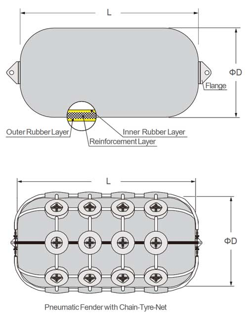

# Fender Design Data

## Pneumatic Fender Specifications

| Parameter | 4.5m Fender (Standard) | 6m Fender (Custom) | 7m Fender (Custom) | Unit |
|-----------|------------------------|--------------------|--------------------|------|
| Pneumatic Fender Nominal Diameter | 4.5 | 6 | 7 | m |
| Fender Outer Diameter | 4.5? | 6.928 | 8.083 | m |
| Fender Outer Diameter - 5% Initial Compression | 4.275? | 6.582 | 7.679 | m |
| Fender Length | 9-12 | Custom | Custom | m |
| Initial Internal Pressure | 50 | 50-80 | 50-80 | kPa |
| Working Pressure | 50-80 | 50-80 | 50-80 | kPa |
| Maximum Reaction Force | 146-154 | Custom | Custom | kN |
| Energy Absorption (GEA) | 5.7-8.0 | Custom | Custom | MJ |
| Safety Valve Setting | 200-250 | 200-250 | 200-250 | kPa |

### Notes:
- **Standard Yokohama Range**: D0.5m × L1m to D4.5m × L12m (ISO 17357-1:2014 compliant)
- **6m & 7m Fenders**: Custom sizes - specifications would need to be engineered based on application requirements
- **4.5m Data**: Based on Yokohama Pneumatic 50 series specifications
- **Compression Ratio**: Standard testing at 60% compression for energy absorption values
- **Net Types**: Available as Type I (chain/wire/fiber net) or Type II (sling type with attachment eyes)

