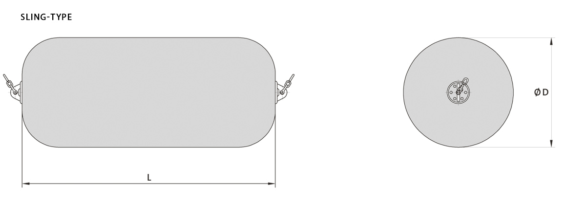

https://www.y-yokohama.com/global/product/mb/fenders/floating/

### Custom Sizes

I'll search for the standard dimensions of pneumatic fenders with 6m and 7m nominal diameters.Let me search for more specific information about the dimensions of 6m and 7m diameter pneumatic fenders.Let me search for a comprehensive dimension table or specification sheet that includes 6m and 7m diameter fenders.Based on my research, I can provide you with the standard dimensions for pneumatic fenders with 6m and 7m nominal diameters. However, it's important to note that pneumatic fenders are typically specified by diameter × length, and the actual sizes available in the 6-7m diameter range are limited to specific standard configurations.

## Standard Pneumatic Fender Dimensions

According to ISO 17357-1:2014 standards, there are **no standard pneumatic fenders with exactly 6m or 7m diameters**. The standard sizes jump from 4.5m diameter to larger custom sizes. Here are the closest standard dimensions:

### Standard Sizes Near Your Requirements:

**4.5m Diameter Fenders (largest standard size):**
- 4500mm × 9000mm (4.5m × 9m)
- 4500mm × 12000mm (4.5m × 12m)

### Important Notes:

1. **Custom Manufacturing**: Some applications may require sizes outside of those specified in ISO standards. Manufacturers like Trelleborg, Yokohama, and others can produce custom sizes including 6m and 7m diameter fenders upon request.

2. **Available Range**: Pneumatic Fenders are available in diameters ranging from 300 mm to 4,500 mm and lengths ranging from 500 mm to 9,000 mm, as well as special sizes

3. **Pressure Ratings**: These large fenders typically come in two pressure ratings:
   - 50 kPa (Pneumatic 50)
   - 80 kPa (Pneumatic 80)

### For 6m and 7m Diameter Fenders:

Since these are non-standard sizes, you would need to:
1. Contact manufacturers directly for custom fabrication
2. Specify your exact requirements including:
   - Diameter (6m or 7m)
   - Length (typical lengths might be 10-15m for such large diameters)
   - Initial pressure (50 or 80 kPa)
   - Type (sling type or with chain-tire net)
   - Application (ship-to-ship transfer, terminal berthing, etc.)

The actual dimensions, weight, and performance characteristics would be calculated based on your specific requirements and the manufacturer's engineering capabilities.

Would you like me to provide information about the performance characteristics (energy absorption, reaction force) that would be expected for fenders of this size, or do you need contact information for manufacturers who can produce custom 6m and 7m diameter fenders?