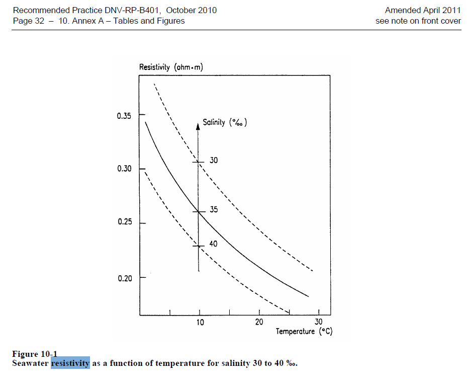

# Codes

## DNV

## ABS

See docs\cathodic_protection\codes\cathodic-protection-gn-dec17.pdf

## Other References

## ABS Calculation

### Design Current, Section 4

Design current for each sub area of the ship is to be used for the CP design.

- Structure subdivision
  - Port side (Shore-side)
  - Starboard side (Carrier side)
- Surface Area calculations

- Any marine growth prevension systems (MGPS) or anti-fouling system can impact the CP system design and the associated efffectiveness.

- Internal surfaces
  - All internal surfaces of the ship are to be protected by CP system.

- From typical design current below, V <= 1 m/s (as vessel is stationary) is used

- Evaluate Design current density for coated steeel, See section 4.4

- Evaluate current demand, See section 4.5

### Circuit Resistance, Section 5

- The objective of the CP system is to provide a protection potential over the whole steel surface.

- The number and location of anodes is critical for this

I = ΔE / R,
where
I = current output from anode, in amperes
ΔE = driving voltage between anode and structure, in volts (FE vs. Al/Zn)
R = circuit resistance, which is sum of anode-to-electrolyte resistance, electrolyte resistance and structure-to-electrolyte resistance, in ohms

**Need ΔE source/data**

### Anode Resistance, Section 6

- Assume slender anodes at 0.3m offset from steel, Section 6.1 (Implement in Spreadsheet)

- For other anode types, see Section 6.2 and Section 6.3 (Implement in Python)

### Anode current output and Operating Life, Section 7

- Service temperature
  - Assume 40 def F (5 deg C)

- Current capacity
Q(T) = 2000 – 27 × (T – 20°C) A-h/kg
Q(T) = 907 – 6.8 × (T – 68°F) A-h/lb

#### Minimum Net Weight of Anode (Main Output)

If calculation is started in this Section, Rest of it will be chain reaction to the above and below evaluations

- See Section 7.3

Wtotal = (Imean × Tdesign × 8760)/(Q × u) kg
Wtotal = 2.2046 × (Imean × Tdesign × 8760)/(Q × u) lb
where
Wtotal = minimum total net weight of galvanic anode material needed, in kilograms (kg) [pounds (lb)]
Imean = total maintenance current needed for the structure, in amperes (A)
Tdesign = design life (period between drydocking) for the anode system, in years (y)
u = utilization factor determined by the portion of anodic material consumed when the remaining anode material cannot deliver the current needed (dimensionless). The shape of the anode and the design of the steel core within it will affect the utilization factor, which may be in the range of 0.7 to 0.95
Q = practical current capacity for the anode material in the environment considered, in A-h/kg (A-h/lb). (see EN 12496)
8760 = number of hours per year

#### Anode Life: 25 yrs Design life

Tanode = (Wanode × u)/(E × Is) years
where
Tanode = effective lifetime of the anode, in years (y)
Wanode= net mass of anode alloy (excluding the steel core), in kilograms (kg) [pounds (lb)]
u = utilization factor determined by the portion of anodic material consumed when the remaining anode material cannot deliver the current needed (dimensionless). The shape of the anode and the design of the steel core within it will affect the utilization factor, which may be in the range of 0.7 to 0.95
E = consumption rate of the anode material in the environment considered, in kg/(A-y) [lb/(A-y)]
Is = average (mean) current output of the anode during the lifetime, in amperes (A)

#### Anode resistance at End of Life, Section 7.5

Wfinal = Winitial(1 – u) kg (lb)
where
W = net mass of anode alloy (excluding the steel core), in kg (lb)
Winitial = initial value, in kg (lb)
Wfinal = final (or end of life) value, in kg (lb)
ABSGUIDANCE NOTES ON CATHODIC PROTECTION OF SHIPS . 2017 15
Section 2 Design Criteria and Recommendations
u = utilization factor determined by the portion of anodic material consumed when the remaining anode material cannot deliver the current needed (dimensionless). The shape of the anode and the design of the stee1 core within it will affect the utilization factor, which may be in the range of 0.70 to 0.95.
