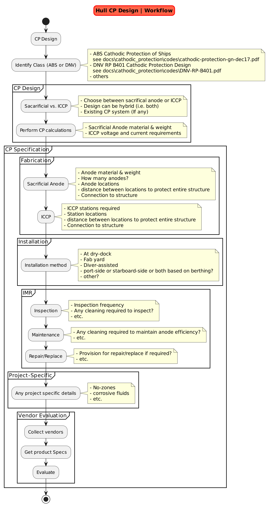

# Codes

## DNV

## ABS

docs\cathodic_protection\codes\ABS cathodic-protection-offshore-gn-dec18.pdf
docs\cathodic_protection\codes\cathodic-protection-gn-dec17.pdf

## Other References

SNAME T&R Report R-21: Fundamentals of Cathodic Protection for Marine Service (1976)

<https://www.calqlata.com/productpages/00057-help.html>

<https://www.linkedin.com/pulse/cathodic-protection-design-summary-kaya-korkmaz/>

<https://engineercalcs.com/cathodic-protection-calculation/>
SNAME T&R Report R-21: Fundamentals of Cathodic Protection for Marine Service (1976)

## Ship Design

Tyipical design for CP system is shown in the figure below:

The detailed calculations for Sacrificial Anode Cathodic Protection System is:

The detailed calculations for Impressed Current Cathodic Protection System is:
[Sacrificial Anode Methodology](sacrificial_anode.md)

## Vendors

### Sacrificial Anode Cathodic Protection System

<https://www.mme-group.com/cathodic-protection/sacrificial-anodes/>

### ICCP

<https://www.mme-group.com/cathodic-protection/iccp/>
