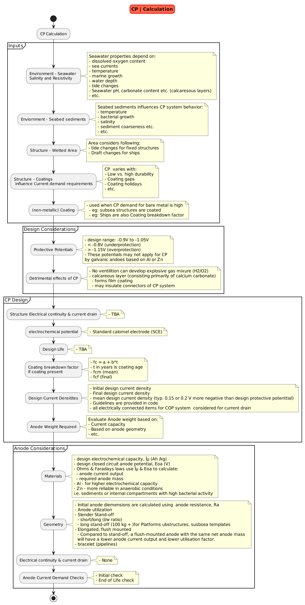

# Introduction

- Ship is a steel structure and will need be protected from Corrosion
- To prevent/mitigate/minimize corrosion from occuring cathodic protection is required.
- If a ship is coated, is cathodic protection (Anodes or ICCP) required? Yes
  - Even if coated efficiently, there can be presence of holidays during the initial paining
  - Due to the dynamic nature of these structures, there can be areas of damage that needs to be protected which can be done using minimal cathodic protection
  - This minimal cathodic protection will also provide insurance against any coating failures

## Design Data

#### Salinity

Salinity Calculations

3.5% Salinity = 35,000 ppm = 35 ppt
**Unit Definitions**

- ppt parts per thousand
- ppm parts per million
- % parts per hundred
- therefore, 1 ppm = 0.001 ppt = 0.0001 % or (parts per hundred)

<https://www.capitalcityaquatics.com/salinity>
<https://www.unitsconverters.com/en/Salinitypercentage-To-Partsperthousand/Unittounit-4923-4921>

**example data of seawater at a location, Temperature is ?:**
Salinity 0.1ppt =  0.21  mS/cm = 4762  Ohm.cm
Salinity 1.0ppt = 1.970 mS/cm = 507.6 Ohm.cm
Salinity 10ppt  = 17.02 mS/cm = 58.75 Ohm.cm
Salinity 25ppt  = 39.26 mS/cm = 25.47 Ohm.cm
Salinity 31ppt  = 47.62 mS/cm = 21.00 Ohm.cm

# Codes

### DNV

### ABS

docs\cathodic_protection\codes\ABS cathodic-protection-offshore-gn-dec18.pdf

CATHODIC PROTECTION OF SHIPS, DECEMBER 2017
docs\cathodic_protection\codes\cathodic-protection-gn-dec17.pdf

DNV Cathodic Protection Design, October 2010
docs\cathodic_protection\codes\DNV RP B401 (2011) Cathodic Protection Design.pdf

## Courses

See, [See other literature including course work from various sources](literature)

## Other References

SNAME T&R Report R-21: Fundamentals of Cathodic Protection for Marine Service (1976)

<https://www.calqlata.com/productpages/00057-help.html>

<https://www.linkedin.com/pulse/cathodic-protection-design-summary-kaya-korkmaz/>

<https://engineercalcs.com/cathodic-protection-calculation/>

### Maintenance and Service

**References**

OTC 24012, Service Life and Definition of Failure of Coatings and Cathodic Protection, Brian Gibbs, Thomas Graf, ABS Consulting Inc., 2013

SNAME T&R Report R-21: Fundamentals of Cathodic Protection for Marine Service (1976)

<https://www.marineinsight.com/tech/understanding-sacrificial-anodes-on-ships>

## Ship Design

Tyipical design for CP system is shown in the figure below:

The detailed calculations for Sacrificial Anode Cathodic Protection System is:

The detailed calculations for Impressed Current Cathodic Protection System is:
[Sacrificial Anode Methodology](sacrificial_anode.md)

## Vendors

### Sacrificial Anode Cathodic Protection System

<https://www.mme-group.com/cathodic-protection/sacrificial-anodes/>
<https://cathwell.com/industries/floating-offshore-units/sacrificial-anodes/>
    - <https://cathwell.com/tech-categories/data-sheet/ht-anode/>
    - <https://cathwell.com/tech-categories/data-sheet/aluminium-sacrificial-anodes/>

### ICCP

<https://www.mme-group.com/cathodic-protection/iccp/>
