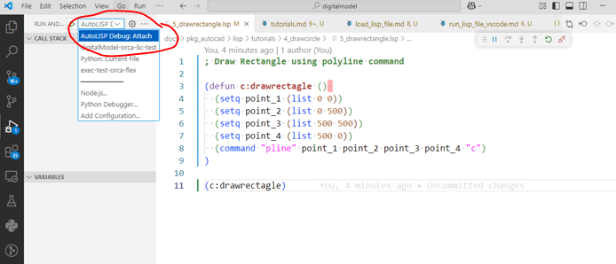

# Run LISP file using VS COde

## Summary

## STeps
-  Add configuration launch.json file
- check if the below command is deprecated (or) better command exists

<code>

    {
        "type": "attachlisp",
        "request": "attach",
        "name": "AutoLISP Debug: Attach",
        "attributes": {
            "//": "This configuration has been deprecated. Instead use the Debug: Attach Process setting of the AutoCAD AutoLISP Extension."
        }
    },

</code>

-  Run the command `Debug: Attach Process` from the command palette

-  Select the AutoCAD process from the list of processes
-  The debugger will attach to the AutoCAD process
-  Set breakpoints in the LISP file
-  Run the LISP file
-  The debugger will stop at the breakpoints
-  Use the debugger to inspect variables and step through the code
-  The debugger will stop at the breakpoints
-  Use the debugger to inspect variables and step through the code
-  The debugger will stop at the breakpoints
-  