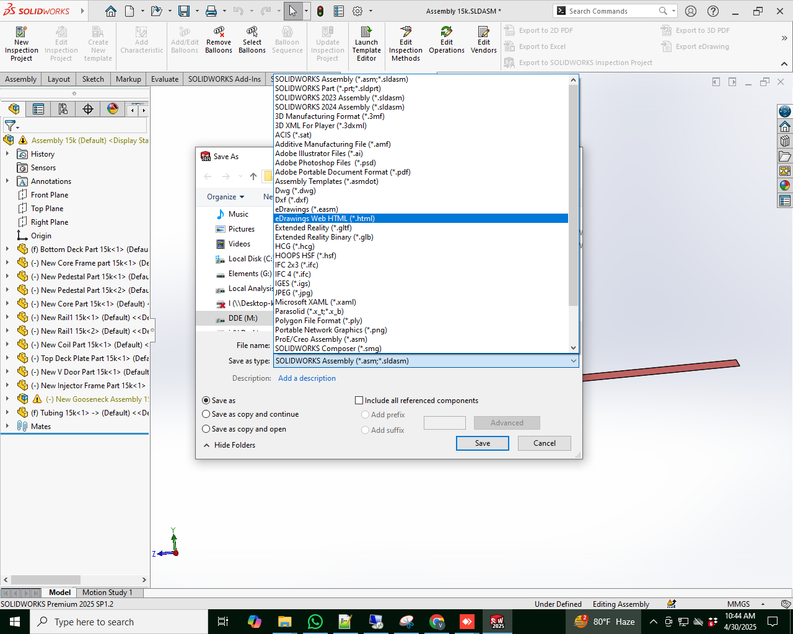

### Naming Conventions

- Do not use spaces. Instead use _ (underscore)
- Do not use "New" or "old" or "Updated" words in filenames (part names or drawing labels)
- Grouping parts by names. An example is below:
  - 01 (decks)
  - 02 (drum related)
  - 03 (injector related)

### Client Presentation

Screenshots

- Use the same background color as the client

Executable

- Send drawings to client in zip format:
- https://www.youtube.com/watch?v=udaPy1Dbd9g

- Send executable to client
  - https://www.javelin-tech.com/blog/2016/08/solidworks-composer-package/
  - https://youtu.be/rJxDryRr2BA

- Save html and send to client:

