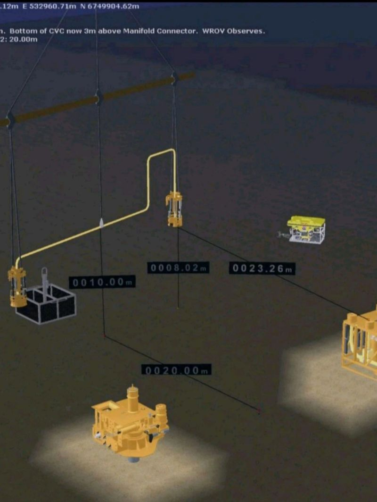
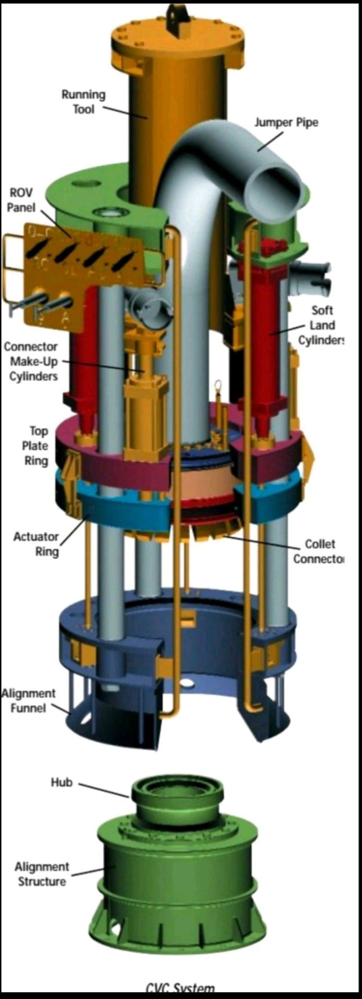

https://www.linkedin.com/posts/ahmedbassiounymohamed_subsea-offshore-oilandgas-activity-7321526069415555073-7qb-?utm_source=share&utm_medium=member_desktop&rcm=ACoAAAFdG9kB103ydcFGign1_8EYQx7YwiUPV4k

The below animation illustrates an overview of vertical jumper installation.
Subsea rigid jumpers with vertically oriented hubs can be installed without using guidelines by running the jumpers on spreader beams from a construction vessel or drilling rig. Installation tools are attached to downward-facing collet connectors at both ends of the jumper, and the rigid spreader beam is attached to the installation tools and the center of the jumper. The jumper is then lowered by crane to its subsea location.
 This procedure requires a vessel with dynamic positioning (DP) and two cranes. If that combination is not available, the jumper can be run on guidelines using a single crane.
 
 Once the integrity of the connections has been verified, the ROV releases the installation tools from the connections
 and the spreader beam from the jumper. The crane then retrieves the spreader beam with the installation tools attached.
Because the installation tools are ROV operated, there’s no umbilical to worry about. The tool’s ROV panel contains the hydraulic control system required to test the connected jumper seal and operate the connector and soft-landing system.
 An alignment funnel guides the initial landing of the tool and connector assembly. Latch dogs in the funnel lock onto the receiver structure as the soft-landing system is engaged to hydraulically force the hub and collet connector faces together.

 hanks for sharing such valuable and fruitful information which i always follow and get benifit from. However, I noticed that the installation method and details mentioned above and illustrated in the video are a bit outdated. Nowadays, the installation and landing techniques have evolved to keep up pace with the upgrades occurrd on the connectors and tie-in , for example ; baker hughes connector now fabricated with torque tool bucket class 5 to close the connector clamp on the hub without need of running tools or even ROV pannel for back seal test, even the deployment of the jumper rarely happened using two cranes , mostly using one crane and in a few cases using A/R winch to support the crane.
Also, it’s very difficult to retrieve the spreader bar with the installation tools attached because the CoG will be variy from that while the installation, therefore, the spreader bar recovered firstly to deck or supply vessel, then the retrieval of the running tools come after. 

Finally, Thank you because i have learnt from you a lot in the subsea field.

Subsea rigid jumpers with vertically oriented hubs can be installed without using guidelines by running the jumpers on spreader beams from a construction vessel or drilling rig. Installation tools are attached to downward-facing collet connectors at both ends of the jumper, and the rigid spreader beam is attached to the installation tools and the center of the jumper. The jumper is then lowered by crane to its subsea location.
 This procedure requires a vessel with dynamic positioning (DP) and two cranes. If that combination is not available, the jumper can be run on guidelines using a single crane.
 On guideline less installations, an ROV monitors the operation, transmitting images to the surface to guide lowering of the jumper onto the hubs. After the jumper is in position, the ROV operates valves on the installation tools to lock the collet connectors to their hubs and pressure test the gaskets as per attached figure which contains detailed view for CVCRT
 Once the integrity of the connections has been verified, the ROV releases the installation tools from the connections
 and the spreader beam from the jumper. The crane then retrieves the spreader beam with the installation tools attached.
Because the installation tools are ROV operated, there’s no umbilical to worry about. The tool’s ROV panel contains the hydraulic control system required to test the connected jumper seal and operate the connector and soft -landing system.
 An alignment funnel guides the initial landing of the tool and connector assembly. Latch dogs in the funnel lock onto the receiver structure as the soft -landing system is engaged to hydraulically force the hub and collet connector faces together.
 
 
 

 

 