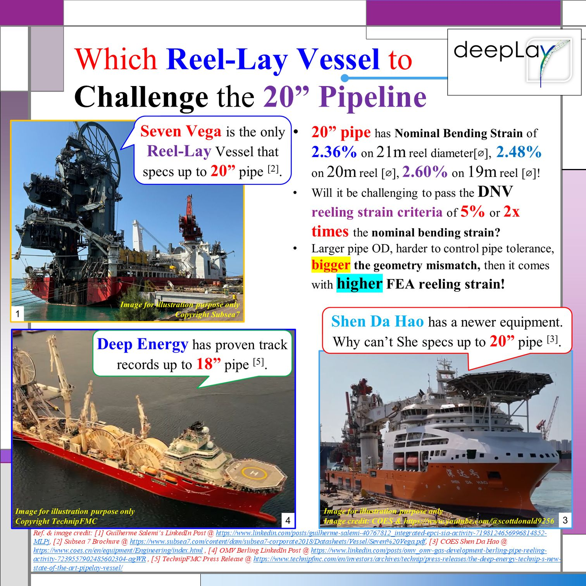
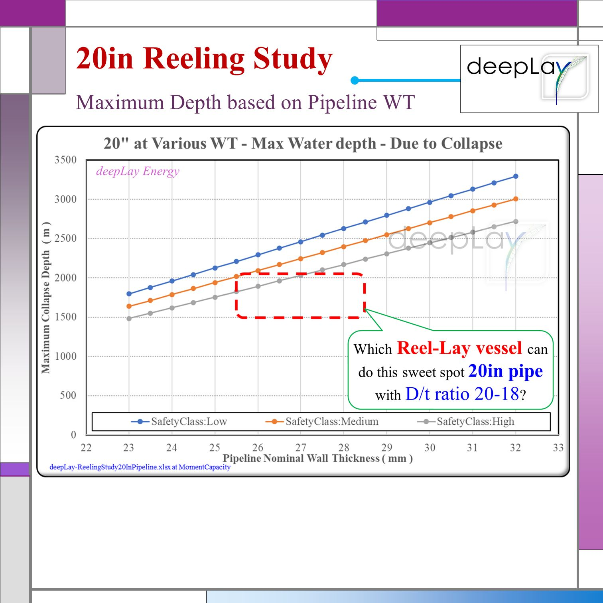
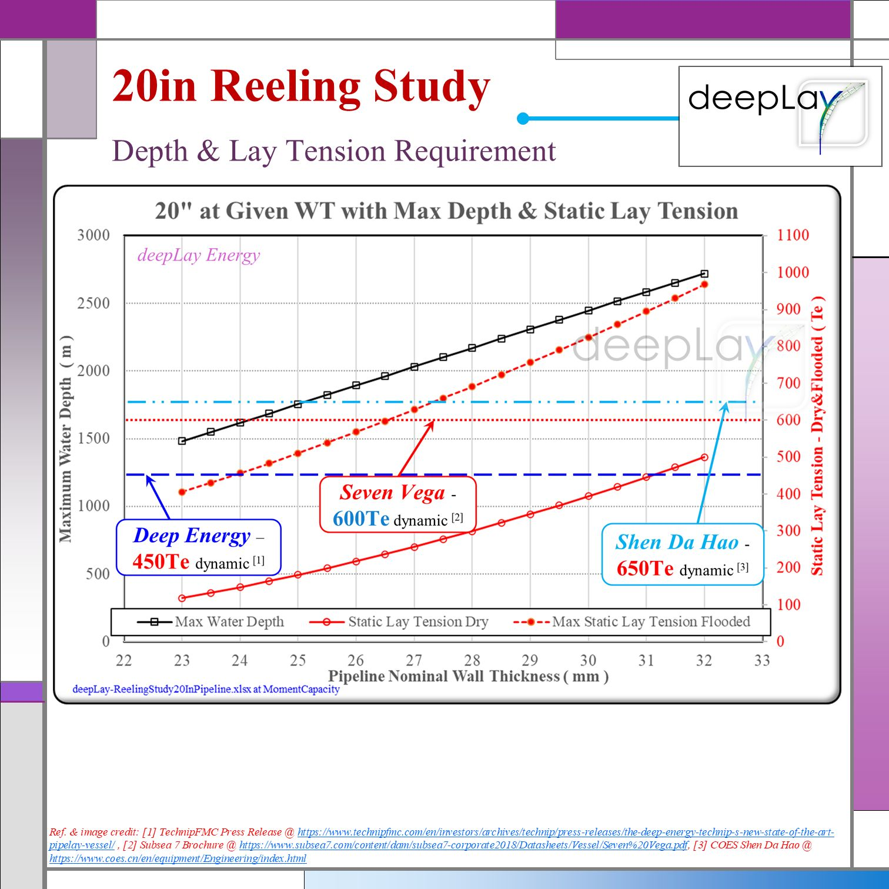
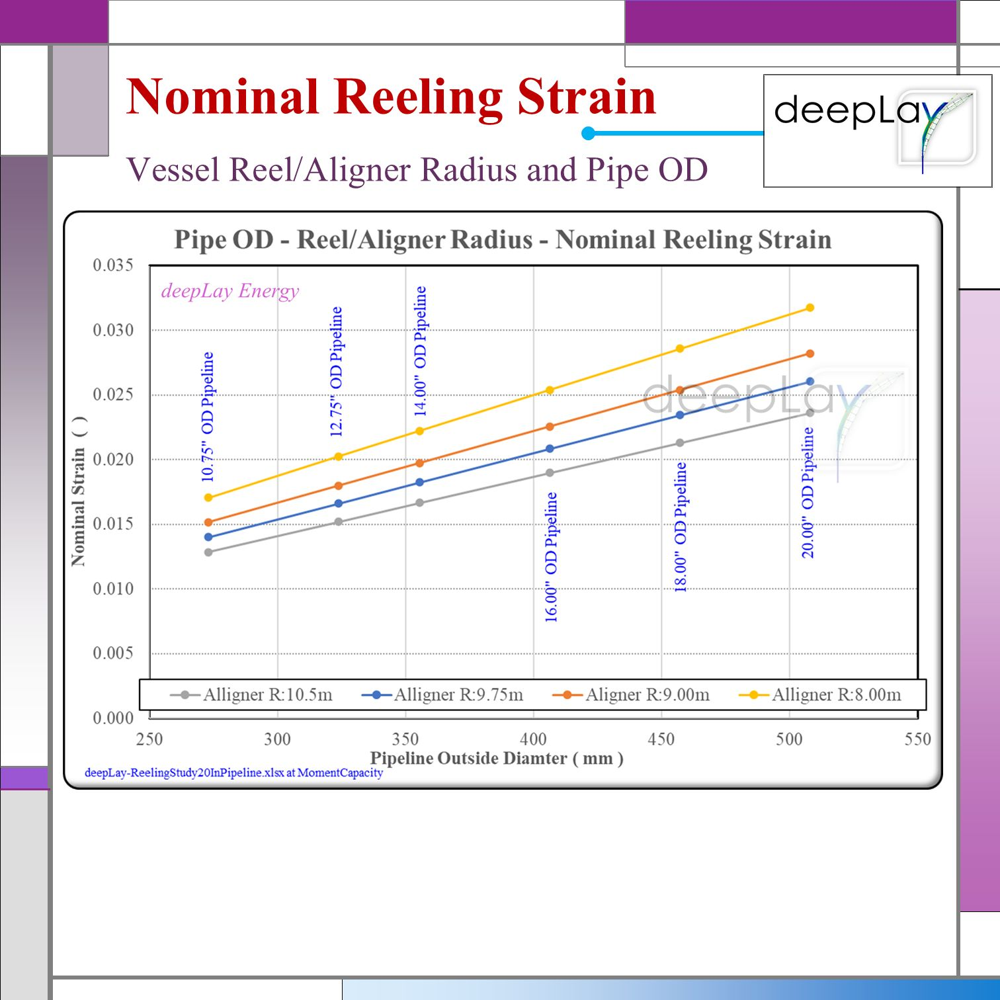
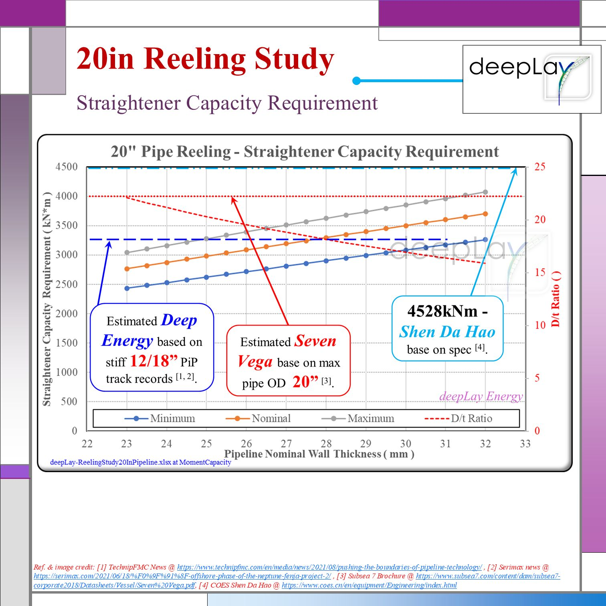

??? ????????-???? & ?????? ?????? 20-???????? ???????????????? ???
Can a hashtag#ReelLay Vessel ?? enter the deepwater?WD1,500 to 2,000m?hashtag#JLay market, particularly for installing a 20-inch ???????????????????? ???????????????? ?????????????????????????? ???? ?? ?????????? ???????????????? ?????????? [ hashtag#SCR ]?

Which hashtag#ReelLay vessel in the market is capable of handling this 20-inch ???????????????? ?????????????????????????
Can either of hashtag#SevenVega, hashtag#ShenDaHao, hashtag#DeepEnergy, hashtag#SevenOceans or hashtag#DeepBlue lay the 20-inch pipeline?

To approach this with sound engineering considerations, please have a thought about the following questions:
#1) Is it feasible to install the SCR without causing high strain at each weld joint due to ???????????????? ?????? ???????????????? ?????????????????
#2) What is the optimal range of ??/?? ?????????? for reeling a 20-inch pipeline to account for acceptable ???????????????? ???????????????
#3) What is the ???????????????? ???????? / ?????????????? ???????????????? without requiring a heavy wall design?
#4) If the pressure collapse design requires a heavy wall, what will be the main challenge regarding accidental ?????????????? ?????? ???????????????
#5) Does the?????????????????? ?????? ???????????????????????? have sufficient capacity to handle the 20-inch pipe?

