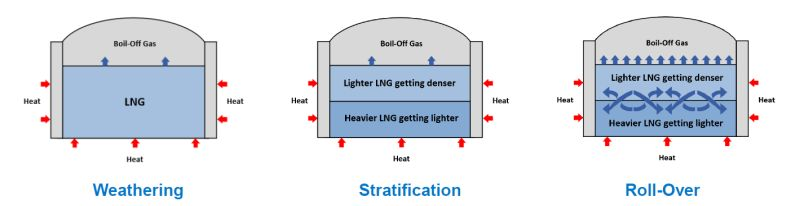

In LNG import terminals, receiving cargoes from different suppliers often results in variations in LNG density. When this LNG is transferred into a storage tank containing a heel, stratification can occur especially if a denser LNG is introduced beneath a lighter one, or a lighter LNG is introduced above a denser one. This creates a layered LNG system within the tank. 

The upper layer behaves as expected, gradually boiling off. As evaporation cools the surface, its density increases slightly, forming internal convection currents. Eventually, BOG (boil-off gas) generation from this layer decreases. 

The lower layer, however, absorbs heat but doesn’t evaporate due to the static pressure from the upper layer. It becomes superheated, a liquid above its boiling point. Without surface evaporation, there's no cooling effect, so it continues to warm and decrease in density. 

Once the densities of both layers equalize, the superheated bottom layer rises. On reaching the surface, it violently flashes, releasing a large volume of vapor. 

If this sudden BOG release is not properly managed via flaring or pressure relief, it can cause over-pressurization, tank damage, and hazardous vapor release. Rollover is a credible overpressure scenario in cryogenic tanks and must be addressed in tank safety design. 

The P&ID of cryogenic tanks typically includes several critical instruments. One of the most vital is the LTD sensor (Level, Temperature, Density). With high accuracy, LTD readings enable early detection of stratification, ensuring safe tank operation by monitoring temperature and density variations along the LNG column. 

The recommended practice is to introduce  the incoming LNG in a way that prevents layering. If the incoming LNG is lighter, it should be injected below the denser heel. If it’s heavier, it should be injected above the heel. This promotes homogenization and minimizes stratification risk. 

As per NFPA 59A, measures must be implemented to prevent stratification and uncontrolled vapor evolution during LNG transfers to mitigate rollover risk. 

Feel free to share your thoughts and add any insights in the comments below. 

Image Source: https://lnkd.in/esWqy-YZ

https://www.youtube.com/watch?v=a4ej9FA_DD4