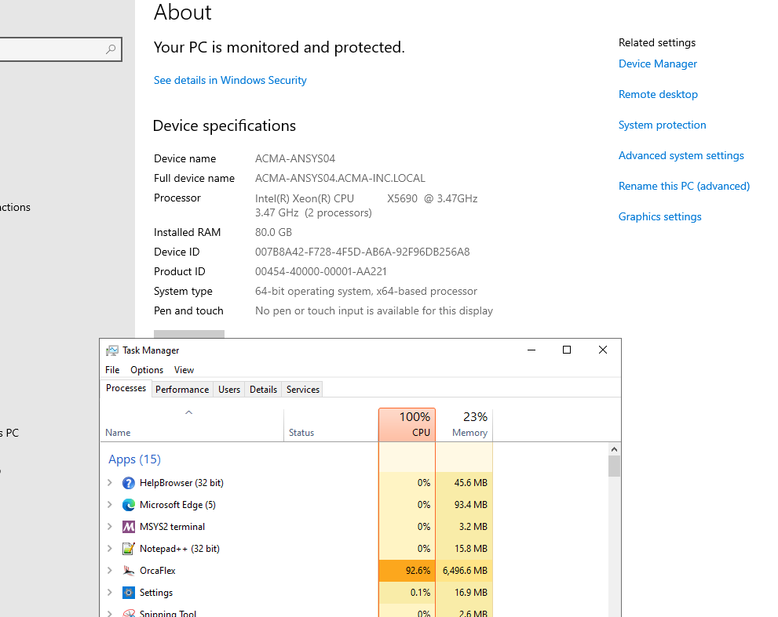

## Summary

Based on casestudy results, 
each Xeon core has 2 threads. For 11 threads,
CPU utilization : 100% ()

RAM utilization : 20% (10 GB) ~ 1 GB per core (2 GB per core with safety factor of 2)

Way foreard
https://store.supermicro.com/us_en/customer/configurations/

## CPU Analysis 

CPU with single thread
https://www.intel.com/content/www/us/en/products/sku/240359/intel-xeon-6740e-processor-96m-cache-2-40-ghz/specifications.html

Intel® Xeon® Gold 6548Y+ Processor 32-Core 2.50GHz 60MB Cache - 5th Gen
Intel® Xeon® Gold 6548N Processor 32-Core 2.50GHz 60MB Cache - 5th Gen
Intel® Xeon® Platinum 8562Y+ Processor 32-Core 2.80GHz 60MB Cache - 5th Gen

## Casestudy

### OS Communication with SuperMicro

Mark

Name:
Vamsee Achanta
E-mail:
vamsee.achanta@aceengineer.com
What can we help you with?
Configure/Quote for Server(s)
Please Enter Your Supermicro Server/Chassis SKU#? (If Applicable)
Supermicro 2U Mainstream SuperServer (SYS-621P-TR)

Show more
Mark 12:29 PM
Hi there! We have recently added new GOLD systems that ship within 24 hours! You can view them here: https://store.supermicro.com/us_en/systems/gold-series.html
Hi Vamsee
Vamsee Achanta 12:30 PM
hello...
Mark 12:30 PM
How can I help you today?
Vamsee Achanta 12:30 PM
I am looking for this configuration
https://store.supermicro.com/us_en/configuration/view/index/?cid=1000339662&9803=
Mark 12:31 PM
Would like to know the ETA?
Vamsee Achanta 12:32 PM
does it come with a desktop OS that can be added to it
The server OS seems to be going into the roof
Mark 12:32 PM
We only offer Windows server/
Vamsee Achanta 12:32 PM
if I want to buoy a desktop software, where do I get it from?
Mark 12:32 PM
Was there particular OS you would like to run?
Vamsee Achanta 12:33 PM
latest windows I guess...
latest windows OS i guess.
Mark 12:33 PM
Windows 11 pro?
Vamsee Achanta 12:33 PM
yes..
can you add it in?
or does it already come with it?
Mark 12:34 PM
This system hasn't been certified with Windows 11 pro
https://www.supermicro.com/en/support/resources/certification/SYS-621P-TR
image.png
but its possible it can work.
I would need to verify with the PM.
Vamsee Achanta 12:35 PM
please can you quickly verify so that we can place the hardware order?
Mark 12:35 PM
Please give me a moment to do this.
Vamsee Achanta 12:35 PM
also find out if we can add the Windows 11 Pro OS to the order?
it is easy/economical to buy as a OEM ware..
why is the windows server software so costly at supermicro?
Mark 12:40 PM
I have reached out to PM, I am waiting on a update.
Vamsee Achanta 12:40 PM
sure...
Mark 12:40 PM
Unfortunately we don't have control over price. The price is set by the eStore configurator.
Vamsee Achanta 12:40 PM
I see...
Mark 12:42 PM
I am still waiting on a update.
Vamsee Achanta 12:42 PM
ok sure..
Mark 12:42 PM
Would you like for me to email you back?
Vamsee Achanta 12:42 PM
Can you send an email to me?
yes please...
Mark 12:42 PM
at vamsee.achanta@aceengineer.com?
Vamsee Achanta 12:42 PM
yes Mark. Thank you.
Mark 12:42 PM
I can email you once i get an update.
May i ask who soon do you wish to order?
Vamsee Achanta 12:43 PM
1/ compatibility and 2/ if I can buy the Windows 11 Pro OS from the store
Mark 12:43 PM
Yes i can do this for you.
Vamsee Achanta 12:43 PM
in 2 hours today..
so that I can get the server ready end of next week
should have done this homework 2 weeks ago.. Ohh well..
Read
Write a message…

Powered by

Powered by

### Communications - David Heffernan

Vamsee

I don't think you can get CPUs that only have 1 thread per core.

OrcaFlex will not automatically disable hyperthreading. But it can be disabled in the machine BIOS. You might prefer to configure OrcaFlex to default to use only a set number of threads. There is a registry setting that controls this:

Key: HKEY_LOCAL_MACHINE\Software\WOW6432Node\Orcina\OrcaFlex
Name: DefaultThreadCount
Type: DWORD

If this is not specified then the total number of logical processors as reported by the machine will be used.

Best regards,

David Heffernan

From: Vamsee Achanta <vamseea@acma-inc.com> 
Sent: 18 April 2025 12:06
To: Orcina <orcina@orcina.com>
Cc: Scott McClure <scottm@acma-inc.com>; Bram Weisman <bramw@acma-inc.com>
Subject: RE: Go-by Hardware Configurations

Also is it better to directly get CPU which only allows 1 thread per core so it is a no brainer and no need to fiddle with anything?

Thank you for accommodating these piecemeal questions. They are coming across as I know more.

Thank you,
Vamsee

From: Vamsee Achanta 
Sent: Friday, April 18, 2025 5:50 AM
To: Orcina <orcina@orcina.com>
Cc: Scott McClure <scottm@acma-inc.com>
Subject: RE: Go-by Hardware Configurations

On the hyperthreading (2 threads per core) subject, did you find that 1 thread per core is faster? 

Also, does Orcaflex automatically switch it off (or) is there a setting that we can use to switch it off in OrcaFlex or can be done in OS level?

From: Orcina <orcina@orcina.com> 
Sent: Friday, April 18, 2025 4:21 AM
To: Vamsee Achanta <vamseea@acma-inc.com>
Cc: Scott McClure <scottm@acma-inc.com>
Subject: RE: Go-by Hardware Configurations

Vamsee

We have some information on our website:

https://www.orcina.com/support/hardwarerequirements/
https://www.orcina.com/support/hardwarerequirements/benchmark/

Specifically, the benchmark program allows you to evaluate machines. If you have a hardware supplier that has machines to hand, then you may be able to get them to use the benchmark program on your behalf.

GPU isn't relevant for simulation performance because OrcaFlex simulations run on the CPU.

The linear rule you mention, I guess is that scaling is linear with number of cores. This isn't generally true. Linear scaling is the holy grail, but I never seen it. In reality other factors come in to play. For instance, memory performance tends to stop you reaching linear scaling. The benchmark program will give you a strong indication of what actual throughput can be achieved.

We can't actually offer specific guidance on machine choice because the field is changing so rapidly. But generally speaking, more cores is better if there is sufficient memory, and sufficient memory throughput to support them. Hyperthreading (two threads per core) is generally unhelpful and we tend to disable it.

Best regards,

David Heffernan

From: Vamsee Achanta <vamseea@acma-inc.com> 
Sent: 18 April 2025 00:27
To: Orcina <orcina@orcina.com>
Cc: Scott McClure <scottm@acma-inc.com>
Subject: RE: Go-by Hardware Configurations

Dear Support Team,

We understand the more cores, it is better throughput assuming the linear rule. Typically, we run many parallel variation runs on our model.

Specifically, please pass on any GPU vs. CPU benchmark tests that we can relate to make decisions on the compute requirements.

Thank you very much,
Vamsee

From: Vamsee Achanta 
Sent: Thursday, April 17, 2025 5:14 PM
To: Orcina <orcina@orcina.com>
Subject: Go-by Hardware Configurations

Dear Support Team,

Do you have typical hardware configurations on your website (or by email) that we can refer to as go-by before we choose one of them? 

I reviewed the below link however would like to see typical hardware req chosen by the software users before deciding on one based on budget. Our budget is between USD 10,000 to USD 20000:
OrcaFlex benchmark

Thank you very much,
Vamsee

## Resources

https://youtu.be/xJNkEzy3-O4?si=5Ia6y_Ae7faV-Ms5

https://www.orcina.com/support/hardwarerequirements/
https://www.orcina.com/support/hardwarerequirements/benchmark/
