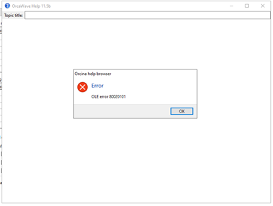

I am able to open the help page directly. You may need to reopen the application or sign out and back in.

 

From: Vamsee Achanta <vamseea@acma-inc.com> 
Sent: Thursday, February 13, 2025 11:36 AM
To: Adam Rivera <arivera@rockit-consulting.com>; Scott McClure <scottm@acma-inc.com>
Subject: RE: [EXT]Blockage of Java-script on ANSYS03 and ANSYS04 servers

Adam, Tried on ANSYS04. No luck.

From: Adam Rivera <arivera@rockit-consulting.com> 
Sent: Thursday, February 13, 2025 11:32 AM
To: Scott McClure <scottm@acma-inc.com>
Cc: Vamsee Achanta <vamseea@acma-inc.com>
Subject: RE: [EXT]Blockage of Java-script on ANSYS03 and ANSYS04 servers

Ah, that would make sense. It’s using IE. I turned off the enhanced security that is on by default on servers. Please try again.

From: Scott McClure <scottm@acma-inc.com> 
Sent: Thursday, February 13, 2025 11:17 AM
To: Adam Rivera <arivera@rockit-consulting.com>
Cc: Vamsee Achanta <vamseea@acma-inc.com>
Subject: [EXT]Blockage of Java-script on ANSYS03 and ANSYS04 servers

Adam,

Can you look into why this is happening on the ANSYS03 and ANSYS04 servers please.
Vamsee got this message back from Orcina on this issue.

Dear Vamsee,

Some policy on your computer is blocking the javascript we use in the built-in help browser. You must contact your own IT service to look into this further.
In the meantime, I am glad to hear that you should be able to use the internet help until the local difficulty is resolved.
I hope that your IT service can assist you with the blockage.

Regards,
Colin Lewis.
Orcina,Ltd

Thanks,
Scott

Scott C. McClure, P.E.
President
 
2929 Briarpark Dr, Suite 220
Houston, TX  77042
O) 713 789 1840
C) 832 419 4068
scottm@acma-inc.com 

Dear Vamsee,

Some policy on your computer is blocking the javascript we use in the built-in help browser. You must contact your own IT service to look into this further.

In the meantime, I am glad to hear that you should be able to use the internet help until the local difficulty is resolved.

I hope that your IT service can assist you with the blockage.

Regards,

Colin Lewis.
 
T :  +44(0)1229 584742
E :  orcina@orcina.com
W:  www.orcina.com
     

From: Vamsee Achanta <vamseea@acma-inc.com> 
Sent: 13 February 2025 17:00
To: Orcina <orcina@orcina.com>
Cc: Scott McClure <scottm@acma-inc.com>; Adam Rivera <arivera@rockit-consulting.com>; Dusty Hardin <dustyh@acma-inc.com>
Subject: RE: Orcina | Help Website Access on Analysis Servers | OLE error 80020101

Yes, I am able to access the default web help start file. So, the F1 does not work from the GUI.

Any further thoughts?

From: Orcina <orcina@orcina.com> 
Sent: Thursday, February 13, 2025 10:34 AM
To: Vamsee Achanta <vamseea@acma-inc.com>
Cc: Scott McClure <scottm@acma-inc.com>; Adam Rivera <arivera@rockit-consulting.com>; Dusty Hardin <dustyh@acma-inc.com>
Subject: RE: Orcina | Help Website Access on Analysis Servers | OLE error 80020101

Dear Vamsee,

The OrcaFlex help uses mathjax to render equations in a well-presented way.

This error code is sometimes associated with javascript errors, so could your machines be blocking use of java in browsers?

Can you access the web help starting at https://www.orcina.com/webhelp/OrcaFlex/Default.htm ?

I hope that something here helps.

Regards,

Colin Lewis.
 
T :  +44(0)1229 584742
E :  orcina@orcina.com
W:  www.orcina.com
     

From: Vamsee Achanta <vamseea@acma-inc.com> 
Sent: 13 February 2025 15:55
To: Orcina <orcina@orcina.com>
Cc: Scott McClure <scottm@acma-inc.com>; Adam Rivera <arivera@rockit-consulting.com>; Dusty Hardin <dustyh@acma-inc.com>
Subject: Orcina | Help Website Access on Analysis Servers | OLE error 80020101

Dear Support Representative,

The help documentation is not accessible on my analysis machine.

However, on another machine with demo version, it is accessible. Please can you let us know why this error may happen on 1 machine?

Thank you,
Vamsee

From: Vamsee Achanta 
Sent: Wednesday, February 12, 2025 11:16 PM
To: Dusty Hardin <dustyh@acma-inc.com>
Cc: Scott McClure <scottm@acma-inc.com>
Subject: Orcina | Help Website Access on Analysis Servers

Dusty,

Please can you help coordinate with IT to get the help directly on ANSYS04 (and also ANSYS03). Currently I can get help documents open on my computer but not on ANSYS servers 03, 04. See error below.

 

Thank you,
Vamsee
