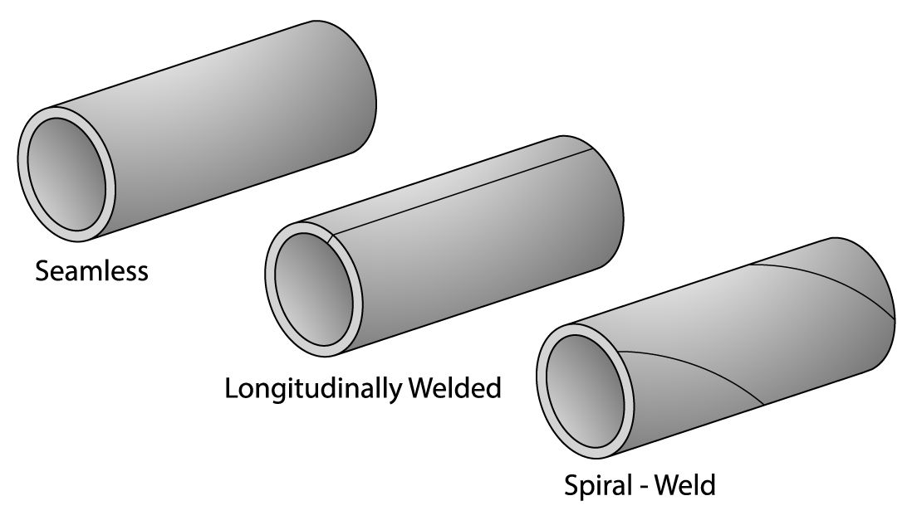

Seamless pipes, longitudinal pipes, and spiral pipes are three types of steel pipes used in various industries, each with distinct manufacturing processes, characteristics, and applications. Here's an overview:

1. Seamless Pipes

Manufacturing Process: Seamless pipes are made from a solid cylindrical piece of steel (a billet) that is heated and pierced to form a hollow tube. They don?t have any weld seams.

Characteristics:

High strength and durability.

No weld joints, ensuring uniform structure and resistance to pressure and corrosion.

Can withstand high temperatures and pressures.

Applications: Oil and gas pipelines, power plants, boilers, and high-pressure equipment.

---

2. Longitudinal Welded Pipes (ERW or LSAW)

Manufacturing Process: These pipes are made by bending a steel plate into a cylindrical shape and welding along the longitudinal seam. Common welding techniques include Electric Resistance Welding (ERW) or Longitudinal Submerged Arc Welding (LSAW).

Characteristics:

Uniform wall thickness.

Economical for long runs of pipelines.

Suitable for medium to high-pressure applications.

Applications: Water pipelines, construction, and structural applications.

---

3. Spiral Welded Pipes (SSAW)

Manufacturing Process: Spiral pipes are made by spirally bending a steel coil and welding the edges together along a helical seam.

Characteristics:

Can be produced in larger diameters compared to longitudinal pipes.

Lower manufacturing costs due to the use of coils.

Higher flexibility for different pipe sizes and thicknesses.

Applications: Water transmission, dredging pipelines, and low to medium-pressure fluid transport.

---

Key Differences:

Seamless Pipes: No seams, used for high-pressure and high-temperature applications.

Longitudinal Pipes: Welded along the length, ideal for straight runs of pipelines.

Spiral Pipes: Welded helically, cost-effective for large-diameter pipelines.

Choosing the right pipe type depends on the specific requirements of the project, such as pressure, temperature, diameter, and budget.

