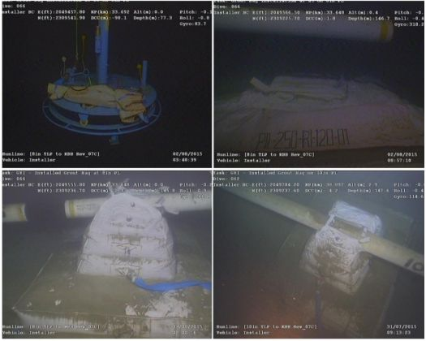

Anomaly Criteria for Free Span of Subsea Pipelines

The allowable free span length depends on pipeline diameter, environmental conditions, and hydrodynamic effects.
* Critical Span Length (Lcr): Determined based on pipeline diameter, wall thickness, operational pressure, and environmental loading.
* Free spans exceeding the calculated allowable span length for a given fatigue life are anomalies.

Excessive Deflection & Sagging (Static Loads)
* Pipeline Sagging: If the vertical deflection of the pipeline exceeds 10% of the pipeline diameter, it is considered excessive.
* Uneven seabed settlement leading to plastic deformation may trigger intervention.
* Free spans caused by localized seabed mobility (sand waves, sediment transport, or soil liquefaction) should be corrected 

Grout Bag Installation for Free Span Correction:
1- Identify span location, dimensions, and seabed conditions.
2-Deploy pre-fabricated grout bags (single or multiple layers depending on required support).
3- Position bags under the span using divers or ROVs.
4- Use cementitious grout mixed with anti-washout additives.
5- Ensure controlled filling to prevent overloading the pipeline.
6- Allow 24-48 hours curing before re-evaluating.
7-Perform ROV post-installation survey.

Free Span Length Calculation for Subsea Pipelines:

The maximum allowable free span length (Lmax) is calculated based on structural integrity, fatigue life, and vortex-induced vibration (VIV) effects.
The governing equations are derived from DNV-ST-F105 and DNV-RP-F105.

Step 1: Define Input Parameters

Before performing calculations, we need:
D = Pipeline outer diameter (m)
t = Pipe wall thickness (m)
ρw = Seawater density (kg/m³)
ρs = Pipeline steel density (kg/m³)
ρc = Content density (kg/m³)
E = Young’s modulus of pipe material (Pa)
ν = Poisson’s ratio of the material
g = Gravitational acceleration (9.81 m/s²)
h = Water depth (m)
U = Current velocity (m/s)
Δ = Submerged weight per unit length (N/m)
Now, let’s calculate Lmax for a given pipeline.

Step 2: Calculate Submerged Weight per Unit Length (Δ)
Δ=π((D²−(D−2t)² ​)/4 )(ρs​−ρw​)g

Step 3: Calculate Maximum Allowable Free Span (Lmax)
Lmax​=(8EI/ Δ)^1/4
I = Moment of inertia = π/64(D⁴−(D−2t)⁴)
Lmax must not exceed allowable bending stress criteria.

Practical Example Calculation

Given Data:
D = 0.6 m (24-inch pipeline)
t = 0.02 m (20 mm wall thickness)
E = 2.1 × 10¹¹ Pa (Carbon steel)
ρs = 7850 kg/m³, ρw = 1025 kg/m³
U = 1.2 m/s (Current velocity)
ν = 0.3, g = 9.81 m/s²

Let’s run this calculation now.
Calculation Results for Free Span of a 24-inch Pipeline
Maximum Allowable Free Span (Static Bending Limit): 32.06 m

So, If the free span exceeds 32.06 m, the pipeline is at risk of excessive bending stress and may require grout bag support.

The attached photo is credited by https://offshore-ocs.com/

BS PD8010-2 is also an excellent code of practice for referencing in subsea pipeline design.

