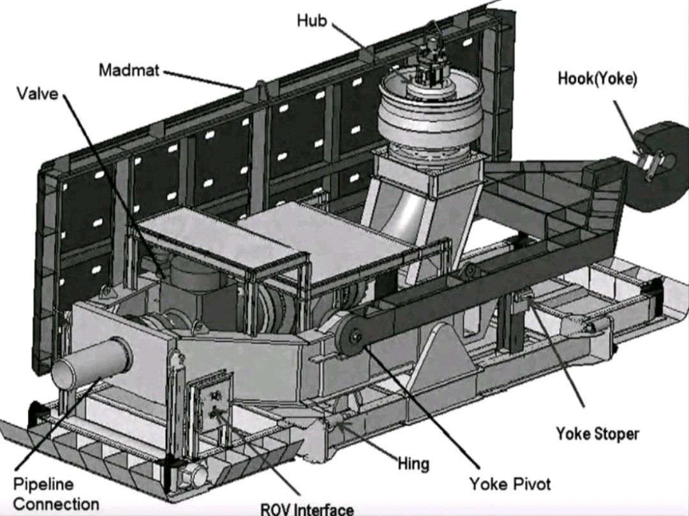
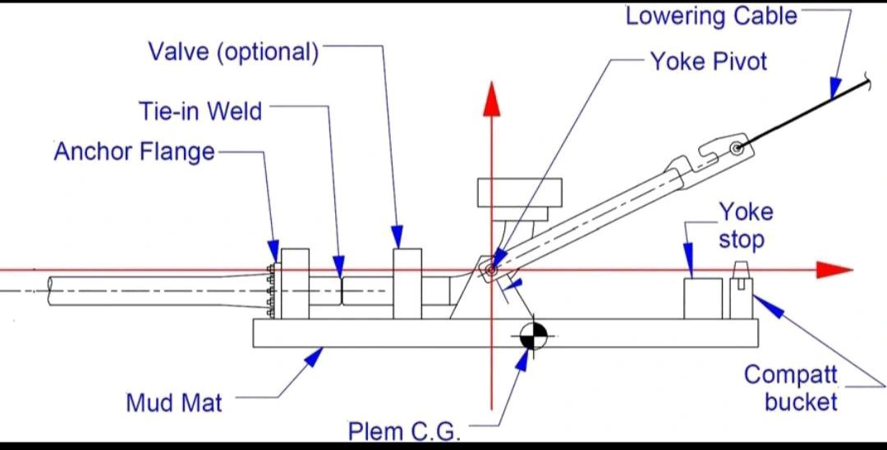

Subsea PLEM (Pipeline End Manifold)

The purpose of the subsea PLEM is to provide an installation structure to attach these piping components and then lower them to the seafloor in the desired orientation. The structure must not only withstand the installation loads while being lowered to the seafloor, but also retrieval to the surface should a failure occur. Figure below shows a typical configuration for a PLEM.
 Subsea PLEM can be any configuration, but generally is made up of the following
assemblies:
• Piping system and components;
• Structural frame, which supports the piping and components 
• Foundation (mudmat), which distributes the loads to the seabed while minimizing settlement;
• Installation yoke, which is hinged to the structural frame, to minimize
torsion-related rotation of the PLEM pipeline assembly during installation and laydown of the PLEM onto the seabed.

The PLEM foundation provides support for the structural frame of the
piping system. In addition to their normal functions, PLEMs are designed to accommodate reasonable thermal expansion of the pipeline during operation. To accommodate for this movement, the design is based on a stationary mudmat foundation that supports a moving pipe support frame, which allows the pipeline end to slide on the frame. 
The preliminary foundation center section for a foldable mudmat is selected with a width and length that is based on the nominated installation vessel-handling capabilities. The foundation section geometry is further developed by providing folding wings on each side of the center section to obtain the required foundation area to support the anticipated loads on the PLEM.

