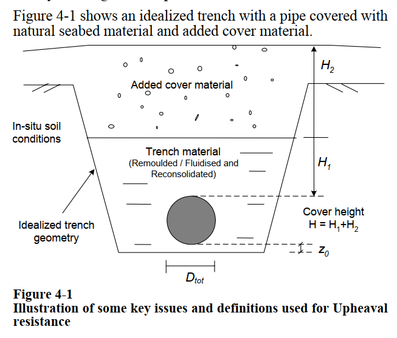
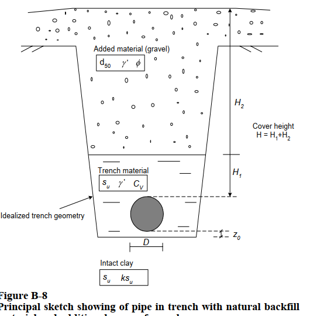
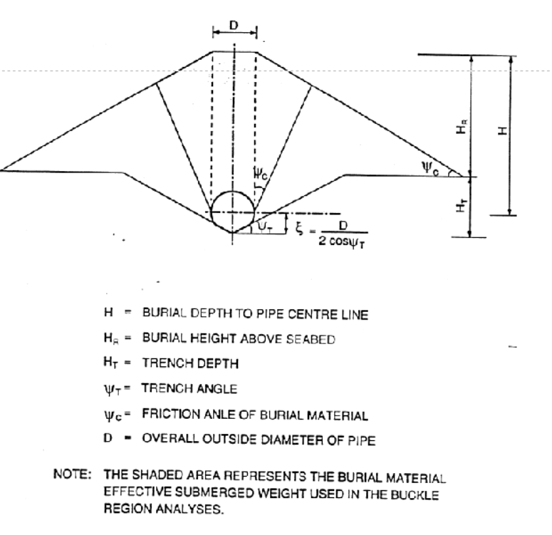

## Introduction

Upheaval buckling occurs when a buried or trenched pipeline, put into axial compression by thermal expansion and internal pressure, cannot move sideways and instead vents that compression vertically at an out-of-straightness such as an overbend. It is resisted by the download available from the pipe's submerged weight plus the uplift resistance of the cover, so the design levers are cover depth and imperfection sharpness rather than lateral friction. The surface-laid counterpart is [lateral buckling](lateral_buckling.md).

Objective:  Estimate the thermal movement and associated reaction forces for single pipe or Pipe-in-Pipe (PIP) systems.

## Summary

### Input data

- Pipe properties
  - Pipe diameter
  - Pipe wall thickness
  - Pipe material properties
    - Young's modulus
    - Poisson's ratio
    - Yield strength
    - Thermal expansion coefficient
  - internal fluid
    - density
    - internal pressure
    - topside elevation w.r.t MSL

  - corrosion allowance
  - average metal loss due to internal corrosion
  - insulation
    - insulation thickness
    - insulation density
  - COrrosion Coating
    - Coating thickness
    - Coating density
  - Concrete Coating
    - Concrete water absorption rate (%)
    - Concrete thermal conductivity
    - Concrete density
    - concrete thickness

- Pipeline length
- Pipe Temperature (along length)
- water depth (along length)
- Soil properties
  - Axial friction coefficient
  - lateral breakout coefficient
- Pipe boundary conditions
  - tension/resistance at start
  - tension/resistance at end
- Route
  - lay tension
  - Route Curve radius

## Illusratoins

