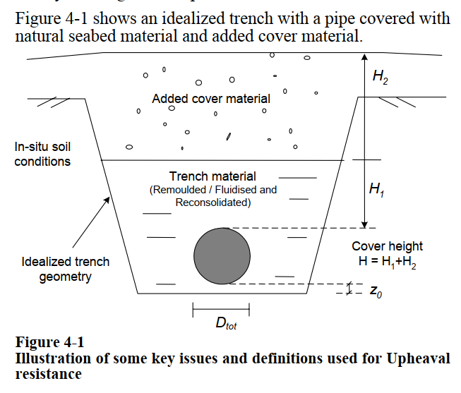
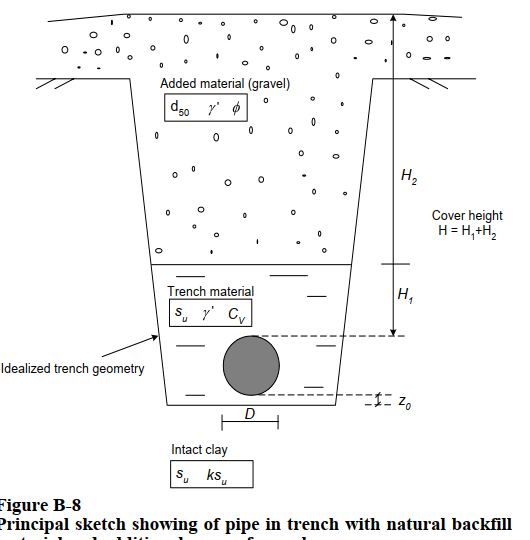
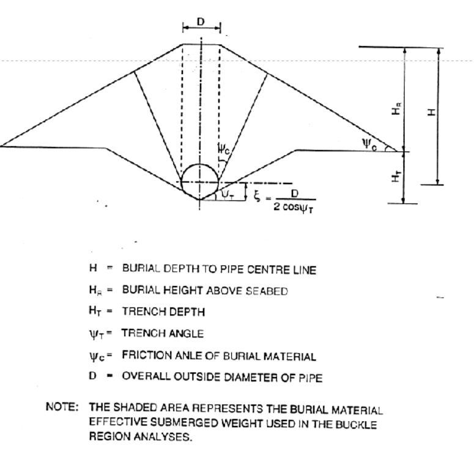

## Introduction

Lateral buckling of pipelines is a phenomenon that occurs when a pipeline is subjected to thermal expansion or contraction. This can cause the pipeline to buckle laterally, which can lead to damage or failure of the pipeline. Lateral buckling can be caused by a number of factors, including temperature changes, pressure changes, and external forces. It is important to design pipelines to prevent lateral buckling and to ensure that they are safe and reliable.

Objective:  Estimate the thermal movement and associated reaction forces for single pipe or Pipe-in-Pipe (PIP) systems.

## Summary

### Input data

- Pipe properties
  - Pipe diameter
  - Pipe wall thickness
  - Pipe material properties
    - Young's modulus
    - Poisson's ratio
    - Yield strength
    - Thermal expansion coefficient
  - internal fluid
    - density
    - internal pressure
    - topside elevation w.r.t MSL

  - corrosion allowance
  - average metal loss due to internal corrosion
  - insulation
    - insulation thickness
    - insulation density
  - COrrosion Coating
    - Coating thickness
    - Coating density
  - Concrete Coating
    - Concrete water absorption rate (%)
    - Concrete thermal conductivity
    - Concrete density
    - concrete thickness

- Pipeline length
- Pipe Temperature (along length)
- water depth (along length)
- Soil properties
  - Axial friction coefficient
  - lateral breakout coefficient
- Pipe boundary conditions
  - tension/resistance at start
  - tension/resistance at end
- Route
  - lay tension
  - Route Curve radius

## Illusratoins

