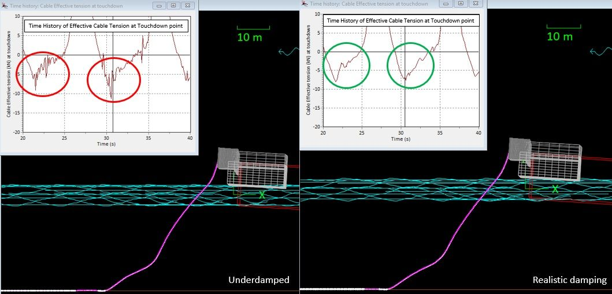

Damping for in-air and in-water structures.

Add structural damping (typ. 5% theoretical) for flexibles and umbilicals. This damping is inherent structural damping due to cable material (polyurethane, steel layers, etc), we typically get the recommended value from manufacturer and can be used directly. Any higher values will need justification.

### Offshore Independents

<https://www.linkedin.com/posts/offshore-independents_orcaflex-researchanddevelopment-marineengineering-activity-7272192608909639680-u-qL?utm_source=share&utm_medium=member_desktop>

At Offshore Independents, we are continually working on the improvement of our simulation models. A very challenging aspect of our OrcaFlex models concerns fluid-structure interactions.

For example, we have found that our cable installation models can be quite sensitive to the damping input. Usually, it is necessary to add damping to these models to the part of the cable in air, since otherwise the cable will be underdamped and will exhibit a non-physical resonant response.

Accurately modelling the cable damping requires special attention to tailor the settings specifically to each model. It is paramount to avoid over- or underdamping of the cable system as this can result into inaccurate data output by OrcaFlex.

After a thorough R&D program within Offshore Independents, checking engineering codes, software manuals and consulting Orcina, we have developed a procedure to check results for any failure cases caused by incorrect damping. The correction to the models is implemented and quality-checked by our Python scripts that link to OrcFxAPI, which is the only way to feasibly handle the extremely large amount of models.

The objective of all of this: we want to remove results that are not realistic, to achieve as high as possible workability limits for our clients and get the best understanding of the actual behavior during offshore operations of the cable during cable installation. In this way, we can help them to avoid unnecessary vessel standby times, leading to more efficient operations.

Interested in discussing this topic more in depth and want to Nerd.. uh know more about it? Our OrcaFlex engineers are more than happy to help!

