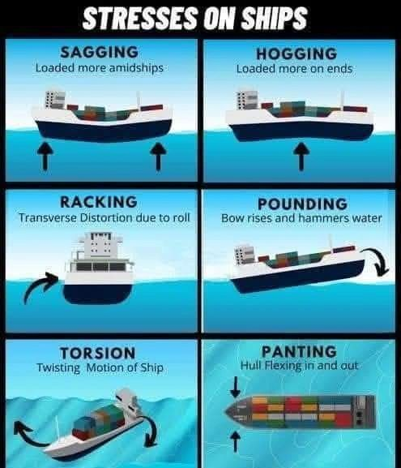

A ship at sea is constantly battling the elements—and it’s not just about staying afloat. Structural stresses can significantly impact a vessel’s 𝐢𝐧𝐭𝐞𝐠𝐫𝐢𝐭𝐲, 𝐩𝐞𝐫𝐟𝐨𝐫𝐦𝐚𝐧𝐜𝐞, 𝐚𝐧𝐝 𝐬𝐚𝐟𝐞𝐭𝐲.
Here are some key stress types every marine professional should recognize:
⚓ 𝐒𝐚𝐠𝐠𝐢𝐧𝐠 – When weight is concentrated midship, causing the vessel to bend downward at the center.
⚓ 𝐇𝐨𝐠𝐠𝐢𝐧𝐠 – The reverse of sagging: heavy loading at bow and stern lifts the middle section upward.
⚓ 𝐑𝐚𝐜𝐤𝐢𝐧𝐠 – Caused by rolling motion, it leads to side-to-side twisting and strains the transverse structure.
⚓ 𝐏𝐨𝐮𝐧𝐝𝐢𝐧𝐠 – Violent slamming of the bow during heavy seas can seriously fatigue the hull over time.
⚓ 𝐓𝐨𝐫𝐬𝐢𝐨𝐧 – Uneven wave impact or cargo loading causes the hull to twist along its length.
⚓ 𝐏𝐚𝐧𝐭𝐢𝐧𝐠 – In-and-out flexing of hull plates under pressure variations—particularly in the bow section.
🛠️ Whether you're in design, operations, or on deck, knowing how to anticipate and mitigate these forces is essential for a safe voyage.
📌 What stress type have you encountered most in your experience at sea?

Source: Engr. Mohamed Khamis,

