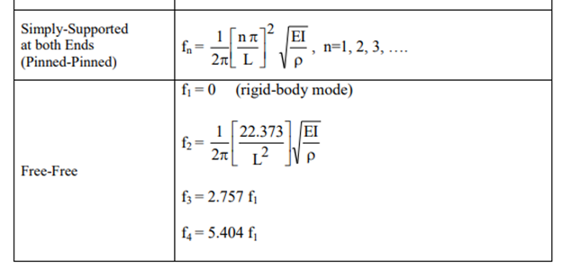

# Introduction

VIV of tubular members is a phenomenon that occurs when a tubular member is subjected to an oscillatory flow. This can cause the tubular member to vibrate, which can lead to damage or failure of the tubular member. VIV can be caused by a number of factors, including flow velocity, flow direction, and tubular member properties. It is important to design tubular members to prevent VIV and to ensure that they are safe and reliable.

## Summary

## Theory

- Flow is steady at 90 degrees to centerline of the tubular.  Cross flow is considered in this calculation as a ratio factor to in-line flow.
- The vortex-induced vibration (VIV) dominated by first mode vibration of the tubular in an oscillatory flow.
- The strong secondary mode dominance and lock-in phenomena only occurs in the case of larger Keulegan-Carpenter (KC) numbers (KC > 56).
- This calculation only considers the mass of the seawater in the flooded tubular and ignores external virtual added mass.

