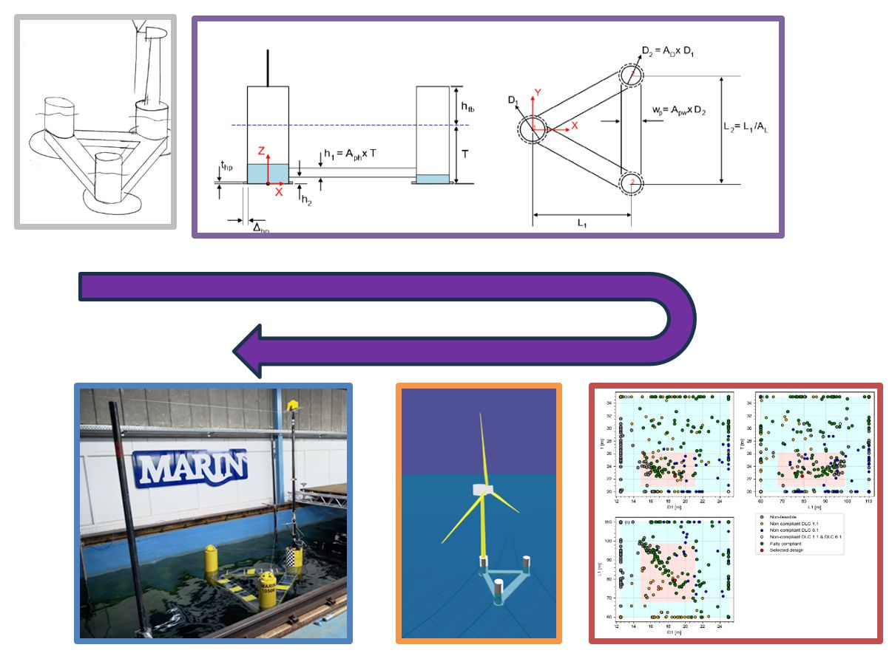

IEA Wind Turbine Design
https://github.com/IEAWindTask37/IEA-15-240-RWT

After a successful webinar, we at MARIN (Maritime Research Institute Netherlands) have shared our work on the development and testing of a generic open-source semi-submersible floating offshore wind turbine (FOWT) floater. 

This floater is intended for co-operative research together with industry into the design challenges and methodologies for industrial scale FOWT platforms. To enhance this research, we have shared:
- Report on how we applied the design methodology
- Report on the design screening frequency domain simulations, as well as the time domain simulations
- Report describing the basin tests
- Processed basin data, as well as video's of each tests

You can find all information on the MARIN website via the link below. There is also a "short" executive summary of the complete work. 

https://lnkd.in/diWjpUHt

