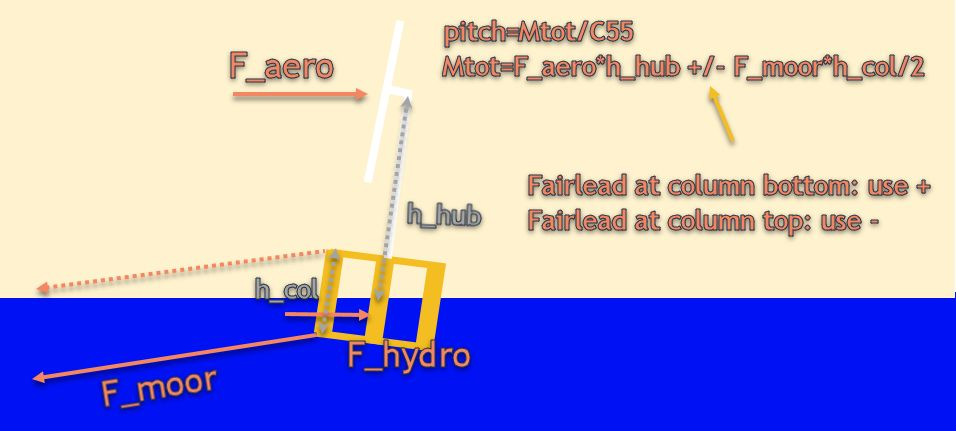

Is fairlead above MSL a good idea for floating wind? Please share your reflections, as this has been bugging me for a few days now.

Lets assume (thats the fun part of engineering):
- Mooring load is close to horisontal (may be ok-ish to assume for taut mooring in shallow waters)
- Floater rotates about a point that is halfway between bottom and top of floater columns, ca at MSL.
- F_hydro=F_aero, such that F_moor=2xF_aero
- F_hydro contribution to pitch is neglible
- h_col=0.2*h_hub (f.ex h_hub=150m, and h_col=30m)

Then the total moment would be (assuming fairlead at bottom, which is the usual):
Mtot=F_aero*h_hub+F_moor*h_col/2=F_aero*h_hub+(2*Faero)*(0.2*h_hub/2)=1.2*F_aero*h_hub
However, is we place the fairlead at the top of the column, we get the mooring force to be a restoring moment, which results in
Mtot=0.8*F_aero, which is an almost 40% reduction in overturing moment.

Change my mind! (or enrich my understanding)

