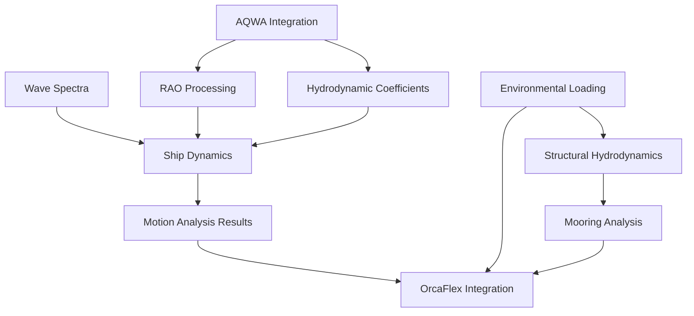

# Marine Engineering Excel to Spec Module Mapping

**Analysis Date:** 2025-10-02
**Source File:** `D:\workspace-hub\_temp\marine_analysis_data.xlsm`
**Purpose:** Map Excel engineering features to existing/new spec modules

---

## Executive Summary

The Excel file contains **9 major engineering systems** that can be organized into **7 spec modules** within `specs/modules/marine-engineering/`. This document maps each Excel feature to appropriate implementation modules and identifies reorganization opportunities.

---

## Feature Mapping Matrix

| Excel Feature | Sheets | Formulas | Target Module | Status | Priority |
|---------------|--------|----------|---------------|--------|----------|
| **RAO Processing** | RAO Check | 49×17 | `rao-processing/` | ✅ Exists | P1 |
| **6DOF Motion** | RAO Check, Periods | ~200 | `ship-dynamics/` | ✅ Exists | P1 |
| **Mooring Analysis** | 7 sheets | 3,869 | 🆕 `mooring-analysis/` | ❌ New | P1 |
| **Wave Spectra** | Implicit | - | 🆕 `wave-spectra/` | ❌ New | P1 |
| **AQWA Integration** | Condition 1 | 135×28 | `rao-processing/` | ✅ Exists | P2 |
| **OrcaFlex Integration** | Multiple | - | `orcaflex-integration/` | ✅ Exists | P2 |
| **Hydrodynamic Coefficients** | Damping | 84×12 | 🆕 `hydrodynamic-coefficients/` | ❌ New | P2 |
| **Environmental Loading** | OCIMF | 1,244 | 🆕 `environmental-loading/` | ❌ New | P2 |
| **Morison Elements** | Morison Elements | 2,419 | 🆕 `structural-hydrodynamics/` | ❌ New | P3 |

---

## Detailed Feature Analysis

### 1. RAO Processing Module ✅
**Current Status:** Implementation Complete (90%)
**Excel Source:** Sheet "RAO Check" (49×17)

#### Excel Features:
- RAO validation with/without damping
- Transfer function calculations
- Frequency-domain analysis
- Phase and magnitude data

#### Existing Spec Coverage:
- ✅ `rao-processing/sub-specs/aqwa-rao-import.md` - AQWA .lis parsing
- ✅ `rao-processing/sub-specs/orcaflex-rao-import.md` - OrcaFlex YAML
- ✅ `rao-processing/sub-specs/rao-validation-framework.md` - Quality validation
- ⚠️ Missing: Damping correction algorithms (from Excel)

#### Excel Implementation Opportunities:
```yaml
new_features:
  - damping_correction_module:
      excel_sheet: "RAO Check, Damping"
      formulas: "Damping coefficients, roll/pitch corrections"
      target: "rao-processing/sub-specs/damping-corrections.md"
```

---

### 2. Ship Dynamics Module ✅
**Current Status:** Active Development
**Excel Source:** Sheets "RAO Check", "Periods" (100×38 combined)

#### Excel Features:
- 6DOF motion calculations (Surge, Sway, Heave, Roll, Pitch, Yaw)
- Natural period calculations
- Motion response in irregular seas

#### Existing Spec Coverage:
- ✅ `ship-dynamics/sub-specs/motion-analysis-6dof.md` - Core specification
- ✅ `ship-dynamics/sub-specs/epic-implementation.md` - Implementation epic
- ⚠️ Missing: Natural period calculation methods (from Excel sheet "Periods")

#### Excel Implementation Opportunities:
```yaml
new_features:
  - natural_periods:
      excel_sheet: "Periods"
      formulas: "50×21 = ~1050 formulas"
      target: "ship-dynamics/sub-specs/natural-period-analysis.md"
```

---

### 3. Mooring Analysis Module 🆕
**Current Status:** NOT EXISTS - HIGH PRIORITY
**Excel Source:** 7 sheets, 3,869 formulas total

#### Excel Sheets Breakdown:
1. **Poly Mooring** (107×22, 695 formulas) - Catenary analysis
2. **Mooring Line Data** (252×17, 1,817 formulas) - Component properties
3. **Chain Data** (60×13, 473 formulas) - Chain specifications
4. **Wire Data** (24×13, 144 formulas) - Wire rope properties
5. **Mooring Nodes** (coordinates)
6. **Mooring Plot** (visualization)
7. **Mooring Equipment** (hardware database)

#### Proposed Module Structure:
```
mooring-analysis/
├── README.md
├── tasks.md
├── sub-specs/
│   ├── catenary-solver.md          # From "Poly Mooring"
│   ├── component-database.md       # From Chain/Wire/Line Data
│   ├── mooring-configuration.md    # From Mooring Nodes
│   ├── tension-analysis.md         # Quasi-static analysis
│   └── equipment-specifications.md # Hardware database
```

#### Excel Features to Extract:
- **Catenary Equations:** Array formulas for polynomial solutions
- **Component Database:** 336 component definitions (Chain: 60, Wire: 24, Line: 252)
- **Breaking Load Formulas:** Grade-dependent calculations
- **Stiffness Models:** Material property relationships

#### Integration Points:
- **OrcaFlex Integration:** Export mooring configurations
- **Ship Dynamics:** Mooring stiffness coupling
- **Passing Ship Forces:** Combined loading scenarios

---

### 4. Wave Spectra Module 🆕
**Current Status:** NOT EXISTS - HIGH PRIORITY
**Excel Source:** Implicit in formulas (27 references)

#### Excel References:
- JONSWAP spectrum: 15 references
- Pierson-Moskowitz: 12 references
- Spectral moment calculations
- Frequency binning and integration

#### Proposed Module Structure:
```
wave-spectra/
├── README.md
├── tasks.md
├── sub-specs/
│   ├── jonswap-spectrum.md
│   ├── pierson-moskowitz-spectrum.md
│   ├── spectral-moments.md
│   ├── directional-spreading.md
│   └── irregular-wave-synthesis.md
```

#### Excel Implementation Opportunities:
```python
# From Excel Summary (lines 166-183)
class WaveSpectrum:
    """
    Excel implements:
    - JONSWAP: S(ω) = αg²/ω⁵ * exp(-1.25(ωp/ω)⁴) * γ^exp(...)
    - P-M: Simplified JONSWAP with γ=1
    - Moments: m_n = ∫ ω^n S(ω) dω
    - Hs = 4√m₀
    """
```

#### Integration Points:
- **Ship Dynamics:** Motion response in irregular seas
- **RAO Processing:** Spectral analysis integration
- **Environmental Loading:** Wave condition definitions

---

### 5. AQWA Integration ✅
**Current Status:** Partially Covered
**Excel Source:** Sheet "Condition 1" (135×28)

#### Excel Features:
- Vessel configuration (L, B, D, T, Displacement, CoG)
- Hydrostatic properties
- Body and fluid input parameters
- Frequency/time domain setup

#### Existing Spec Coverage:
- ✅ `rao-processing/sub-specs/aqwa-rao-import.md` - RAO data import
- ⚠️ Missing: AQWA input file generation (from Excel)

#### Excel Implementation Opportunities:
```yaml
new_features:
  - aqwa_input_generation:
      excel_sheet: "Condition 1"
      data: "Vessel properties, hydrostatic data"
      target: "rao-processing/sub-specs/aqwa-input-generation.md"
```

---

### 6. OrcaFlex Integration ✅
**Current Status:** Advanced Implementation (85%)
**Excel Source:** 183 references across multiple sheets

#### Existing Spec Coverage:
- ✅ `orcaflex-integration/` - Comprehensive module
- ✅ Browser interface, results dashboard, workflow automation
- ⚠️ Missing: Component database export (from Excel mooring data)

#### Excel Enhancement Opportunities:
```yaml
enhancements:
  - mooring_component_export:
      excel_sheets: "Chain Data, Wire Data, Line Data"
      formulas: "617 component formulas"
      target: "orcaflex-integration/sub-specs/component-library-export.md"
```

---

### 7. Hydrodynamic Coefficients Module 🆕
**Current Status:** NOT EXISTS
**Excel Source:** Sheet "Damping" (84×12)

#### Excel Features:
- Roll damping coefficients
- Pitch damping coefficients
- Radiation damping
- Added mass coefficients

#### Proposed Module Structure:
```
hydrodynamic-coefficients/
├── README.md
├── tasks.md
├── sub-specs/
│   ├── added-mass.md
│   ├── radiation-damping.md
│   ├── viscous-damping.md
│   └── frequency-dependent-coefficients.md
```

#### Excel Implementation:
- 28 hydrodynamic references in Excel
- Frequency-dependent coefficient interpolation
- Coupling coefficients for multi-body systems

---

### 8. Environmental Loading Module 🆕
**Current Status:** NOT EXISTS - MEDIUM PRIORITY
**Excel Source:** Sheets "AQWA OCIMF Inputs", "OCIMF (raw)" (1,244 formulas)

#### Excel Features:
- **OCIMF Wind Coefficients:** 186 rows × 38 columns of reference data
- **Current Coefficients:** Heading-dependent interpolation
- **Force Calculation:** CXw, CYw, CMw coefficients

#### Proposed Module Structure:
```
environmental-loading/
├── README.md
├── tasks.md
├── sub-specs/
│   ├── ocimf-wind-coefficients.md
│   ├── current-loading.md
│   ├── combined-environmental.md
│   └── coefficient-interpolation.md
├── data/
│   └── ocimf_coefficients.csv  # Extracted from Excel
```

#### Excel Data Extraction:
- 186 rows of OCIMF reference data
- Heading-dependent coefficient tables
- Displacement correction formulas

---

### 9. Structural Hydrodynamics Module 🆕
**Current Status:** NOT EXISTS - LOWER PRIORITY
**Excel Source:** Sheet "Morison Elements" (101×35, 2,419 formulas)

#### Excel Features:
- Morison equation implementation (F_drag + F_inertia)
- Node coordinates and element connectivity
- Cd, Cm coefficient definitions
- Wave kinematics application

#### Proposed Module Structure:
```
structural-hydrodynamics/
├── README.md
├── tasks.md
├── sub-specs/
│   ├── morison-equation.md
│   ├── element-definitions.md
│   ├── wave-kinematics.md
│   └── force-synthesis.md
```

---

## Proposed Directory Reorganization

### Current Structure Issues:
1. ❌ Flat structure mixing features and integration modules
2. ❌ Missing critical modules (mooring, wave spectra, etc.)
3. ❌ Inconsistent naming conventions
4. ❌ No clear hierarchy

### Proposed New Structure:

```
specs/modules/marine-engineering/
├── README.md                                    # Updated overview
│
├── core-analysis/                               # Core engineering modules
│   ├── ship-dynamics/                          # ✅ Existing (keep)
│   ├── rao-processing/                         # ✅ Existing (keep)
│   ├── mooring-analysis/                       # 🆕 NEW - Priority 1
│   ├── wave-spectra/                           # 🆕 NEW - Priority 1
│   ├── hydrodynamic-coefficients/              # 🆕 NEW - Priority 2
│   ├── environmental-loading/                  # 🆕 NEW - Priority 2
│   └── structural-hydrodynamics/               # 🆕 NEW - Priority 3
│
├── software-integration/                        # External software interfaces
│   ├── aqwa-integration/                       # ♻️ Move from rao-processing
│   ├── orcaflex-integration/                   # ✅ Existing (keep)
│   └── general-integration/                    # 🆕 NEW - Future
│
├── specialized-calculations/                    # Specific calculation modules
│   ├── mathcad-to-python-psf/                  # ✅ Existing (keep)
│   └── custom-calculations/                    # 🆕 NEW - Future
│
├── legacy/                                      # Archive old specs
│   ├── feature-6dof-motion-analysis-2025.md   # ♻️ Archive
│   ├── user-story-*.md                        # ♻️ Archive
│   └── epic-marine-analysis-*.md              # ♻️ Archive
│
└── docs/                                        # Documentation
    ├── implementation-roadmap.md               # 🆕 NEW
    ├── excel-feature-mapping.md                # This document
    └── integration-guide.md                    # 🆕 NEW
```

---

## Implementation Priorities

### Phase 1: Critical Modules (Weeks 1-4)
**Priority:** P1 - Enable core marine analysis workflows

1. **Mooring Analysis Module** 🆕
   - Extract Excel: Poly Mooring, Chain/Wire/Line Data (3,869 formulas)
   - Deliverable: Catenary solver + component database
   - Integration: OrcaFlex export capability

2. **Wave Spectra Module** 🆕
   - Extract Excel: JONSWAP/P-M implementations
   - Deliverable: Spectral analysis library
   - Integration: Ship dynamics motion analysis

3. **Enhance RAO Processing** ✅+
   - Add: Damping correction from Excel "Damping" sheet
   - Add: Natural period calculations from "Periods" sheet

### Phase 2: Integration & Enhancement (Weeks 5-8)
**Priority:** P2 - Software integration and advanced features

4. **Hydrodynamic Coefficients Module** 🆕
   - Extract Excel: Damping sheet (84×12)
   - Deliverable: Coefficient database + interpolation

5. **Environmental Loading Module** 🆕
   - Extract Excel: OCIMF sheets (1,244 formulas, 186 data rows)
   - Deliverable: Wind/current coefficient library

6. **AQWA Integration Enhancement** ✅+
   - Add: Input file generation from Excel "Condition 1"

### Phase 3: Advanced Features (Weeks 9-11)
**Priority:** P3 - Specialized calculations

7. **Structural Hydrodynamics Module** 🆕
   - Extract Excel: Morison Elements (2,419 formulas)
   - Deliverable: Morison equation solver

8. **Directory Reorganization**
   - Implement new structure
   - Migrate existing specs
   - Update all cross-references

---

## Excel Data Extraction Strategy

### Critical Datasets to Extract:

#### 1. Component Databases (Priority 1)
```python
# From Excel to CSV/JSON
datasets = {
    "chain_database": {
        "sheet": "Chain Data",
        "rows": 60,
        "columns": ["Type", "Diameter", "Grade", "MBL", "Stiffness", "Weight"],
        "target": "specs/modules/marine-engineering/mooring-analysis/data/chain_properties.csv"
    },
    "wire_database": {
        "sheet": "Wire Data",
        "rows": 24,
        "target": "specs/modules/marine-engineering/mooring-analysis/data/wire_properties.csv"
    },
    "mooring_lines": {
        "sheet": "Mooring Line Data",
        "rows": 252,
        "target": "specs/modules/marine-engineering/mooring-analysis/data/line_properties.csv"
    }
}
```

#### 2. OCIMF Coefficients (Priority 2)
```python
ocimf_data = {
    "sheet": "OCIMF (raw)",
    "rows": 186,
    "columns": 38,
    "target": "specs/modules/marine-engineering/environmental-loading/data/ocimf_coefficients.csv"
}
```

#### 3. RAO Validation Data (Priority 1)
```python
rao_data = {
    "sheet": "RAO Check",
    "rows": 49,
    "columns": 17,
    "target": "tests/validation_data/rao_reference.csv"
}
```

---

## Validation Strategy

### Excel-to-Python Validation:
```python
# For each extracted feature
def validate_against_excel(module_name: str):
    """
    Compare Python implementation against Excel calculations
    Tolerance: ±1% for engineering calculations
    """
    excel_results = load_excel_results(f"tests/validation_data/{module_name}_excel.csv")
    python_results = run_python_module(module_name)

    np.testing.assert_allclose(
        python_results,
        excel_results,
        rtol=0.01,  # 1% relative tolerance
        err_msg=f"{module_name} validation failed"
    )
```

---

## Cross-Module Integration Map



---

## Success Metrics

### Technical Validation:
- ✅ All Python modules match Excel within ±1%
- ✅ 100% formula coverage for extracted features
- ✅ All 50 named ranges converted to Python constants

### Performance:
- ✅ 10-100× faster than Excel for batch operations
- ✅ <2GB memory for typical analyses
- ✅ Parallel processing for parametric studies

### Documentation:
- ✅ Complete spec for each new module
- ✅ Excel-to-Python mapping documented
- ✅ Validation test suite for all features

---

## Next Steps

### Immediate Actions:
1. Review this mapping with marine engineering team
2. Prioritize modules based on business value
3. Create data extraction scripts for Excel
4. Set up new directory structure

### Week 1-2:
1. ✅ Create mooring-analysis module spec
2. ✅ Create wave-spectra module spec
3. Extract component database from Excel
4. Extract OCIMF coefficients

### Week 3-4:
1. Implement mooring analysis catenary solver
2. Implement wave spectra library
3. Validate against Excel results
4. Update marine-engineering README

---

**Document Status:** Draft for Review
**Next Update:** After team review and prioritization
