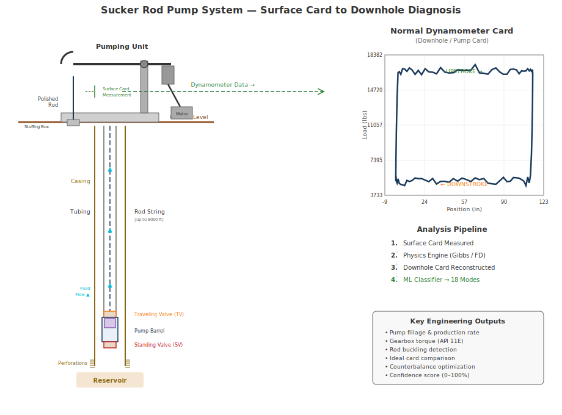
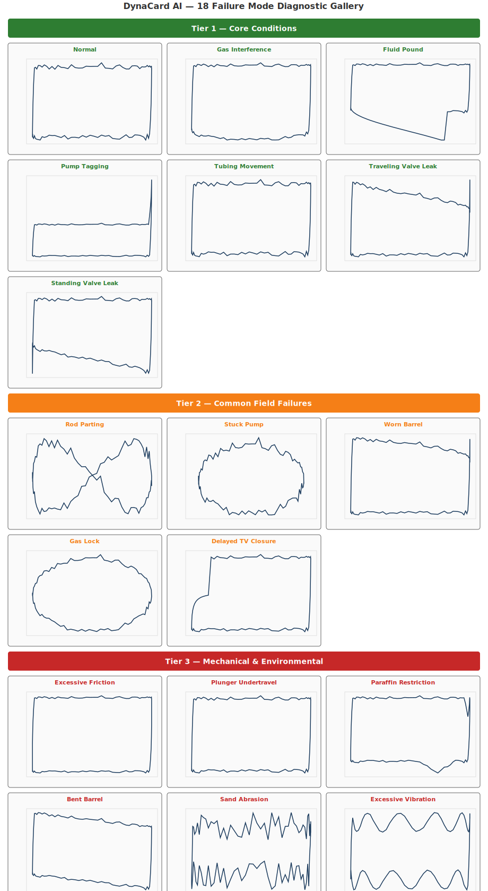
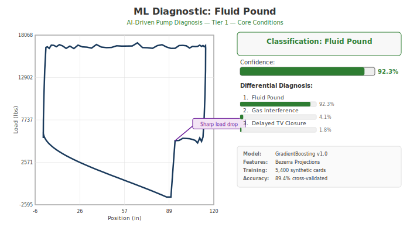

# DynaCard AI Diagnostics

### Intelligent Sucker Rod Pump Analysis -- From Surface Card to Actionable Insight

---

## The Challenge

Rod pump failures cost the upstream oil and gas industry billions annually in lost production, unplanned workovers, and deferred output. Traditional dynamometer card analysis relies on **manual pattern matching** and **threshold-based rules** that detect only a handful of failure modes -- typically four or fewer. Engineers face:

- **Late detection** -- failures identified only after production has already declined
- **Limited diagnostic coverage** -- most systems recognize fewer than five conditions
- **No confidence quantification** -- binary pass/fail with no measure of certainty
- **Expert dependency** -- interpretation quality varies with analyst experience
- **Connectivity requirements** -- many tools require cloud access unavailable at remote well sites

Production teams need a diagnostic system that is accurate, comprehensive, and deployable anywhere a rod pump operates.

---

## The System



---

## The Solution

**DynaCard AI Diagnostics** is a fully integrated sucker rod pump analysis module that combines physics-based downhole modeling with machine-learning diagnostics. It transforms raw surface dynamometer card data into engineering calculations, pump health assessments, and prioritized maintenance recommendations -- all in a single, offline-capable package.

```
  Surface Card Data
        |
        v
  +---------------------+
  |   Physics Engine     |  Two solver options:
  |  (Gibbs | Finite     |  Frequency-domain (fast)
  |   Difference)        |  Time-domain (detailed)
  +---------------------+
        |
        v
  +---------------------+
  |  Engineering         |  7 analysis phases:
  |  Calculations        |  Fluid load, torque, lift,
  |  (P1 -- P7)          |  geometry, buckling, ideal
  +---------------------+  card, torque balance
        |
        v
  +---------------------+
  |  ML Diagnostics      |  18 failure modes
  |  (GradientBoosting)  |  Confidence scores
  |                      |  Differential diagnosis
  +---------------------+
        |
        v
  Prioritized Maintenance Recommendations
```

---

## Feature Highlights

### Dual Physics Engine

Choose the solver that fits your workflow:

| Solver | Method | Best For |
|--------|--------|----------|
| **Gibbs** | Frequency-domain (FFT/IFFT) | Real-time monitoring, high-frequency polling |
| **Finite Difference** | Time-domain (PDE grid) | Complex rod strings, transient analysis, detailed studies |

Both solvers convert surface dynamometer cards to downhole pump cards using the damped wave equation, calibrated against API RP 11L standards.

### Machine Learning Diagnostics

- **GradientBoosting classifier** trained on 5,400 synthetic dynamometer cards
- **89.4% cross-validated accuracy** across all 18 failure modes
- **Bezerra vertical projection** feature extraction -- a literature-proven method demonstrated at 98.87% accuracy on 6,101 real-world cards
- Every classification includes a **confidence score (0--100%)** and **differential diagnosis** listing the top 3 alternative conditions

### Seven-Phase Engineering Analysis

| Phase | Analysis | Key Outputs |
|-------|----------|-------------|
| **P1** | Fluid Load and Production | CPIP, pump fillage, theoretical production rate |
| **P2** | Gearbox Torque | Torque profile per API 11E specification |
| **P3** | Lift Capacity | Lift capacity, polished rod load ratios |
| **P4** | Card Geometry | Area, perimeter, centroid, quadrant zone mapping |
| **P5** | Rod Buckling | Sinusoidal and helical buckling detection |
| **P6** | Ideal Card Generation | Reference card synthesis, shape similarity scoring |
| **P7** | Torque Balance | Counterbalance optimization for energy efficiency |

### Secure, Portable Model

- Model ships as **JSON** inside the module -- no pickle files, no deserialization risk
- **Zero cloud dependency** -- runs fully offline on SCADA systems, edge devices, or air-gapped networks
- **30+ Pydantic data models** enforce strict input/output validation at every stage

---

## Failure Mode Coverage

DynaCard AI Diagnostics detects **18 distinct failure modes** organized into three tiers by severity and frequency:

### Tier 1 -- Core Conditions

| Mode | Description |
|------|-------------|
| **Normal** | Healthy pump operation -- baseline reference |
| **Gas Interference** | Free gas entering pump, reducing volumetric efficiency |
| **Fluid Pound** | Incomplete pump fillage causing mechanical shock loading |
| **Pump Tagging** | Plunger contacting pump barrel at stroke extremes |
| **Tubing Movement** | Unanchored tubing stretching under cyclic load |
| **Traveling Valve Leak** | Traveling valve fails to seal -- fluid bypasses on upstroke |
| **Standing Valve Leak** | Standing valve fails to seal -- fluid drains on downstroke |

### Tier 2 -- Common Field Failures

| Mode | Description |
|------|-------------|
| **Rod Parting** | Rod string separation -- immediate workover required |
| **Stuck Pump** | Plunger seized in barrel -- no fluid displacement |
| **Worn Barrel** | Internal barrel wear causing progressive slippage |
| **Gas Lock** | Complete gas blockage preventing fluid transfer |
| **Delayed TV Closure** | Sluggish traveling valve response reducing pump efficiency |

### Tier 3 -- Mechanical and Environmental

| Mode | Description |
|------|-------------|
| **Excessive Friction** | Abnormal drag forces along the rod string or in the pump |
| **Plunger Undertravel** | Insufficient stroke length reaching the pump |
| **Paraffin Restriction** | Wax buildup restricting flow through the pump or tubing |
| **Bent Barrel** | Mechanical deformation of the pump barrel |
| **Sand Abrasion** | Abrasive wear from produced sand in the pump assembly |
| **Excessive Vibration** | Resonance or mechanical imbalance in the rod-pump system |

---

## Diagnostic Card Gallery

Each failure mode produces a distinctive dynamometer card shape. The ML classifier recognizes these geometric signatures automatically. All 18 failure modes across three diagnostic tiers:



---

## Sample Diagnostic Output



A single API call returns the complete diagnostic result:

```json
{
  "classification": "FLUID_POUND",
  "confidence": 0.923,
  "differential": [
    {"mode": "FLUID_POUND",       "probability": 0.923},
    {"mode": "GAS_INTERFERENCE",  "probability": 0.041},
    {"mode": "DELAYED_TV_CLOSURE","probability": 0.018}
  ],
  "model_version": "1.0",
  "engineering": {
    "pump_fillage": 0.64,
    "fluid_load_lbs": 8420,
    "theoretical_production_bpd": 38.2,
    "buckling_detected": false,
    "torque_balance": {
      "peak_torque_in_lbs": 412000,
      "optimal_counterbalance_in_lbs": 9850
    }
  }
}
```

**Reading this result**: The classifier is 92.3% confident this is **Fluid Pound** -- incomplete pump fillage (64%) causing mechanical shock. Gas Interference is a distant alternative at 4.1%. The engineering section provides the quantitative context: production rate, fillage, torque, and buckling status -- all from a single analysis call.

---

## Before and After

| Capability | Threshold-Based Systems | DynaCard AI Diagnostics |
|------------|------------------------|------------------------|
| Failure modes detected | 4 | **18** |
| Confidence scoring | No | **Yes (0--100%)** |
| Differential diagnosis | No | **Top 3 alternatives** |
| Physics solvers | 1 (typically Gibbs only) | **2 (Gibbs + Finite Difference)** |
| Engineering calculations | Basic (fluid load only) | **7 phases (P1--P7)** |
| Rod buckling detection | No | **Sinusoidal + helical** |
| Torque optimization | No | **Counterbalance optimization** |
| Ideal card comparison | No | **Shape similarity scoring** |
| Offline operation | Varies | **Fully offline** |
| Data validation | Minimal | **30+ Pydantic models** |
| Automated test coverage | Limited | **498 tests** |

---

## Business Benefits

**Reduce Unplanned Downtime**
Detect 18 failure modes instead of 4 -- catch emerging problems before they escalate to rod parts, stuck pumps, or lost production.

**Prioritize Interventions with Confidence**
Confidence scores (0--100%) and differential diagnosis let your team allocate workover crews and equipment to the wells that need attention most, reducing unnecessary truck rolls.

**Enable Proactive Maintenance**
Shift from reactive break-fix to condition-based maintenance. Trend confidence scores over time to schedule interventions during planned windows.

**Deploy Anywhere**
No cloud connectivity required. Run diagnostics on SCADA systems, edge computing devices, or standalone engineering workstations -- even in remote or offshore locations with limited bandwidth.

**Eliminate Proprietary Hardware Lock-In**
Works with standard dynamometer card data from any surface measurement system. No specialized sensors or vendor-specific hardware required.

**Backward Compatible**
Drop-in replacement for existing threshold-based diagnostic systems. Existing integrations continue working while gaining expanded capability.

**Auditable and Explainable**
JSON-based model with structured Pydantic outputs. Every diagnostic result can be traced, reviewed, and validated -- no opaque black-box predictions.

---

## Technical Specifications

| Specification | Detail |
|---------------|--------|
| **Language** | Python 3.11+ |
| **Source** | 21 modules, approximately 5,600 lines of code |
| **Physics Solvers** | Gibbs (frequency-domain), Finite Difference (time-domain) |
| **ML Algorithm** | GradientBoosting classifier |
| **Training Data** | 5,400 synthetic dynamometer cards |
| **Cross-Validated Accuracy** | 89.4% |
| **Feature Extraction** | Bezerra vertical projection method |
| **Failure Modes** | 18 (3-tier classification) |
| **Data Models** | 30+ Pydantic v2 validated schemas |
| **Calculators** | 12 specialized (BaseCalculator pattern) |
| **Automated Tests** | 498 passing |
| **Model Format** | JSON (no pickle, no security risk) |
| **Cloud Dependency** | None -- fully offline capable |
| **API Standards** | API RP 11L, API 11E |
| **Exception Handling** | 6-type structured hierarchy |
| **Backward Compatibility** | Drop-in replacement for threshold systems |

---

## How It Works -- In Three Steps

**Step 1: Ingest**
Provide surface dynamometer card data (position and load arrays), rod string configuration, pump properties, and surface unit geometry. The system validates all inputs through Pydantic models before processing.

**Step 2: Analyze**
The physics engine converts the surface card to a downhole pump card. Seven engineering calculation phases extract fluid load, torque profiles, lift capacity, card geometry, buckling status, ideal card comparison, and torque balance. The ML classifier then evaluates the downhole card against all 18 failure modes.

**Step 3: Act**
Receive a structured diagnostic report: primary classification with confidence score, differential diagnosis with the top three alternative conditions, and complete engineering calculations -- all in a single response object ready for dashboard integration, historian storage, or automated alerting.

---

## Who Benefits

| Role | Value |
|------|-------|
| **Production Engineers** | Faster, more accurate well diagnostics with quantified confidence |
| **Optimization Teams** | Comprehensive analysis (18 modes) from a single tool -- no manual pattern matching |
| **Field Supervisors** | Clear prioritization of which wells need intervention first |
| **Artificial Lift Consultants** | Professional-grade analysis toolkit for client engagements |
| **SCADA / Automation Teams** | Offline-capable module that integrates into existing control systems |
| **Asset Managers** | Data-driven maintenance planning with auditable diagnostic trails |

---

## Get Started

DynaCard AI Diagnostics is available for integration into your production monitoring, SCADA, or engineering analysis environment.

**To learn more or request a technical evaluation:**

| | |
|---|---|
| **Email** | [contact@yourcompany.com] |
| **Web** | [www.yourcompany.com/dynacard] |
| **Technical Documentation** | Available upon request |

---

<sub>DynaCard AI Diagnostics -- Physics-driven modeling. Machine-learning diagnostics. Field-proven accuracy. Deployed where you need it.</sub>
