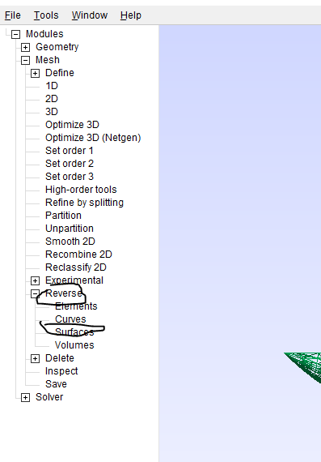
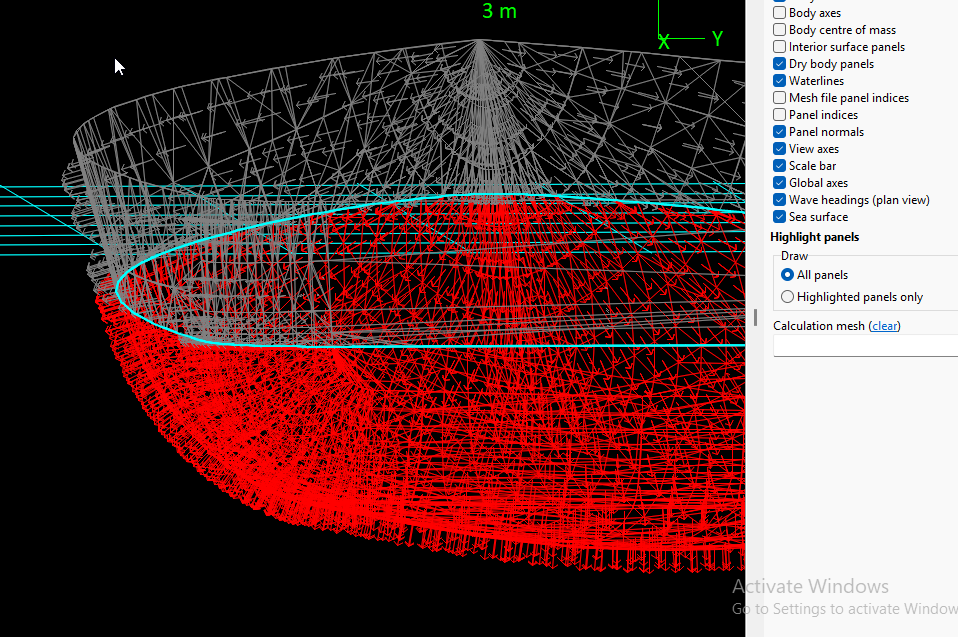
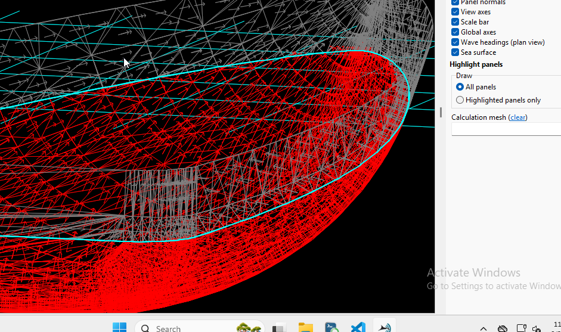

## Reverse Normals

Using the Command Line:
The command ReverseMesh Surface{-new_surfs()}; will reverse the normals of the specified surface.
The {-new_surfs()} part indicates that a new surface will be created with the reversed normals. This is useful for preserving the original mesh and creating a copy with reversed normals.
You can also use the API function mesh::setReverse to achieve the same result within a script. 
2. Using the Gmsh GUI:
Open your mesh file in Gmsh.
Go to "Tools" -> "Reverse shapes". This will reverse the normals of the selected surfaces. 

3. Visualizing Normals:
To verify the change, you can enable "Backface Culling" in the Gmsh GUI (Options -> Mesh -> Color -> Backface Culling).
This will display one side of the mesh in a different color (e.g., gray), allowing you to visually check the normal direction. 

Before reversing:

After reversing:

References

https://gmsh.info/

Check mesh compatibility in open source software
https://prepomax.fs.um.si/

https://gitlab.com/MatejB/PrePoMax
https://gitlab.com/MatejB/PrePoMax-Models

https://grabcad.com/library/pneumatic-gripper-11

https://grabcad.com/dashboard

### References

https://www.manpagez.com/info/gmsh/gmsh-2.2.6/gmsh_63.php
https://victorsndvg.github.io/FEconv/formats/gmshmsh.xhtml
https://gmsh.info/doc/texinfo/gmsh.html

