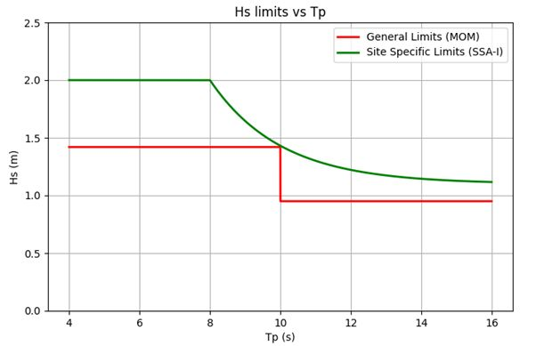

???????????????????????? ???????????? ?????? ????????-??????

Frequent relocation of Wind Turbine Installation Vessels (WTIVs) with varying site conditions, highlight challenges for going-on-location: balancing operability limits to ensure safety while minimizing unnecessary downtime.
The current generalized installation limits in Marine Operations Manuals (MOMs) often fall short of accounting for site-specific factors like water depth, vessel headings, or extremely stiff seabed conditions such as bedrock. These short-comings can result in:

- ?????????????????????? ???? ????/????-???? ??????????????????, increasing the risk of delays, equipment damage, or environmental harm.

- ???????????????????????????????? ???? ????????-????, leading to costly and avoidable downtime.

By incorporating site-specific data for establishing installation limits, we can bridge the gap between safety and efficiency. The challenges posed by generalized operability limits from the MOM can be addressed through Site-Specific Assessments for Installation (SSA-I). This approach ensures the full capabilities of the equipment are utilized without risking damage or loss, maintaining trust in the equipment's reliability and performance.

The SSA-I establishes site-specific installation limits as presented in the figure. This enables safer and more efficient Go/No-Go decisions, reduces unnecessary downtime, and ensures that jack-up capabilities are maximized.

???????? ???????????????????? ???????? ?????? ?????????? ???????? ?????????????????????? ???????????????????????? ?????????????

