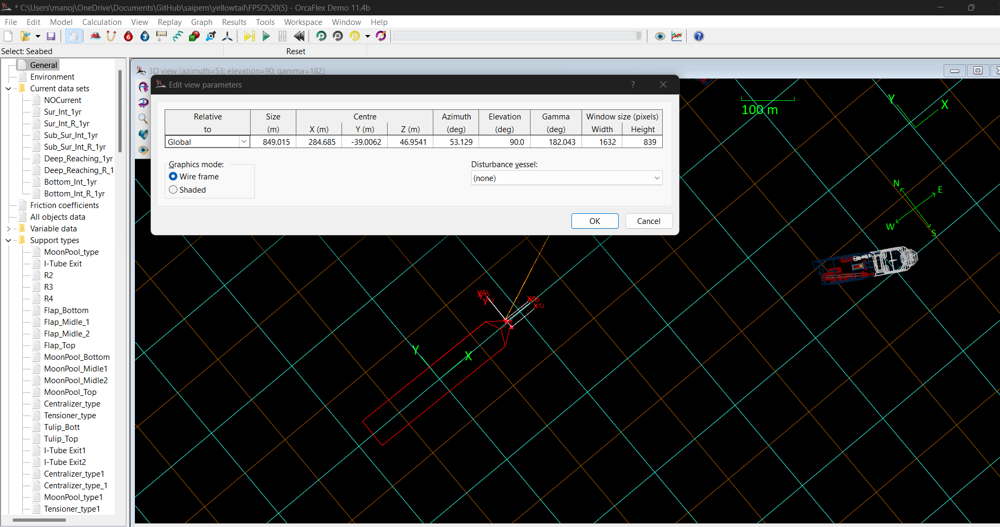

# Introduction

To help automate Orcaflex for a typical analysis

# Summary

## N-S Orientation

Follow below steps for changing the orientation of the FPSO and vessel as per Alignment sheets.

Goto
General>Drawing>Select "North Direction Defined" and define the north direction from alignment sheet and press "OK"

Now, Ctrl+W and change the azimuth and gamma as per FPSO coordinates.

## Seabed Definition

- 2 ways
  - Using '2D profile'
  - Using '3D profile'

## References

<https://www.orcina.com/webhelp/OrcFxAPI/Content/html/Pythonreference,OrcaFlexWizardObject.htm>

<https://www.orcina.com/webhelp/OrcaFlex/Content/html/Linesetupwizard.htm>

<https://www.orcina.com/webhelp/OrcaFlex/Content/html/Batchprocessing,Scriptcommands.htm#BatchScriptInvokeLineSetupWizardCommand>
