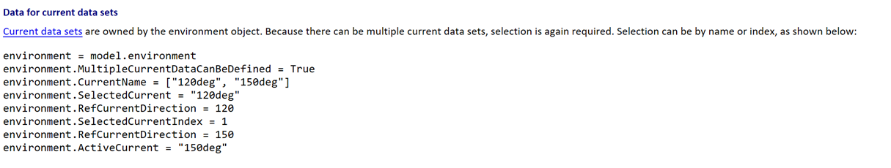
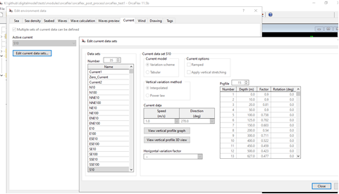

When you have more than one current data set defined in your model, you need to indicate which data set you want to interact with by setting SelectedCurrent. We also have ActiveCurrent, which is the selection applied in the model. The two are not necessarily the same and this behaviour is consistent in older versions. I?m not sure why you script behaviour has changed. Perhaps you only had one current data set last time your ran it?

You can find the following pointers in the API help document. :

 

https://www.orcina.com/webhelp/OrcFxAPI/Default_Left.htm#StartTopic=html/Pythoninterface,Objectdata.htm|SkinName=Web%20Help

To report active current speed and direction, you could write something like this:

model = OrcFxAPI.Model(?filename.sim')
model['Environment'].SelectedCurrent = model['Environment'].ActiveCurrent # Set the selected current to be the active current
print(model['Environment'].RefCurrentSpeed, model['Environment'].RefCurrentDirection) # Print selected current speed and direction

Kind regards,
Max Nicholson

 
T :  +44(0)1229 584742
E :  orcina@orcina.com
W:  www.orcina.com
     

From: Vamsee Achanta <vamseea@acma-inc.com> 
Sent: 17 December 2024 03:06
To: Orcina <orcina@orcina.com>
Subject: OrcFXAPI | V11.5 | Ref Current Speed

Dear Support Representative,

With the release of 11.5, my code for RefCurrentSpeed with index 0, does not choose the active current anymore.  It chooses the first set of current and its associated properties. Is this expected behavior? If so, please advice how to get the active current speed and direction?

Thank you,
Vamsee
