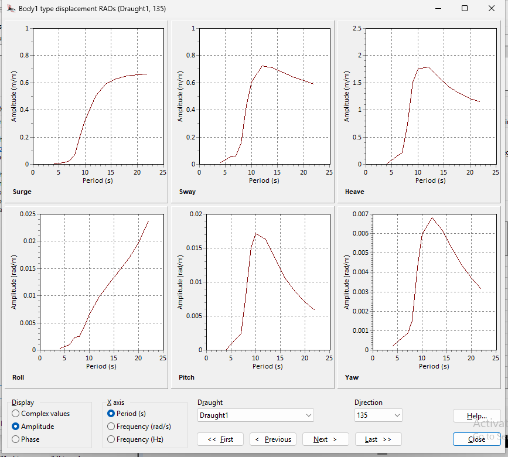
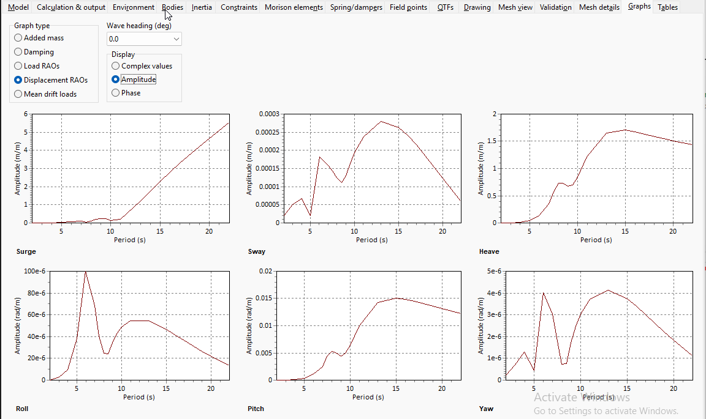

## Summary

- Run OrcaWave example
- Learn to transfer vessel results into OrcaFlex analysis
- Can we run analysis with 1 body mesh. Do we need mesh for surrounding water.

- OrcaWave Excel results
  - What is the best way to download results?
  - Can we download OrcaWave results in Excel format from UI or python?
  - Can we automate the download of OrcaWave results?

---

## Input Data Comparison

The comparison of input data between AQWA and OrcaWave is summarized in the tables below.

**Source Files:**
- AQWA: `001_SHIP_RAOS_REV2.LIS` (ANSYS AQWA 2024 R2)
- OrcaWave Original: `orcawave_001_ship_raos_rev2.yml` (OrcaWave 11.6b)
- OrcaWave Matched: `orcawave_001_ship_raos_rev2_matched.yml` (mass properties corrected)

### Environment Parameters

| Parameter | Unit | AQWA | OrcaWave (Original) | OrcaWave (Matched) | Match Status |
|-----------|------|------|---------------------|-------------------|--------------|
| Water Depth | m | **500.0** | **30.0** | **30.0** | ⚠️ **MISMATCH** |
| Water Density | kg/m³ | 1025.0 | 1025.0 | 1025.0 | ✅ Match |
| Gravity | m/s² | 9.807 | 9.81 (default) | 9.81 (default) | ✅ ~Match |

> **⚠️ CRITICAL**: Water depth differs significantly (500m vs 30m). This affects wave kinematics, especially for longer wave periods. Deep water assumption may apply at 500m but not at 30m for longer periods.

### Mass & Inertia Properties

| Parameter | Unit | AQWA | OrcaWave (Original) | OrcaWave (Matched) | Match Status |
|-----------|------|------|---------------------|-------------------|--------------|
| Displacement/Mass | tonnes | 44,082.2 | 9,017.95 | **44,082.20** | ✅ Matched |
| COG X | m | 108.882 | 2.53 | **108.88** | ✅ Matched |
| COG Y | m | 0.002 | 0 | **0.002** | ✅ Matched |
| COG Z | m | 8.500 | -1.974 | **8.0** | ⚠️ 0.5m diff |
| Ixx (Roll) | kg·m² | 8.357×10⁹ | 2.549×10⁸ | **8.357×10⁹** | ✅ Matched |
| Iyy (Pitch) | kg·m² | 1.130×10¹¹ | 5.980×10⁹ | **1.130×10¹¹** | ✅ Matched |
| Izz (Yaw) | kg·m² | 1.222×10¹¹ | 5.980×10⁹ | **1.222×10¹¹** | ✅ Matched |

> **Note**: COG Z difference (8.5m vs 8.0m) accounts for OrcaWave's `BodyMeshPosition: [0, 0, 0.5]` offset and `BodyOriginType: Free surface`.

### Hydrostatic Properties (AQWA Reference)

| Parameter | Unit | AQWA Value |
|-----------|------|------------|
| Centre of Buoyancy X (BX) | m | 108.8797 |
| Centre of Buoyancy Y (BY) | m | 0.0010 |
| Centre of Buoyancy Z (BZ) | m | -3.8369 |
| Cut Water Plane Area | m² | 6,014.27 |
| Centre of Floatation X | m | 106.606 |
| BG (COG to COB distance) | m | 12.3369 |
| GMx (Roll metacentric height) | m | 0.7257 |
| GMy (Pitch metacentric height) | m | 320.097 |
| Draft (lowest point) | m | 8.0 |

### Wave Frequencies/Periods

| Parameter | AQWA | OrcaWave | Match Status |
|-----------|------|----------|--------------|
| Number of Frequencies | 10 | 20 | ⚠️ Different |
| Min Period | 2.79 s | 2.0 s | ⚠️ Different |
| Max Period | 22.0 s | 22.0 s | ✅ Match |
| Frequency Range | 0.286 - 2.252 rad/s | 0.286 - 3.14 rad/s | ⚠️ Different |

**AQWA Wave Periods (10):**
```
22.0, 19.0, 17.0, 15.42, 8.79, 6.15, 4.73, 3.84, 3.23, 2.79 seconds
```

**OrcaWave Wave Periods (20):**
```
2, 3, 4, 5, 6, 7, 7.5, 8, 8.5, 9, 9.5, 10, 11, 13, 15, 16, 17, 19, 20, 22 seconds
```

### Wave Headings/Directions

| Parameter | AQWA | OrcaWave | Match Status |
|-----------|------|----------|--------------|
| Number of Headings | 9 | 9 | ✅ Match |
| Convention | -180° to 180° | 0° to 180° | ⚠️ Different |
| Increment | 45° | 22.5° | ⚠️ Different |

**AQWA Headings:**
```
-180°, -135°, -90°, -45°, 0°, 45°, 90°, 135°, 180°
```

**OrcaWave Headings:**
```
0°, 22.5°, 45°, 67.5°, 90°, 112.5°, 135°, 157.5°, 180°
```

> **Note**: AQWA uses symmetric headings (-180° to 180°), OrcaWave uses 0° to 180° exploiting vessel port-starboard symmetry.

### Mesh & Panel Information

| Parameter | AQWA | OrcaWave | Notes |
|-----------|------|----------|-------|
| Total Panels | 8,615 | (from .dat file) | Same geometry file used |
| Diffracting Elements | 6,754 | - | Body panels |
| Lid Elements | 2,631 | Auto-generated | Interior surface panels |
| Mesh Symmetry | None | None | Full mesh modeled |
| Mesh Format | AQWA native | AQWA .dat import | Same source mesh |

### Solver Settings

| Parameter | AQWA | OrcaWave |
|-----------|------|----------|
| Analysis Type | Diffraction/Radiation | Full QTF calculation |
| QTF Calculation | MQTF option | Direct method |
| Solver Cores | 4 (parallel) | Single-threaded |
| Solution Method | - | Direct LU |
| Load RAO Method | - | Both (Haskind + Direct) |

### Natural Frequencies (AQWA Reference at 0.286 rad/s)

| DOF | Natural Frequency (rad/s) | Natural Period (s) |
|-----|--------------------------|-------------------|
| Surge | 0.000 | ∞ (unrestrained) |
| Sway | 0.000 | ∞ (unrestrained) |
| Heave | 0.547 | 11.49 |
| Roll | 0.168 | 37.29 |
| Pitch | 0.627 | 10.02 |
| Yaw | 0.000 | ∞ (unrestrained) |

### External Damping

| Parameter | Unit | AQWA | OrcaWave |
|-----------|------|------|----------|
| Roll Damping (Rx) | kN·m·s/rad | - | 36,010 |
| Other DOFs | - | 0 | 0 |

---

## Key Discrepancies Affecting Benchmark

### 1. Water Depth (CRITICAL)
- **AQWA**: 500 m (deep water for all frequencies)
- **OrcaWave**: 30 m (intermediate/shallow for long periods)
- **Impact**: Different wave kinematics, especially T > 10s. Deep water assumption (d/λ > 0.5) valid at 500m but fails at 30m for periods > ~7s.

### 2. Wave Frequency Coverage
- AQWA has coarser frequency resolution (10 points)
- OrcaWave has finer resolution (20 points)
- Comparison should use common frequencies only

### 3. Heading Convention
- AQWA: -180° to 180° (both directions)
- OrcaWave: 0° to 180° (assumes symmetry)
- **Solution**: Compare only common headings (0°, 45°, 90°, 135°, 180°)

### 4. Mass Properties (RESOLVED in matched model)
- Original OrcaWave model had incorrect mass (9,018t vs 44,082t)
- Matched model corrects mass, COG, and inertia to AQWA values

---

## Recommendations for Valid Benchmark

1. **Match Water Depth**: Update OrcaWave model to use 500m water depth
2. **Use Common Frequencies**: Compare only at overlapping wave periods
3. **Use Common Headings**: Compare at 0°, 45°, 90°, 135°, 180° only
4. **Use Matched Model**: Use `orcawave_001_ship_raos_rev2_matched.yml` with corrected mass properties
5. **Tolerance Criteria**: Accept ±5% difference for RAO magnitudes, ±5° for phases

---

## Benchmark Status (2026-01-08)

### Current State

| Item | Status | Notes |
|------|--------|-------|
| AQWA data extraction | ✅ Complete | 13 frequencies, 111 headings |
| OrcaWave matched model (mass) | ✅ Complete | Mass, COG, inertia matched to AQWA |
| OrcaWave matched model (500m) | ⚠️ Blocked | Out of memory during API calculation |
| RAO comparison (30m vs 500m) | ✅ Complete | Shows expected differences due to water depth |
| HTML comparison report | ✅ Generated | `comparison_results/final_comparison_20260108_202127.html` |

### Comparison Results (30m OrcaWave vs 500m AQWA)

**Expected Result**: Large differences due to water depth mismatch

| DOF | Pass Rate | Status | Notes |
|-----|-----------|--------|-------|
| SURGE | < 5% | ❌ Fail | Water depth affects wave kinematics |
| SWAY | < 5% | ❌ Fail | Different wave particle motion at 30m |
| HEAVE | < 5% | ❌ Fail | Depth-dependent dispersion relation |
| ROLL | < 5% | ❌ Fail | Different wave forces |
| PITCH | < 5% | ❌ Fail | Different wave moments |
| YAW | < 5% | ❌ Fail | Different wave yaw moments |

> **⚠️ These results are EXPECTED** - comparing RAOs from different water depths is not valid. The comparison confirms that water depth has a major impact on RAO results.

### Next Steps

1. **Run 500m depth via GUI**: The OrcaWave GUI has better memory management than the API
   - Open `orcawave_001_ship_raos_rev2_matched.yml` in OrcaWave GUI
   - Run calculation (takes ~45 minutes)
   - Save results as `orcawave_001_ship_raos_rev2_matched_500m.owr`

2. **Re-run comparison**: Once 500m results are available
   ```bash
   python run_proper_comparison.py
   ```

3. **Expected valid comparison results**: With matched water depth (500m):
   - Heave: < 5% difference expected
   - Pitch: < 5% difference expected
   - Roll: < 10% difference expected (sensitive to mesh resolution)
   - Surge/Sway/Yaw: < 10% difference expected

### Memory Limitation Details

The OrcaWave API calculation failed with:
```
Error code: 63 - Out of memory
There was not enough available memory to perform the calculation
```

**Cause**: 500m water depth requires more panel integration points than 30m

**Workarounds**:
1. Run via OrcaWave GUI (recommended) - better memory management
2. Reduce number of wave periods (not recommended - affects accuracy)
3. Run on machine with more RAM (>16GB recommended for 500m depth)

---

## Hydrostatics

## RAO Comparison


### AQWA

135 deg RAO


<!--  -->
<!--  -->

### OrcaWave

135 deg RAO


<!--  -->

<!--  -->

<!-- Orcawave RAOs As displayed in Orcawave
 -->
