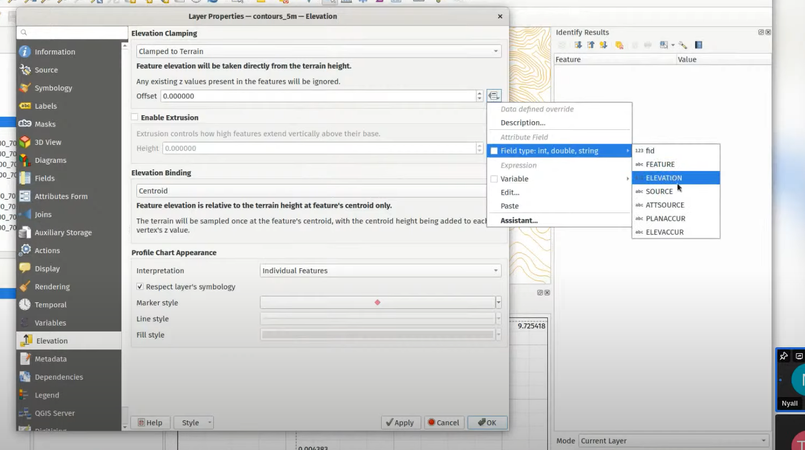
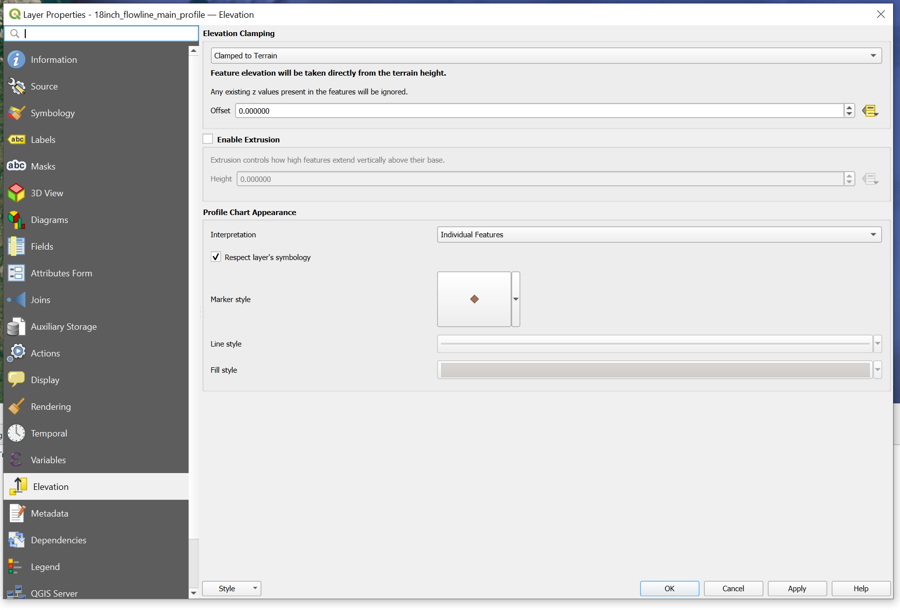

- Adding columns to Attribute table
  - <https://gis.stackexchange.com/questions/332678/add-column-in-qgis>
  
- Add elevation data to layer
<https://www.youtube.com/watch?v=CaDX1bIJ6zo&t=1023s>

### Setting elevation profile

Per video link
<https://www.youtube.com/watch?v=AknJjNPystU&t=393s>

Per Lakach profile:

Exporting .dxf file gives zero elevation. This is the same as the profile object. How to get this fixed?

Check this by following UI steps:

- Open the profile object
- View -> Elevation Profile ->

Steps to work:

- Make the DEM appear in the Elevation Profile object
  - Right clien on the DEM layer, properties, Elevation, check the box for "Represents Elevation Surface"
  - Click OK
-

Way Forward:

- Assign a feature path to the profile - successful
- Elevation profile - Looks right
- Export to DXF - no data is exported.

### To assign depth or elevation above surface to a layer in QGIS

To assign depth or elevation above surface to a layer in QGIS, you need to add a Digital Elevation Model (DEM) raster layer as your elevation reference, then use the "raster analysis" tools to extract elevation values for each point in your vector layer, effectively assigning the elevation data as a new attribute in your layer.
Key steps:
Add DEM data: Load your DEM raster layer into QGIS.
Select your vector layer: Choose the layer where you want to add elevation data.
Use "Raster analysis": Go to the Processing Toolbox, navigate to "Raster analysis" and select "Zonal Statistics".
Set parameters:
Input raster: Select your DEM layer.
Input vector layer: Choose the layer where you want to assign elevation.
Output attribute: Select the new attribute name (e.g., "Elevation") where the extracted elevation values will be stored.
Run the analysis: Click "Run" to calculate the elevation for each feature in your vector layer based on the underlying DEM.
Important points:
Coordinate reference system (CRS):
Ensure both your DEM and vector layer use the same CRS for accurate elevation assignment.
Interpolation method:
Depending on the analysis tool, you may need to choose an interpolation method to estimate elevation values for points not directly aligned with the DEM grid.

<https://www.youtube.com/watch?v=CaDX1bIJ6zo&t=577s>
