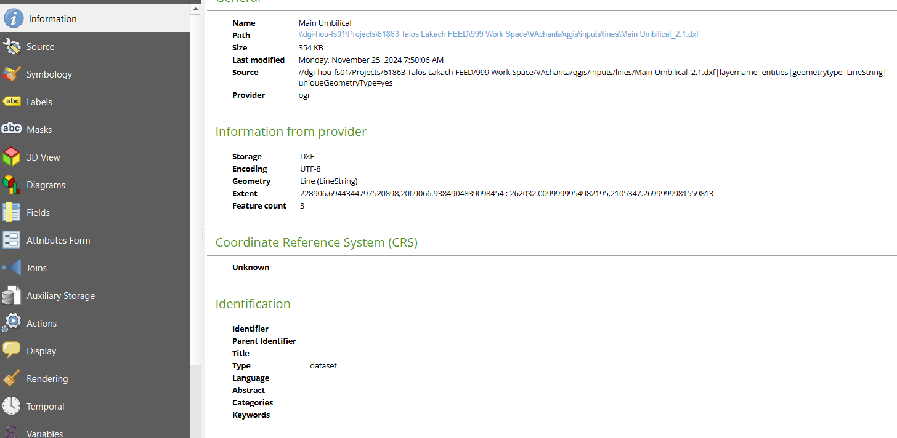
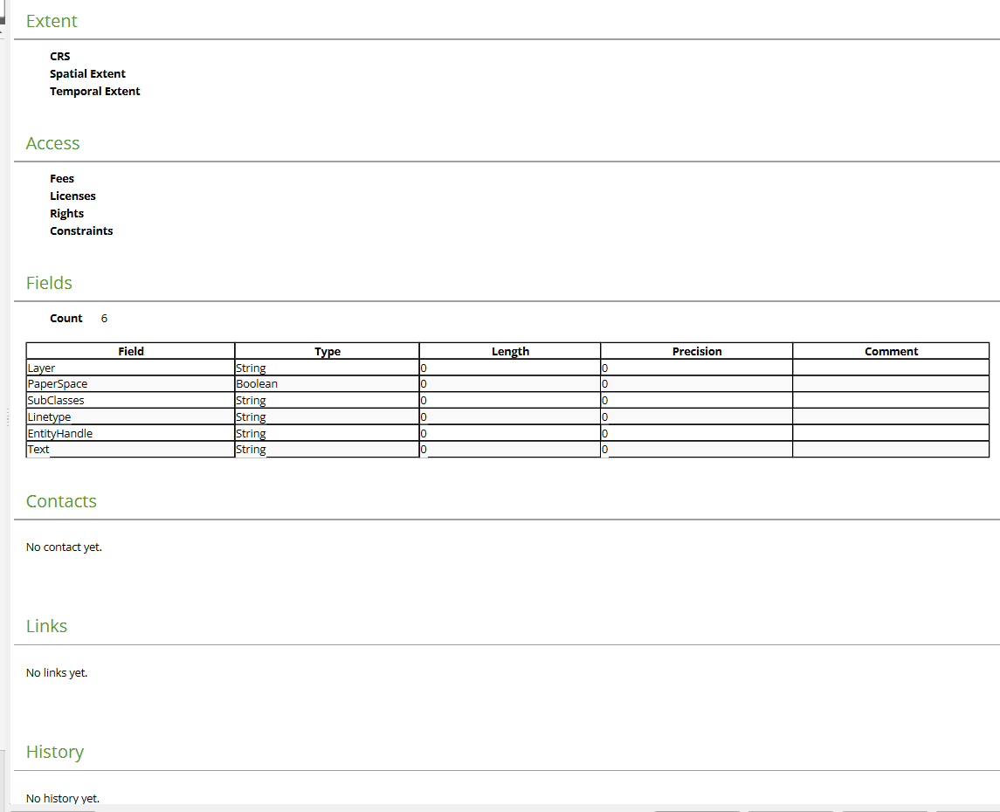

### Summary

pyqgis can be used to import dxf files. The dxf files can be imported using the `QgsVectorLayer` class. The `QgsVectorLayer` class is used to create a vector layer from a file. The `QgsVectorLayer` class takes the file path, layer name, and provider as arguments. The provider is set to `ogr` for dxf files. The `QgsVectorLayer` class is used to create a vector layer from a dxf file. The dxf file is then added to the map canvas using the `QgsMapLayerRegistry` class. The dxf file is added to the map canvas as a vector layer. The dxf file is then displayed on the map canvas. The dxf file is

https://gis.stackexchange.com/questions/221044/import-dxf-with-pyqgis

<code>

dxf_filename = r"\\dgi-hou-fs01\Projects\61863 Talos Lakach FEED\999 Work Space\VAchanta\qgis\inputs\lines\18inch Flowline_3.dxf"
uri = dxf_filename+"|layername=entities|geometrytype=LineString|uniqueGeometryType=yes"
vlayer = QgsVectorLayer(uri, "18inch_flowline_main", "ogr")
vlayer.isValid()
QgsProject.instance().addMapLayer(vlayer)

</code>

# INformation Tab - Screenshots

General

Name
Main Umbilical
Path
\\dgi-hou-fs01\Projects\61863 Talos Lakach FEED\999 Work Space\VAchanta\qgis\inputs\lines\Main Umbilical_2.1.dxf
Size
354 KB
Last modified
Monday, November 25, 2024 7:50:06 AM
Source
//dgi-hou-fs01/Projects/61863 Talos Lakach FEED/999 Work Space/VAchanta/qgis/inputs/lines/Main Umbilical_2.1.dxf|layername=entities|geometrytype=LineString|uniqueGeometryType=yes
Provider
ogr

Information from provider

Storage
DXF
Encoding
UTF-8
Geometry
Line (LineString)
Extent
228906.6944344797520898,2069066.9384904839098454 : 262032.0099999954982195,2105347.2699999981559813
Feature count
3

Coordinate Reference System (CRS)

Unknown

Identification

Identifier

Parent Identifier

Title

Type
dataset
Language

Abstract

Categories

Keywords

Extent

CRS

Spatial Extent

Temporal Extent

Access

Fees

Licenses

Rights

Constraints

Fields

Count
6

Field
Type
Length
Precision
Comment
Layer
String
0
0

PaperSpace
Boolean
0
0

SubClasses
String
0
0

Linetype
String
0
0

EntityHandle
String
0
0

Text
String
0
0

Contacts

No contact yet.

Links

No links yet.

History

No history yet.
