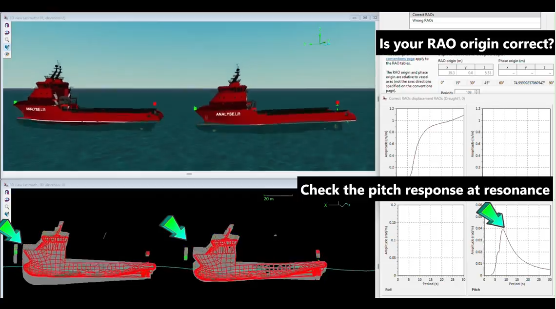

https://www.linkedin.com/posts/stefan-schlomilch_understanding-rao-origins-with-the-help-activity-7303368244151648256-UgNN?utm_source=share&utm_medium=member_desktop&rcm=ACoAAAFdG9kB103ydcFGign1_8EYQx7YwiUPV4k

Understanding RAO-origins with the help of simple simulations 🌊

One of the first checks we do when we receive RAOs for use in marine operation analysis is to check that the RAO conventions and the RAO origins are set correctly. 

One simple test to see that the RAO-origins are set correctly is to run a regular wave simulation with a wave period set to the vessels pitch resonance. 

In the video below the following is shown:
🚢The vessel to the left has the RAO-origin set in the wrong location
🚢The vessel to the right has the correct RAO-origin. 
🚢By adding trails to the Orcaflex simulation and also adding some "helper shapes" one can clearly see that the pitch centre of the vessel seems wrong. 

Failing to perform such tests before running the rest of the analysis can invalidate all analysis work and potentially lead to unsafe (or overly conservative) weather limitations. 

Which other pitfalls do you check for in the beginning of an analysis/project?

