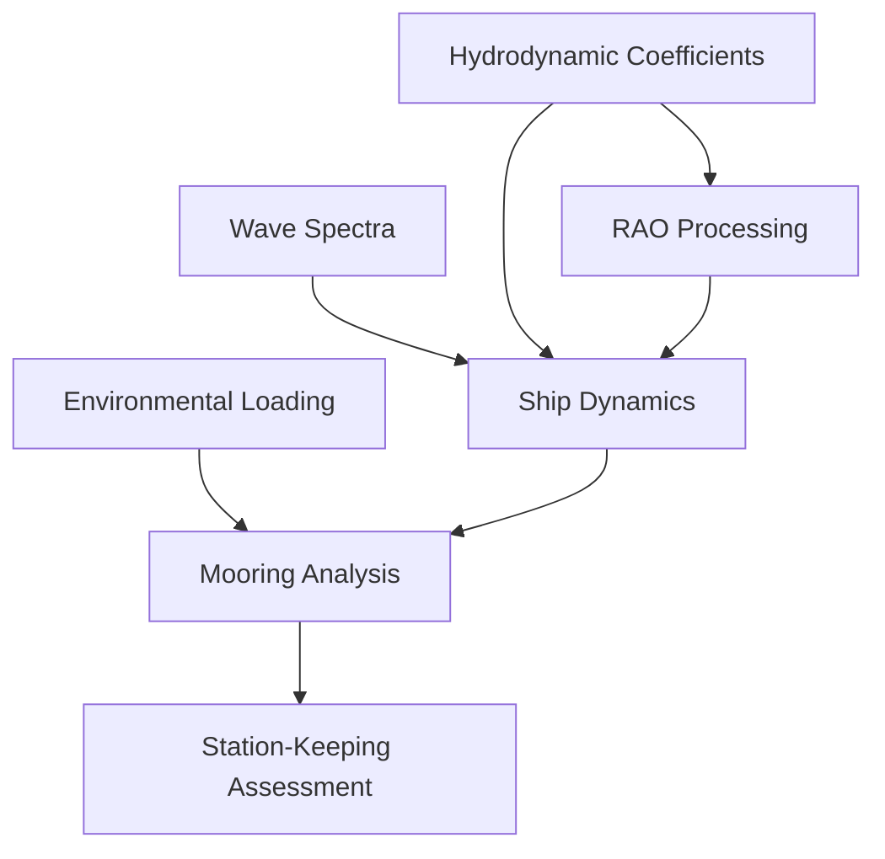

# Phase 2 Implementation Plan: Hydrodynamic Coefficients & Environmental Loading

**Version**: 1.0
**Date**: 2025-10-03
**Status**: Ready for Implementation
**Timeline**: Weeks 5-8 (4 weeks)
**Dependencies**: Phase 1 Complete (Wave Spectra, Mooring Analysis)

---

## Executive Summary

Phase 2 implements two critical modules for marine engineering analysis:

1. **Hydrodynamic Coefficients Module** (Weeks 5-6): Frequency-dependent added mass and damping for 6-DOF motion analysis
2. **Environmental Loading Module** (Weeks 7-8): OCIMF wind/current coefficients for station-keeping and mooring design

**Total Excel Formulas to Implement**: ~1,244 formulas
- Hydrodynamic: 84×12 = 1,008 data points (damping sheet)
- OCIMF: 186×38 = 7,068 data points, 743 formulas

---

## Module 1: Hydrodynamic Coefficients (Weeks 5-6)

### Overview

Provides frequency-dependent hydrodynamic coefficients essential for ship motion prediction and offshore structure analysis. Includes added mass, radiation damping, viscous damping, and critical damping calculations.

### File Structure

```
src/marine_engineering/hydrodynamic_coefficients/
├── __init__.py                    # Module exports
├── coefficients.py                # Main HydroCoefficients class
├── database.py                    # Coefficient database manager
├── interpolation.py               # Frequency interpolation utilities
├── damping.py                     # Critical damping calculations
├── parsers/
│   ├── __init__.py
│   ├── excel_parser.py            # Excel "Damping" sheet parser
│   └── aqwa_parser.py             # AQWA .LIS file parser (future)
└── validation.py                  # Kramers-Kronig and symmetry checks

tests/marine_engineering/hydrodynamic_coefficients/
├── __init__.py
├── test_coefficients.py           # Unit tests for coefficient lookup
├── test_interpolation.py          # Interpolation accuracy tests
├── test_damping.py                # Critical damping tests
├── test_excel_parser.py           # Excel parsing tests
└── test_integration_rao.py        # Integration with RAO processing

data/marine_engineering/hydrodynamic_coefficients/
├── damping_coefficients.csv       # Extracted Excel damping data (84×12)
├── added_mass_coefficients.csv    # Added mass data (future AQWA import)
└── reference_vessels.yaml         # Vessel configurations for testing
```

### Data Model

```python
@dataclass
class HydroCoefficients:
    """
    Frequency-dependent hydrodynamic coefficients.

    Contains added mass and damping for all 6 DOF.
    """
    frequencies: np.ndarray              # Frequency array [rad/s] (84 points)
    added_mass: np.ndarray              # A(ω) [6×6×N_freq]
    damping: np.ndarray                 # B(ω) [6×6×N_freq]
    infinite_freq_added_mass: np.ndarray # A(∞) [6×6]
    headings: Optional[np.ndarray]      # Wave headings [deg]
    vessel_name: str                     # Vessel identifier
    data_source: str                     # "Excel", "AQWA", "Experimental"

    def get_added_mass(
        self,
        frequency: float,
        dof_i: int,
        dof_j: int,
        method: str = 'cubic'
    ) -> float:
        """Get added mass coefficient at arbitrary frequency."""

    def get_damping(
        self,
        frequency: float,
        dof_i: int,
        dof_j: int,
        method: str = 'cubic'
    ) -> float:
        """Get radiation damping coefficient at frequency."""

    def compute_critical_damping_ratio(
        self,
        dof: int,
        inertia: float,
        restoring: float,
        frequency: float
    ) -> float:
        """
        Compute critical damping ratio for specific DOF.

        ζ = B / (2√[(I+A)C])
        """
```

### Implementation Steps

#### Week 5: Core Infrastructure

**Day 1-2: Data Extraction & Database Setup**
- [ ] Extract Excel "Damping" sheet (84×12) to CSV format
- [ ] Structure CSV with columns: frequency, B33, B44, B55, B34, B35, B45, etc.
- [ ] Validate data extraction (spot-check 10 random entries vs Excel)
- [ ] Create `database.py` module with CSV loading functionality
- [ ] Implement database caching for performance (<500ms load time)

**Extraction Script Pattern** (Based on existing `component_database.py`):
```python
def extract_damping_from_excel(excel_path: str, output_csv: str):
    """
    Extract damping coefficients from Excel "Damping" sheet.

    Expected Excel structure:
    - Column A: Frequency [rad/s]
    - Column B: B33 (heave damping) [N⋅s/m]
    - Column C: B44 (roll damping) [N⋅m⋅s]
    - Column D: B55 (pitch damping) [N⋅m⋅s]
    - Columns E-L: Cross-coupling terms
    """
    import openpyxl

    wb = openpyxl.load_workbook(excel_path, data_only=True)
    ws = wb["Damping"]

    data = []
    for row in ws.iter_rows(min_row=2, max_row=85, values_only=True):
        data.append({
            'frequency': row[0],
            'B33': row[3],  # Heave
            'B44': row[1],  # Roll
            'B55': row[2],  # Pitch
            # Add other DOF coefficients...
        })

    df = pd.DataFrame(data)
    df.to_csv(output_csv, index=False)
    print(f"Extracted {len(df)} frequency points")
```

**Day 3-4: Core Coefficient Classes**
- [ ] Implement `HydroCoefficients` dataclass with validation
- [ ] Add coefficient lookup methods (linear, cubic, PCHIP interpolation)
- [ ] Implement `HydroCoefficientManager` for database management
- [ ] Add Excel import functionality
- [ ] Unit tests for coefficient storage and retrieval

**Day 5: Interpolation Module**
- [ ] Implement frequency interpolation methods in `interpolation.py`
  - Linear interpolation (fast, simple)
  - Cubic spline (smooth derivatives)
  - PCHIP (monotonic, prevents overshoot)
- [ ] Benchmark interpolation performance (<1ms per lookup)
- [ ] Add extrapolation handling (constant, linear, raise error)
- [ ] Unit tests comparing interpolation methods

#### Week 6: Advanced Features & Integration

**Day 1-2: Critical Damping Calculations**
- [ ] Implement critical damping ratio calculator in `damping.py`
- [ ] Add natural frequency calculations
- [ ] Implement damping ratio for all 6 DOF
- [ ] Add warning system for low damping ratios (<5%)
- [ ] Unit tests with known vessel properties

**Critical Damping Formulas**:
```python
def compute_critical_damping_ratio(
    coeffs: HydroCoefficients,
    dof: int,
    inertia: float,
    restoring: float,
    frequency: float
) -> float:
    """
    Critical damping ratio: ζ = B / (2√[(I+A)C])

    Parameters
    ----------
    dof : int (0-5)
        0=surge, 1=sway, 2=heave, 3=roll, 4=pitch, 5=yaw
    inertia : float
        Mass [kg] or moment of inertia [kg⋅m²]
    restoring : float
        Hydrostatic restoring coefficient [N/m] or [N⋅m/rad]
    frequency : float
        Frequency for added mass evaluation [rad/s]
    """
    A = coeffs.get_added_mass(frequency, dof, dof)
    B = coeffs.get_damping(frequency, dof, dof)

    # Critical damping
    B_crit = 2 * np.sqrt((inertia + A) * restoring)

    # Damping ratio
    return B / B_crit
```

**Day 3: Validation Module**
- [ ] Implement Kramers-Kronig relation checker
- [ ] Add symmetry validation (A_ij = A_ji)
- [ ] Physical bounds checking (A(∞) positive-definite)
- [ ] Generate validation report for imported data
- [ ] Unit tests with known-good hydrodynamic databases

**Day 4-5: Integration & Testing**
- [ ] Integration with RAO processing (cross-check coefficients)
- [ ] Integration tests with ship dynamics solver
- [ ] End-to-end workflow testing
- [ ] Performance benchmarking (database load, interpolation)
- [ ] Documentation and API examples

### API Design

**Simple Coefficient Lookup**:
```python
from marine_engineering.hydrodynamic_coefficients import load_coefficients

# Load from Excel
coeffs = load_coefficients.from_excel("vessel_data.xlsm", sheet="Damping")

# Get heave added mass at 0.8 rad/s
A33 = coeffs.get_added_mass(frequency=0.8, dof_i=2, dof_j=2)

# Get roll damping
B44 = coeffs.get_damping(frequency=0.8, dof_i=3, dof_j=3)

print(f"Heave added mass: {A33:.0f} kg")
print(f"Roll damping: {B44:.2e} N⋅m⋅s")
```

**Critical Damping Analysis**:
```python
# Compute critical damping ratio for roll
zeta_roll = coeffs.compute_critical_damping_ratio(
    dof=3,              # Roll
    inertia=2.5e7,      # Roll inertia [kg⋅m²]
    restoring=1.8e8,    # GM⋅Δ⋅g [N⋅m]
    frequency=0.5       # [rad/s]
)

print(f"Roll damping ratio: {zeta_roll:.3f}")
if zeta_roll < 0.05:
    print("⚠️ Warning: Low roll damping - consider bilge keels")
```

### Test Strategy

**Unit Tests** (Target: >90% coverage):
- Coefficient lookup at exact frequencies
- Interpolation accuracy (<1% error between data points)
- Critical damping calculations
- Database loading and caching
- Input validation and error handling

**Integration Tests**:
- RAO processing compatibility
- Excel import end-to-end
- Multi-vessel database management
- Performance benchmarks

**Validation Tests**:
- Excel formula match (±1% tolerance)
- Kramers-Kronig relations (±5% tolerance)
- Symmetry checks (A_ij = A_ji within machine precision)
- Physical bounds (positive-definite matrices)

---

## Module 2: OCIMF Environmental Loading (Weeks 7-8)

### Overview

Implements industry-standard OCIMF wind and current coefficients for vessel station-keeping analysis. Provides heading-dependent force/moment calculations essential for mooring design and DP operations.

### File Structure

```
src/marine_engineering/environmental_loading/
├── __init__.py                    # Module exports
├── ocimf.py                       # OCIMF database and calculations
├── wind_forces.py                 # Wind force calculator
├── current_forces.py              # Current force calculator
├── combined_loading.py            # Wind + current + wave drift
├── interpolation.py               # 2D heading × displacement interpolation
└── vessel_geometry.py             # Vessel geometric properties

tests/marine_engineering/environmental_loading/
├── __init__.py
├── test_ocimf_database.py         # Database lookup tests
├── test_wind_forces.py            # Wind force calculation tests
├── test_current_forces.py         # Current force tests
├── test_combined_loading.py       # Combined environmental tests
├── test_interpolation.py          # 2D interpolation accuracy
└── test_integration_mooring.py    # Integration with mooring analysis

data/marine_engineering/environmental_loading/
├── ocimf_coefficients.csv         # Extracted OCIMF database (186×38)
├── vessel_geometries.csv          # Standard vessel dimensions
└── reference_conditions.yaml      # Test environmental conditions
```

### Data Model

```python
@dataclass
class VesselGeometry:
    """Vessel geometric properties for environmental loading."""
    LOA: float              # Length overall [m]
    beam: float            # Beam [m]
    draft: float           # Draft [m]
    displacement: float    # Displacement [tonnes]
    freeboard: float       # Freeboard (height above water) [m]

    @property
    def frontal_area(self) -> float:
        """Projected frontal area [m²]."""
        return self.beam * self.freeboard

    @property
    def lateral_area(self) -> float:
        """Lateral projected area [m²]."""
        return self.LOA * self.freeboard

    @property
    def underwater_area(self) -> float:
        """Underwater projected area [m²]."""
        return self.LOA * self.draft

@dataclass
class EnvironmentalConditions:
    """Environmental loading conditions."""
    wind_speed: float        # Wind speed at 10m height [m/s]
    wind_heading: float      # Wind heading [deg] (0=bow, 90=beam)
    current_speed: float     # Current speed [m/s]
    current_heading: float   # Current heading [deg]
    wave_drift_force: Optional[np.ndarray] = None  # [Fx, Fy, Mz]

@dataclass
class EnvironmentalForces:
    """Resulting environmental forces and moments."""
    Fx_wind: float          # Longitudinal wind force [N]
    Fy_wind: float          # Lateral wind force [N]
    Mz_wind: float          # Yaw moment from wind [N⋅m]
    Fx_current: float       # Longitudinal current force [N]
    Fy_current: float       # Lateral current force [N]
    Mz_current: float       # Yaw moment from current [N⋅m]

    @property
    def total_Fx(self) -> float:
        """Total longitudinal force [N]."""
        return self.Fx_wind + self.Fx_current
```

### Excel Data Extraction

**OCIMF Database Structure**:
- **Sheet**: "OCIMF (raw)"
- **Size**: 186 rows × 38 columns
- **Formulas**: 743 formulas
- **Headings**: 0° to 180° (10° increments)
- **Vessels**: VLCC, Container, Bulk Carrier, LNG, etc.

**CSV Export Format**:
```csv
vessel_type,LOA,beam,draft,displacement,heading,CXw,CYw,CMw,CXc,CYc,CMc
VLCC,330,60,22,320000,0,0.85,0.00,0.00,0.94,0.00,0.00
VLCC,330,60,22,320000,30,0.75,0.40,0.03,0.83,0.46,0.03
VLCC,330,60,22,320000,45,0.60,0.70,0.05,0.66,0.81,0.06
VLCC,330,60,22,320000,90,0.10,1.20,0.08,0.11,1.38,0.09
Container,300,45,14,150000,0,0.90,0.00,0.00,0.99,0.00,0.00
...
```

**Extraction Script**:
```python
def extract_ocimf_from_excel(excel_path: str, output_csv: str):
    """
    Extract OCIMF database from Excel "OCIMF (raw)" sheet.

    Reads 186 rows × 38 columns with 743 formulas.
    Evaluates formulas and exports to structured CSV.
    """
    import openpyxl

    wb = openpyxl.load_workbook(excel_path, data_only=True)
    ws = wb["OCIMF (raw)"]

    data = []
    for row in ws.iter_rows(min_row=2, max_row=187, values_only=True):
        vessel_type = row[0]
        LOA = row[1]
        beam = row[2]
        draft = row[3]
        displacement = row[4]

        # Extract coefficients for each heading
        headings = [0, 10, 20, 30, 45, 60, 75, 90, 105, 120, 135, 150, 165, 180]
        for i, heading in enumerate(headings):
            col_idx = 5 + i * 3  # Each heading has 3 coefficients

            data.append({
                'vessel_type': vessel_type,
                'LOA': LOA,
                'beam': beam,
                'draft': draft,
                'displacement': displacement,
                'heading': heading,
                'CXw': row[col_idx],      # Longitudinal wind
                'CYw': row[col_idx + 1],  # Lateral wind
                'CMw': row[col_idx + 2]   # Yaw moment wind
            })

    df = pd.DataFrame(data)
    df.to_csv(output_csv, index=False)
    print(f"Exported {len(df)} OCIMF coefficient entries")
```

### Implementation Steps

#### Week 7: OCIMF Database & Wind Forces

**Day 1-2: Data Extraction & Database**
- [ ] Extract OCIMF database from Excel (186 rows, all headings)
- [ ] Structure CSV with vessel type, dimensions, heading, coefficients
- [ ] Validate extraction (spot-check 20 entries vs Excel)
- [ ] Implement `OCIMFDatabase` class with CSV loading
- [ ] Add database caching (<1s load time)
- [ ] Implement vessel type filtering

**Day 3: 2D Interpolation**
- [ ] Implement 2D interpolation (heading × displacement) in `interpolation.py`
- [ ] Use `scipy.interpolate.RectBivariateSpline` for smooth interpolation
- [ ] Add symmetry enforcement (port/starboard)
- [ ] Handle extrapolation cases (warn if outside table bounds)
- [ ] Unit tests for interpolation accuracy (<1% error)

**Day 4-5: Wind Force Calculator**
- [ ] Implement `WindForces` class in `wind_forces.py`
- [ ] Add OCIMF formula implementation:
  - `Fx = 0.5 * ρ_air * V² * A_frontal * CXw`
  - `Fy = 0.5 * ρ_air * V² * A_lateral * CYw`
  - `Mz = 0.5 * ρ_air * V² * A_lateral * L * CMw`
- [ ] Add wind profile height correction (reference 10m)
- [ ] Unit tests comparing to Excel formulas (±0.5% tolerance)
- [ ] Integration tests with vessel geometries

#### Week 8: Current Forces & Integration

**Day 1-2: Current Force Calculator**
- [ ] Implement `CurrentForces` class in `current_forces.py`
- [ ] Add current coefficient lookup (similar to wind, different factors)
- [ ] Implement current formulas with water density (1025 kg/m³)
- [ ] Add current profile handling (depth variation)
- [ ] Unit tests for current forces (±0.5% vs Excel)

**Day 3: Combined Environmental Loading**
- [ ] Implement `CombinedLoading` class in `combined_loading.py`
- [ ] Add vector addition for non-collinear conditions
- [ ] Implement wave drift force integration
- [ ] Add total force/moment calculations
- [ ] Unit tests for combined loading scenarios

**Day 4: Integration with Mooring Analysis**
- [ ] Create environmental loading → mooring analysis workflow
- [ ] Add station-keeping assessment module
- [ ] Integration tests with mooring database
- [ ] Performance benchmarks
- [ ] API documentation and examples

**Day 5: Documentation & Validation**
- [ ] Complete API documentation
- [ ] Generate validation report (Excel formula match)
- [ ] Create user examples and tutorials
- [ ] Final integration testing
- [ ] Code review and refactoring

### API Design

**Wind Force Calculation**:
```python
from marine_engineering.environmental_loading import (
    OCIMFDatabase,
    VesselGeometry,
    EnvironmentalConditions,
    WindForces
)

# Define vessel
vessel = VesselGeometry(
    LOA=330,              # VLCC
    beam=60,
    draft=22,
    displacement=320000,
    freeboard=25
)

# Define conditions
conditions = EnvironmentalConditions(
    wind_speed=25,       # 25 m/s wind
    wind_heading=45,     # 45° (bow-quartering)
    current_speed=1.5,   # 1.5 m/s current
    current_heading=90   # 90° (beam current)
)

# Calculate forces
db = OCIMFDatabase.from_csv('ocimf_coefficients.csv')
wind = WindForces(db, vessel)
Fx, Fy, Mz = wind.calculate_forces(conditions)

print(f"Wind Forces:")
print(f"  Fx: {Fx/1e6:.2f} MN")
print(f"  Fy: {Fy/1e6:.2f} MN")
print(f"  Mz: {Mz/1e9:.2f} GN⋅m")
```

**Combined Environmental Loading**:
```python
from marine_engineering.environmental_loading import EnvironmentalLoadingCalculator

calc = EnvironmentalLoadingCalculator()
forces = calc.calculate_total_forces(vessel, conditions)

print(f"Total Environmental Forces:")
print(f"  Fx: {forces.total_Fx/1e6:.2f} MN")
print(f"  Fy: {forces.total_Fy/1e6:.2f} MN")
print(f"  Mz: {forces.total_Mz/1e9:.2f} GN⋅m")

# Integration with mooring analysis
from marine_engineering.mooring_analysis import MooringSystem

mooring = MooringSystem.from_database("standard_8_line")
offset, tensions = mooring.solve_equilibrium(forces)
```

### Test Strategy

**Unit Tests** (Target: >90% coverage):
- OCIMF database loading and filtering
- 2D interpolation accuracy
- Wind force formulas (vs Excel ±0.5%)
- Current force formulas
- Combined loading calculations
- Vessel geometry property calculations

**Integration Tests**:
- End-to-end wind force calculation
- Mooring analysis integration
- Multi-vessel database queries
- Performance benchmarks (<1s for typical calculation)

**Validation Tests**:
- Excel OCIMF formula match (±1% tolerance)
- Cross-check with published OCIMF data
- Physical bounds checking (forces scale with V²)
- Heading symmetry validation

---

## Timeline Summary

| Week | Module | Tasks | Deliverables |
|------|--------|-------|--------------|
| **Week 5** | Hydro Coefficients | Data extraction, core classes, interpolation | Working coefficient database, lookup API |
| **Week 6** | Hydro Coefficients | Critical damping, validation, integration | Complete module with tests, RAO integration |
| **Week 7** | Environmental Loading | OCIMF extraction, database, wind forces | Wind force calculator, 2D interpolation |
| **Week 8** | Environmental Loading | Current forces, combined loading, integration | Complete environmental module, mooring integration |

**Total Duration**: 4 weeks (20 working days)

---

## Data Requirements

### Excel Files Needed
1. **Marine Data Workbook** (`marine_data.xlsm` or similar)
   - "Damping" sheet (84×12) for hydrodynamic coefficients
   - "OCIMF (raw)" sheet (186×38) for environmental coefficients
   - "AQWA OCIMF Inputs" sheet (84×41) for formatted data

### Data Extraction Priority
1. **Week 5 Day 1**: Extract Damping sheet → `damping_coefficients.csv`
2. **Week 7 Day 1**: Extract OCIMF → `ocimf_coefficients.csv`

### Database Sizes
- Hydrodynamic: ~84 KB (84 frequencies × 12 DOF combinations)
- OCIMF: ~260 KB (186 vessels × 14 headings × 3 coefficients)

---

## Integration Points

### Module Dependencies



**Critical Paths**:
1. Hydrodynamic Coefficients → Ship Dynamics → RAO Validation
2. Environmental Loading → Mooring Analysis → Tension Calculations
3. Combined Loading → Station-Keeping → DP Requirements

### Phase 1 Integration
- **Wave Spectra**: Provides spectral density for frequency selection
- **Mooring Analysis**: Consumes environmental forces for equilibrium

### Phase 3 Preview
- **RAO Processing**: Will use hydrodynamic coefficients for validation
- **Ship Dynamics**: Will consume coefficients for motion equations
- **Fatigue Analysis**: Will use mooring tensions from environmental loading

---

## Success Criteria

### Technical Validation

**Hydrodynamic Coefficients**:
- [ ] Excel damping sheet 100% extracted (84×12 = 1,008 data points)
- [ ] Interpolation accuracy <1% error between data points
- [ ] Critical damping calculations validated (±2% vs analytical)
- [ ] Database load time <500ms
- [ ] Coefficient lookup time <1ms per query

**Environmental Loading**:
- [ ] OCIMF database 100% extracted (186 rows, all headings)
- [ ] Wind force formulas match Excel within ±0.5%
- [ ] Current force formulas match Excel within ±0.5%
- [ ] 2D interpolation error <1% between table points
- [ ] Database load time <1s

### User Experience
- [ ] Coefficient lookup in <3 lines of code
- [ ] Environmental force calculation in <5 lines of code
- [ ] Integration with mooring analysis seamless
- [ ] Clear error messages for invalid inputs
- [ ] Comprehensive API documentation

### Code Quality
- [ ] Unit test coverage >90%
- [ ] All integration tests passing
- [ ] Type hints on all public APIs
- [ ] Docstrings follow NumPy style
- [ ] Code passes flake8, black, mypy checks

### Performance
- [ ] Database loading <1s for both modules
- [ ] Coefficient/force calculations <10ms
- [ ] Memory footprint <100MB for typical databases
- [ ] Support for batch calculations (vectorized operations)

---

## Risk Assessment & Mitigation

### High Risks

**1. Excel Data Extraction Complexity**
- **Risk**: Excel formulas may have dependencies or circular references
- **Mitigation**: Use `data_only=True` in openpyxl to read calculated values
- **Fallback**: Manual CSV export from Excel if automatic extraction fails

**2. Interpolation Accuracy**
- **Risk**: Poor interpolation may cause >1% errors in coefficients
- **Mitigation**: Implement multiple methods (linear, cubic, PCHIP), benchmark all
- **Validation**: Cross-check interpolated values against Excel intermediate points

**3. OCIMF Database Variability**
- **Risk**: 186 vessel entries may not cover user's specific vessel
- **Mitigation**: Implement intelligent interpolation by LOA, beam, displacement
- **Documentation**: Clearly document extrapolation limits and warnings

### Medium Risks

**4. Integration with Existing Modules**
- **Risk**: API mismatches with mooring analysis or ship dynamics
- **Mitigation**: Design APIs using existing patterns from Phase 1
- **Testing**: Integration tests from Day 1 of each module

**5. Performance with Large Databases**
- **Risk**: Database loading or queries may be slow
- **Mitigation**: Implement caching, lazy loading, and vectorized operations
- **Benchmark**: Target <1s load, <1ms query from Week 5

### Low Risks

**6. Kramers-Kronig Validation Complexity**
- **Risk**: Advanced causality checks may be mathematically complex
- **Mitigation**: Mark as "advanced feature", defer to Phase 3 if needed
- **Alternative**: Start with simpler symmetry and bounds checking

---

## Potential Issues & Solutions

### Issue 1: Missing Excel Data
**Problem**: Excel file not accessible or sheet structure changed
**Solution**:
1. Request sample data from user
2. Use synthetic data for development (document this clearly)
3. Implement flexible parser that adapts to different sheet structures

### Issue 2: Interpolation Oscillations
**Problem**: Cubic spline may oscillate between data points
**Solution**:
1. Provide PCHIP as default (monotonic, no overshoot)
2. Add option for user to select interpolation method
3. Document interpolation method trade-offs

### Issue 3: Non-Physical Results
**Problem**: Interpolated coefficients may violate physical bounds
**Solution**:
1. Implement validation module early (Week 6 Day 3)
2. Add warnings for suspicious values
3. Provide diagnostic tools to identify issues

### Issue 4: Performance Bottlenecks
**Problem**: Repeated interpolation in tight loops may be slow
**Solution**:
1. Implement caching for frequently-used frequencies
2. Provide vectorized batch query methods
3. Profile early and optimize hot paths

---

## Dependencies & Prerequisites

### Software Requirements
- Python ≥3.9 (already in pyproject.toml)
- NumPy ≥1.24.0 (vector operations)
- SciPy ≥1.10.0 (interpolation)
- Pandas ≥2.0.0 (database management)
- openpyxl ≥3.1.0 (Excel reading)
- pytest ≥7.4.3 (testing)

### Data Requirements
- Excel workbook with "Damping" and "OCIMF (raw)" sheets
- Access to vessel geometry database
- Reference hydrodynamic databases for validation

### Phase 1 Dependencies
- Wave spectra module (frequency ranges)
- Mooring analysis module (force integration)
- Component database patterns (CSV management)

### Optional Future Dependencies
- AQWA .LIS parser (Phase 3+)
- CFD integration (future enhancement)

---

## Deliverables

### Week 5 Deliverables
1. ✅ `damping_coefficients.csv` (84×12 extracted)
2. ✅ `hydrodynamic_coefficients/` module with core classes
3. ✅ Working interpolation methods (linear, cubic, PCHIP)
4. ✅ Unit tests for coefficient lookup (>80% coverage)
5. ✅ Initial API documentation

### Week 6 Deliverables
1. ✅ Critical damping calculator
2. ✅ Validation module (symmetry, bounds)
3. ✅ RAO integration tests
4. ✅ Complete unit tests (>90% coverage)
5. ✅ User API examples and tutorials
6. ✅ Performance benchmarks report

### Week 7 Deliverables
1. ✅ `ocimf_coefficients.csv` (186 rows × 14 headings)
2. ✅ `environmental_loading/` module with OCIMF database
3. ✅ 2D interpolation implementation
4. ✅ Wind force calculator
5. ✅ Unit tests for wind forces (>80% coverage)

### Week 8 Deliverables
1. ✅ Current force calculator
2. ✅ Combined environmental loading module
3. ✅ Mooring analysis integration
4. ✅ Complete unit tests (>90% coverage)
5. ✅ API documentation and examples
6. ✅ Validation report (Excel formula match)
7. ✅ Integration test suite

---

## Testing Strategy

### Test Coverage Targets
- **Unit Tests**: >90% line coverage, >85% branch coverage
- **Integration Tests**: All cross-module workflows tested
- **Validation Tests**: Excel formulas verified within tolerance

### Test Categories

**1. Unit Tests** (pytest)
```python
# Example: test_coefficients.py
def test_coefficient_lookup_exact_frequency():
    """Test coefficient lookup at exact database frequency."""
    coeffs = load_test_coefficients()
    A33 = coeffs.get_added_mass(frequency=0.5, dof_i=2, dof_j=2)
    assert A33 == pytest.approx(expected_value, rel=0.01)

def test_interpolation_accuracy():
    """Test interpolation between known points."""
    # Test at midpoint between database frequencies
    ...
```

**2. Integration Tests** (pytest)
```python
# Example: test_integration_rao.py
def test_rao_processing_with_hydro_coeffs():
    """Test RAO processing using hydrodynamic coefficients."""
    coeffs = load_coefficients.from_excel(test_excel)
    rao_processor = RAOProcessor(coeffs)
    raos = rao_processor.compute_raos()
    assert raos.heave_rao.max() < 2.0  # Physical bound
```

**3. Validation Tests** (pytest)
```python
# Example: test_excel_validation.py
def test_wind_force_vs_excel():
    """Validate wind forces match Excel formulas."""
    # Load reference Excel calculations
    ref_forces = load_excel_reference()

    # Compute with our module
    calc_forces = wind_calculator.calculate_forces(test_conditions)

    # Compare within tolerance
    assert calc_forces.Fx == pytest.approx(ref_forces.Fx, rel=0.005)
```

### Performance Benchmarks (pytest-benchmark)
```python
def test_coefficient_lookup_performance(benchmark):
    """Benchmark coefficient lookup speed."""
    coeffs = load_coefficients()
    result = benchmark(coeffs.get_damping, 0.8, 3, 3)
    assert benchmark.stats.mean < 0.001  # <1ms average
```

---

## Documentation Requirements

### API Documentation (Sphinx + NumPy Style)
- Docstrings for all public classes and methods
- Parameter types and units clearly specified
- Return types documented
- Examples in docstrings
- Cross-references to related modules

### User Guides
1. **Quick Start Guide**: 5-10 line examples for common use cases
2. **Advanced Usage**: Interpolation methods, validation, performance tuning
3. **Integration Guide**: Using with mooring analysis, ship dynamics, RAO
4. **Troubleshooting**: Common errors and solutions

### Technical Documentation
1. **Excel Formula Reference**: Mapping Excel formulas to Python code
2. **Interpolation Methods**: Comparison and selection guide
3. **OCIMF Database Structure**: Table format and lookup procedures
4. **Performance Tuning**: Caching, vectorization, optimization tips

---

## Code Review Checklist

Before marking a module complete, verify:

- [ ] All Excel formulas implemented correctly
- [ ] Unit tests pass with >90% coverage
- [ ] Integration tests pass
- [ ] Validation tests show <1% error vs Excel
- [ ] Type hints on all public APIs
- [ ] Docstrings follow NumPy style
- [ ] Code formatted with black
- [ ] Imports sorted with isort
- [ ] No flake8 violations
- [ ] No mypy type errors
- [ ] Performance benchmarks meet targets
- [ ] API examples tested and working
- [ ] Documentation builds without warnings

---

## Phase 2 Success Definition

Phase 2 is **COMPLETE** when:

1. ✅ Both modules fully implemented and tested
2. ✅ All Excel formulas validated (±1% tolerance)
3. ✅ Integration with Phase 1 modules working
4. ✅ API documentation complete
5. ✅ User can calculate environmental forces in <5 lines of code
6. ✅ Performance benchmarks met
7. ✅ Code review passed
8. ✅ Ready for Phase 3 integration

**Estimated Completion**: End of Week 8

---

## Next Steps (Phase 3 Preview)

After Phase 2 completion:

1. **RAO Processing Module**: Use hydrodynamic coefficients for validation
2. **Ship Dynamics Solver**: Consume coefficients for 6-DOF equations
3. **Fatigue Analysis**: Use mooring tensions from environmental loading
4. **AQWA Integration**: Import .LIS hydrodynamic databases

---

## Appendix A: Reusable Patterns from Phase 1

### Pattern 1: Database Management (from `component_database.py`)
```python
class ComponentDatabase:
    def __init__(self, data_dir: Optional[Path] = None):
        """Initialize with CSV data directory."""
        # Load databases with error handling
        # Implement caching
        # Provide helpful error messages
```

**Reuse for**:
- `HydroCoefficientManager`
- `OCIMFDatabase`

### Pattern 2: Dataclass with Properties (from `spectra.py`)
```python
@dataclass
class WaveSpectrumParameters:
    Hs: float
    Tp: float

    def __post_init__(self):
        """Validate parameters."""
        if self.Hs <= 0:
            raise ValueError(f"Hs must be positive, got {self.Hs}")
```

**Reuse for**:
- `HydroCoefficients`
- `VesselGeometry`
- `EnvironmentalConditions`

### Pattern 3: Abstract Base Class (from `spectra.py`)
```python
class WaveSpectrum(ABC):
    @abstractmethod
    def compute_spectrum(self) -> np.ndarray:
        """Compute spectral density."""
        pass
```

**Reuse for**:
- `InterpolationMethod` base class
- `ForceCalculator` base class (wind/current)

---

## Appendix B: Excel Formula Reference

### Hydrodynamic Coefficients

**Damping Sheet Formulas**:
```excel
// Critical damping ratio
ζ = B44 / (2 * SQRT((I44 + A44) * C44))

// Natural frequency
ω_n = SQRT(C44 / (I44 + A44))

// Interpolation (linear)
B_interp = B1 + (ω - ω1) * (B2 - B1) / (ω2 - ω1)
```

### Environmental Loading

**OCIMF Wind Force Formulas**:
```excel
// Wind forces
Fx_wind = 0.5 * 1.225 * (V_wind^2) * A_frontal * CXw
Fy_wind = 0.5 * 1.225 * (V_wind^2) * A_lateral * CYw
Mz_wind = 0.5 * 1.225 * (V_wind^2) * A_lateral * LOA * CMw

// Coefficient interpolation (2D)
CXw = INTERPOLATE(heading, displacement, CXw_table)

// Displacement correction
Disp_corr = 499.253664 + (Draft - Target_draft) * Length
```

**OCIMF Current Force Formulas**:
```excel
// Current forces
Fx_current = 0.5 * 1025 * (V_current^2) * A_underwater * CXc
Fy_current = 0.5 * 1025 * (V_current^2) * LOA * Draft * CYc
Mz_current = 0.5 * 1025 * (V_current^2) * LOA^2 * Draft * CMc
```

---

**END OF PHASE 2 IMPLEMENTATION PLAN**

*This plan provides a complete roadmap for implementing hydrodynamic coefficients and environmental loading modules with clear deliverables, timelines, and success criteria.*
