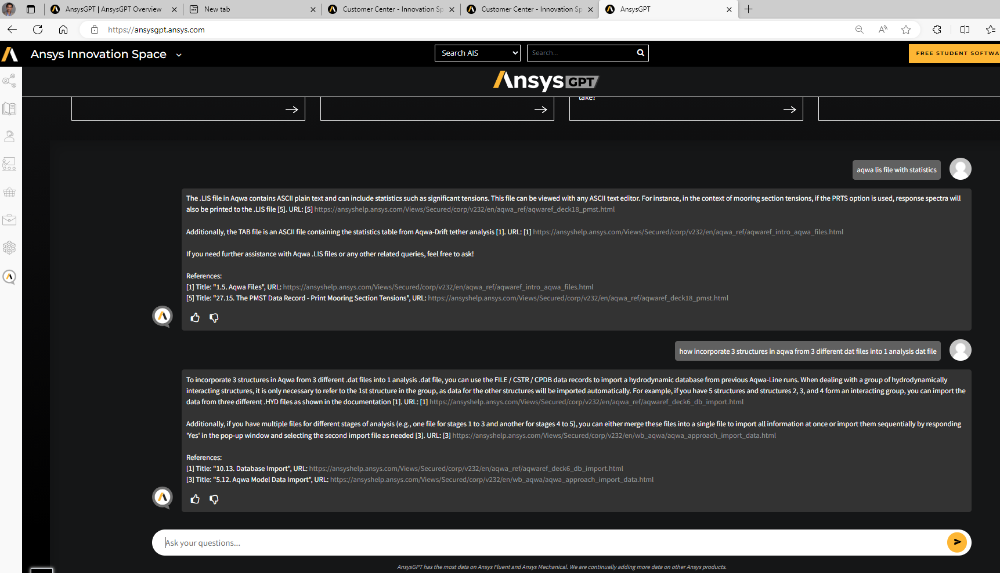

First pass:

======
We are pleased to announce that your account has been selected for access to AnsysGPT, our innovative Ansys Virtual Support Assistant. AnsysGPT is designed to complement the existing support offerings and services provided by Ansys to all our active customers. A few important highlights are listed below:

 ? AnsysGPT is provided as part of the support offerings from Ansys. As such, you will need to maintain an active TECS to have access to AnsysGPT.
 ? AnsysGPT does not store prompts and responses.
 ? Your prompts and responses do not train AnsysGPT in any shape or form.
 ? AnsysGPT is built with Ansys data and all responses include links to the underlying information the response is based upon.

 ? Additional information can be found at the links below

- AnsysGPT Press Release.
- AnsysGPT Overview Video.
- AnsysGPT Frequently Asked Questions (FAQs).

You are receiving this email as you are listed as the Ansys Support Coordinator (ASC) for one or more of these accounts. If you believe this was sent to you in error, please contact <ansysgpt@ansys.com> or your Account Manager. To review the list of accounts in which you are the ASC and can manage access to AnsysGPT, please visit the AnsysGPT Access Management page. As an ASC, we kindly request  that you share information about AnsysGPT with your organization.

AnsysGPT will be made available to your account on 24-July-2024. However, if you prefer to opt-out of access, you may do so at the Account level through the link provided above.

Should you have any questions or concerns, please do not hesitate to reach out to us (<ansysgpt@ansys.com>).
