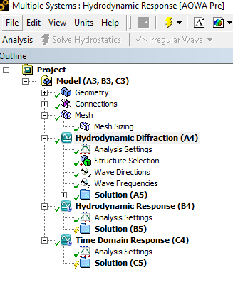

### Introduction

The software is diverges in dat and workbench routes.  

At times working in dat files has significant advantages eg. Working with external-force has many manual steps, easier batch processing, more version control  etc.

This document provides guidance to work between .dat and workbench files.

### Summary

### Understanding Workbench

Explanation

- _files\dp0\AQW\AQW\AQ\Analysis\Analysis.dat : A4 analysis .dat file
- _files\dp0\AQW-1\AQW\AQ\Analysis\Equilibrium.dat : B4 analysis .dat file (Equilibrium or stability analysis)
- _files\dp0\AQW-2\AQW\AQ\Analysis\TimeResponse.dat : C4 analysis .dat file (time domain analysis)

- Associated error files are given with the same filename as the analysis file however with .mes extension. For example,
  - _files\dp0\AQW\AQW\AQ\Analysis\Analysis.mes

- Note the above expanation is valid only if no parametric analysis is performed i.e. only 1 design point. If multiple design points are used, the above dp0 reference folder needs to be changed.

### Workbench to .dat

The .dat (in workbnech files ) is created everytime we hit the solve button.

### Dat to Workbench

**Investigation ongoing**
To import data from an Aqwa solver input file:

- Create a new Workbench project and add a a Hydrodynamic Diffraction system, and any linked Hydrodynamic Response systems as required, to the Project Schematic.

- Attach a geometry, or a dummy geometry, to the system and open the Aqwa editor.
  - Can we suppress existing geometry and only keep other geometry?
  - Spaceclaim geometry did not import properly. Explore if we can use nuetral CAD format files?
  
- Perform analysis.

Reference:

- [AQWA User Manual](https://www.sharcnet.ca/Software/Ansys/16.2.3/en-us/help/aqwa/aqwa_user.pdf), Section 5.12

### Communications

Alex,

Thank you for response. Looks like the software is diverges in dat and worbbench routes.  Sometimes working in dat files has significant advantages eg. Working with external-force has many manual steps, easier batch processing, more version control  etc.

Now the follow up questions:
a/ If I wish to continue to dat file route, what are my options for GUI based post processing. I could see result graphs but could not easily get timetrace animations. Is there a section or two in the aqwa manuals to gain knowledge on these routes?

b/ .dat to workbench: After I prepare my .dat file (eg. Simple run)
  i/ Can I work in workbench i.e. open workbench, import the .dat file or copy the .dat and associated output files manually and then get the output?

Thank you,
Vamsee

From: Alex Austin <aaustin@drd.com>
Sent: Friday, May 31, 2024 8:03 AM
To: Vamsee Achanta <vamseea@acma-inc.com>
Subject: RE: AQWA | .DAT and WB

Vamsee,

a. No. Those files are generated every time you hit the solve button. Any manual changes to the input file are not retained or used for the solve.
b. There is not a method to do this.
c. There is not a method to do this.

In general, once you start working with the input file directly, you are relegated to working outside of Workbench.

Alex Austin
DRD Technology
Technical Support: 918.743.3013 x 1
Office: 918.743.3013 x 612

From: Vamsee Achanta <vamseea@acma-inc.com>
Sent: Friday, May 31, 2024 7:24 AM
To: support <support@drd.com>
Subject: AQWA | .DAT and WB

Dear Support Representative,

As I am working on/between AQWA .dat files and workbench files. Please help with the following:
a/ When in workbench. If I edit the .dat file in the AQW folder, will it reflect back in the model?
b/ If I have a AQWA .dat file and a finished  run, what is the best (shortest) way to view the results in workbench?
c/ If I have a AQWA .dat file, what is the best (and shortest) way to load in workbench

Thank you,
Vamsee
