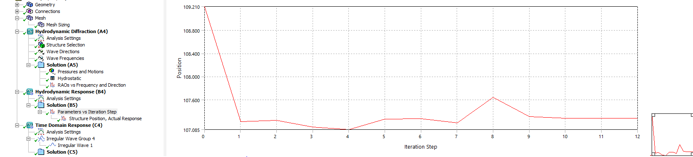

## Introduction

This document summarizes the AQWA post processing requirements

### Summary

TBA

### Frequency Analysis

- RAOs plots

### Stability Analysis

### Time Domain Analysis

- COG Structure 1, COG position

- COG Structure 1, COG position
