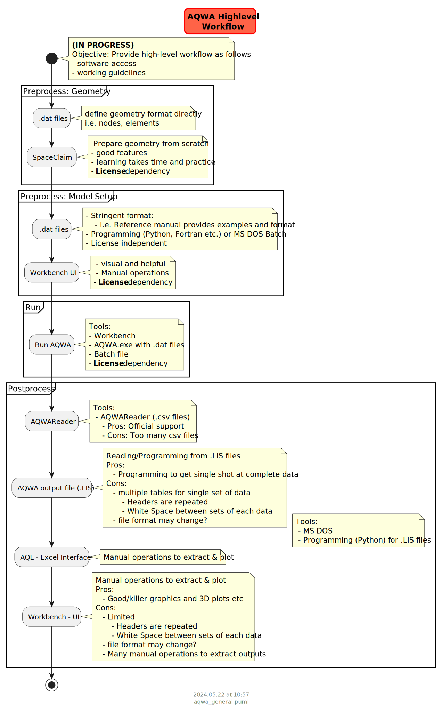

## Introduction

Instructions to run AQWA and the associated suite of softwares

### Summary

#### General Working and License requirements

### Command Line Method

How to open powershell and run the analysis:

- open "Anaconda PowerShell Prompt" by searching for "powershell"
- change director:
  - cd K:\tutorial\sp\dat\003_FPSO_Turret\rev0
- if not in same dirve. change drive. I.e.
  - K:
- check directory files using following command
  - dir
- run batch
  - aqwa_sp.bat

#### Hydrodynamic Runs

#### DAMP Runs

Inject damping into runs

#### Dynamic Runs

Copy these from master runs. Files required:
.EQP
.HYD files.
.RES

Is there a command line with which I can run aqwa.exe analysis1.dat ? I searched and could not find it in help
Please refer Vamsee to chapter 29 reference manual:
<https://ansyshelp.ansys.com/account/Secured?returnurl=/Views/Secured/corp/v232/en/aqwa_ref/aqwaref_chap_appendix_options.html>
this is how they should use the command:
C:\Program Files\ANSYS Inc\v232\aqwa\bin\<platform>\aqwa.exe /nowind altest
where altest.dat is the file that they need to run.

#### Static Runs

Need .HYD file to avoid below error.

Using below command, the error is thrown:

"C:\Program Files\ANSYS Inc\v222\aqwa\bin\winx64\aqwa.exe" /STD I:\B1516\rev2\master\LIBR_NE

**** MODELLING WARNING **** WHEN AQWA IS *NOT* RUN FROM WORKBENCH, ONLY 2 PARAMETERS (RESOLUTION) ARE ALLOWED ON THE
                             SEAG CARD. DEFAULT VALUES HAVE BEEN USED FOR THE GRID SIZE
 ----------------------------------------------------------------------------------------------------------------------

**** INPUT DATA ERROR **** FAILED TO OPEN HYDRODYNAMIC DATA. PLEASE CHECK SPELLING
 ----------------------------------------------------------------------------------------

**WHere to get the HYDRODYNAMIC DATA file Workbench run??**

### Restart

OPTIONS CONV NASF
OPTIONS NOST
OPTIONS RDEP REST END

CONV: Convergence criteria will be used
NASF: Additional Structural stiffness matrix will not be included in the analysis
NOST: No statics
RDEP: Starting position will be taken from .EQP/.RES file
REST: Restart run will be specified

WFRQ: Aqwa-Drift by default runs only drift frequency motions. WFRQ will include wave frequency motions
