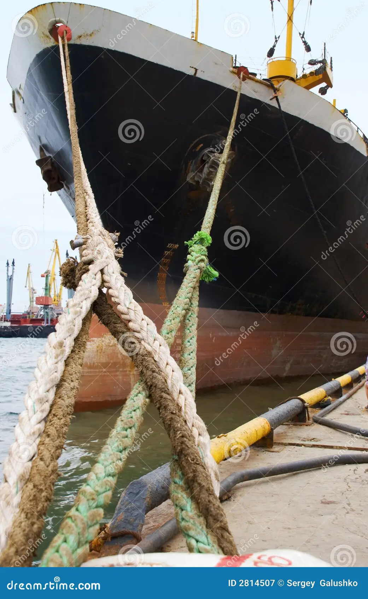

## ANSYS AQWA Tutorial: Ship with Piers

The key steps for running ship with Piers is given below.

### Background

<https://en.wikipedia.org/wiki/Response_amplitude_operator>
<https://www.sciencedirect.com/topics/engineering/response-amplitude-operator>
<https://dsaocean.com/fingerprints-everywhere-rao/>

### Geometry

### Workbench

Steps in workbench are given in this section.

### Error Troubleshooting

??

#### Model: 02_s03_hr_wave.wbpj

### Result

**Hydrostatics** Analysis

**Hydrodynamic Diffraction** Analysis
