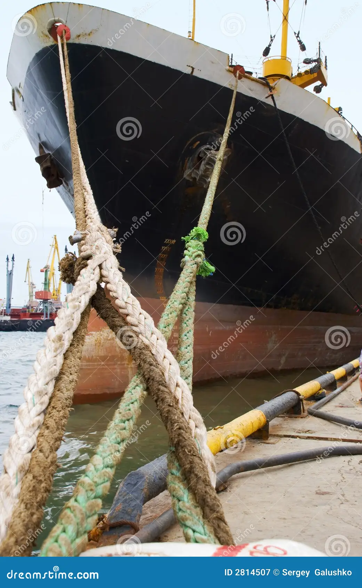
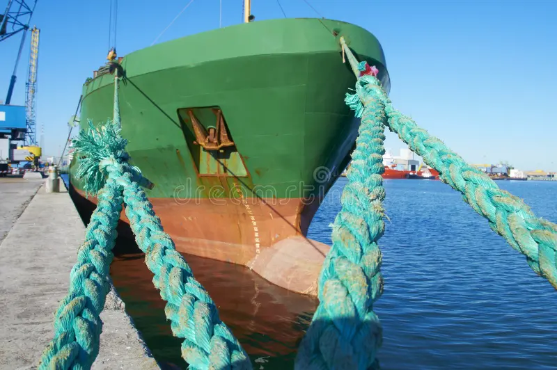
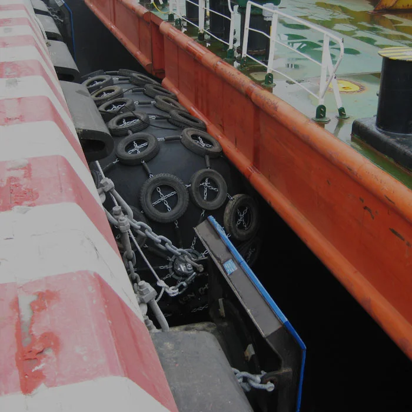

## ANSYS AQWA Tutorial: Ship with Piers

The key steps for running ship with Piers is given below.

### Background

### Geometry

steps for constructing ship_with_piers.scdoc

- Create **Ship** Model
  - Used ship.igs
  - Repaired geometry using `Repair Geometry` tool
  - Created a new part for the ship
  - Water depth is set to 8 m

- Create **Pier** Model
  - Dimensions are 10 m x 400 m x 50 m
  - Pier is placed with top surface at 10m above water surface (i.e. 50 m above seabed)

- Create **External Lid** Surface Geometry
  - Dimensions are 5 m x 300 m
  - Make the external lid surface normal to point upwards
  - Associate external lid with one of the components i.e. Pier

- Shared Topology:
  - Put the following objects in a single component:
    - Pier
    - PierBase
    - External Lid
  - Share topology between all objects in Pier
  
### Workbench

Steps in workbench are given in this section.

#### Model: 02_s01_hd_pier.wbpj

- Add Hydrodynamic Diffraction
- Set water depth to 40 m
- ShipHull: If hull geometry is cut at water plane, Generate Internal Lid
- Pier, PierStructure: Select Pier and fixed in place
- PierBase:
  - Surface Type is "Non-Diffracting"
- Pier, External Lid: Set external lid properties
  - Surface Type: Abstract Geometry
  - Abstract Geometry: External Lid
  - Lid Damping Factor: 0.02
  - Gap for External Lid: 7 m
- Analysis Settings:
  - Ignore Modelling Rule Violations: Yes
  - Include Multi-dimensional wave interaction: No
  - Calculate Full QTF Matrix: No
- Ship Properties: Add point mass
- Pier Properties: Add point mass with Kxx, Kyy and Kzz as 1 m

#### Model: 02_s02_hr_add_fenders.wbpj

- Add Hydrodynamic Response sharing the solution from Hydrodynamic Diffraction
-

#### Model: 02_s03_hr_wave.wbpj

### Error Troubleshooting

- Hydrodynamic Diffraction and Equilibrium runs are successful. Time domain response is not Successful. Gives the following error

 CONVOLUTION ERROR. The convolution has failed to calculate a satisfactory fit to the added mass/damping for structure#2/1 Yaw(Rz)/Heave(Z). The fit quality (100% = exact) was only -22264%. This is usually caused by insufficient frequencies or an inadequate frequency range. PLEASE - ENSURE THAT THESE ARE SUFFICIENT *BEFORE* contacting user support. Frequency range for structure 2/1 should be at least 0.065 to 1.241 rad/sec.

#### Model: 02_s03_hr_wave.wbpj
