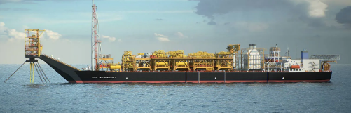
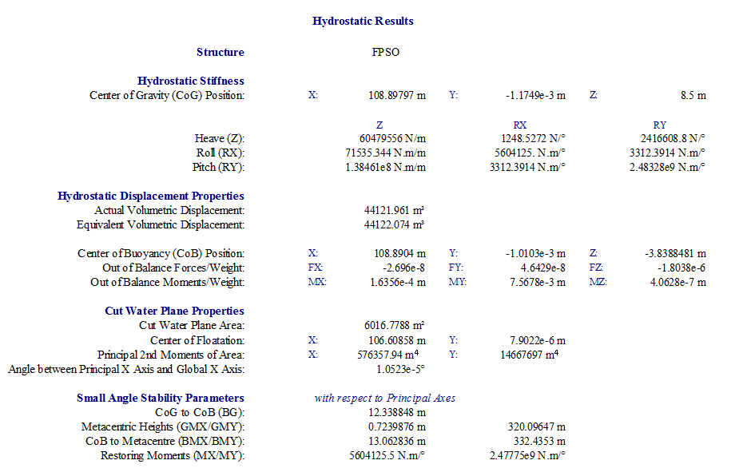
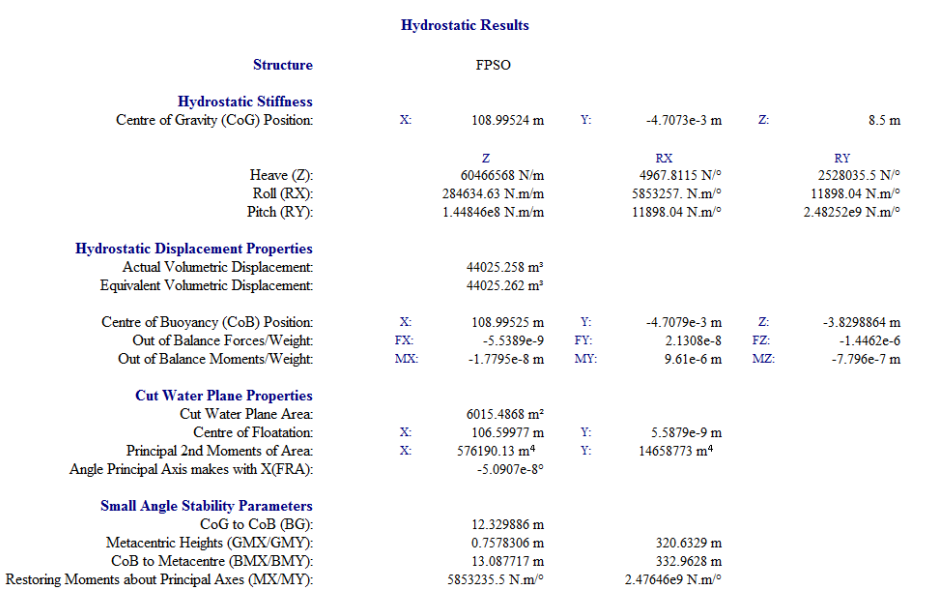
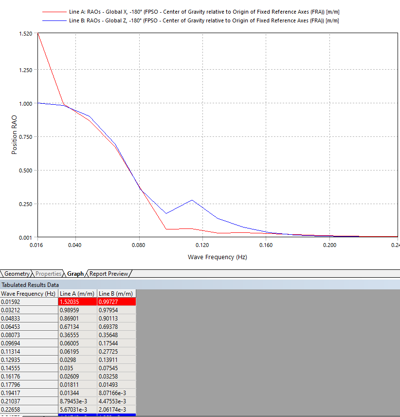
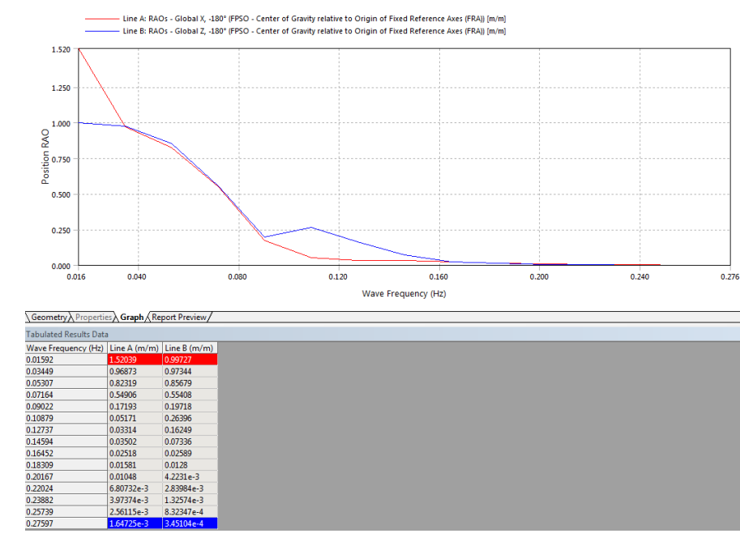
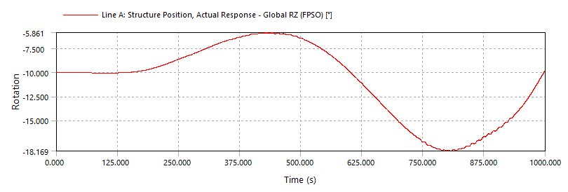
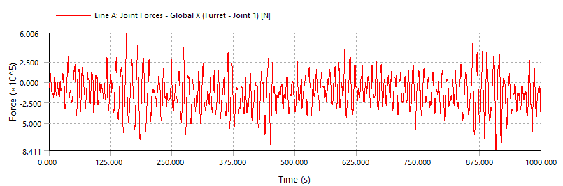

## ANSYS AQWA Tutorial: FPSO Turret

The key steps for running ship with Piers is given below.

### Background

<https://github.com/vamseeachanta/digitalmodel/blob/31e23c409539834e62d7a9899a709b1b38dcea47/docs/sub_ship_design/mooring_turret.md>

### Geometry

#### Workbench

#### Model: 003_FPSO_Turret.wbpj

### Results

**Hydrostatics** Analysis

Conclusion: Close match (<1% )

Rerun | Screenshot

Tutorial | Screenshot

**Hydrodynamic Diffraction** Analysis

Conclusion: Close match (<1% )

Frequency Range: TBA

Rerun | Screenshot

Tutorial | Screenshot

**Time Domain** Analysis

Conclusion:

- Match within 10%.
- Possible reason being change of version and change of seed in Peirson-Moskowitz spectrum.
- Investigation ongoing.

Rerun | Screenshot

Tutorial | Screenshot

| Wave Height (m) | Wave Period (s) | Line A GLobal X   Min. Force (N)   Rerun | Line A GLobal X   Max. Force (N)   Rerun| Line A GLobal X   Min. Force (N)   Tutorial | Line A GLobal X   Max. Force (N)   Tutorial|
|-----------------|-----------------|-----------------|-----------------|-----------------|-----------------|
| 4               | 8               | -8.4E+05      | 6.0E+05  | -9.2E+05      | 6.5E+05  |
| 4               | 10              | -7.4E+05    | 6.6E+05    |   -8.1E+05    | 6.9E+05    |
| 3               | 9               | -4.9E+05    | 4.7E+05    | -6.1E+05    | 4.7E+05    |
| 3               | 11              | -5.8E+05     | 4.1E+05   | -5.9E+05     | 5.9E+05   |
