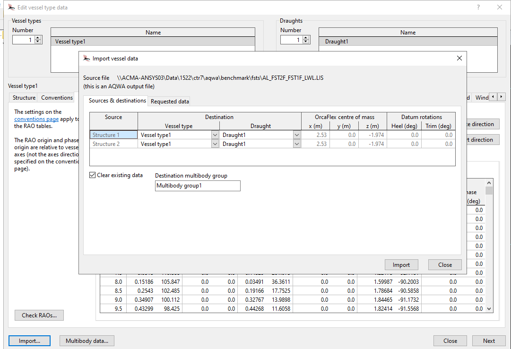
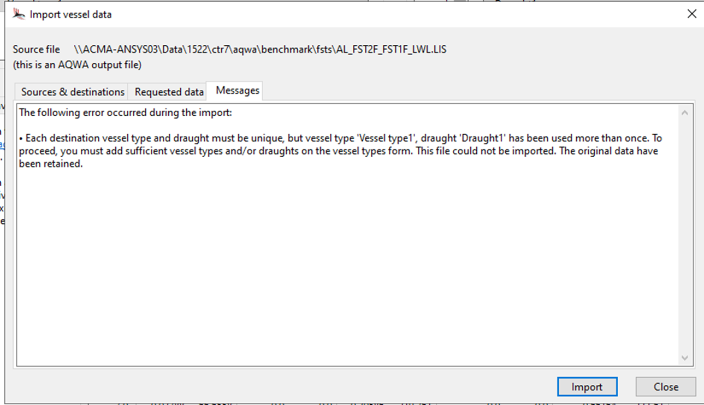

- add a new vessel
- Open import vessel

Select the vessel data to import.

Add 2 vessels to the model.

The requested data were imported, but with the following warnings:

• The symmetry convention has not been modified. Please ensure this is set to a value appropriate for the imported data.
• The QTF data source frame of reference convention has not been modified. Please ensure this is set to a value appropriate for the imported data.
• Duplicate displacement RAO data were found – only the last set of data in the file has been imported. This can occur if AQWA has reprocessed its hydrodynamic database, since the results are output repeatedly to the .lis file.
• The QTF data source RAO rotation conventions have not been modified. Please ensure these choices are appropriate for the imported data.
• Duplicate load RAO data were found – only the last set of data in the file has been imported. This can occur if AQWA has reprocessed its hydrodynamic database, since the results are output repeatedly to the .lis file.
• Hydrostatic datum position Z has been imported for structure 1, but heel and trim are not provided, and are unchanged from the values present before the import.
• Hydrostatic datum position Z has been imported for structure 2, but heel and trim are not provided, and are unchanged from the values present before the import.
• The imported multibody added mass matrices were 1% asymmetric.
• The imported multibody damping matrices were 5% asymmetric.
