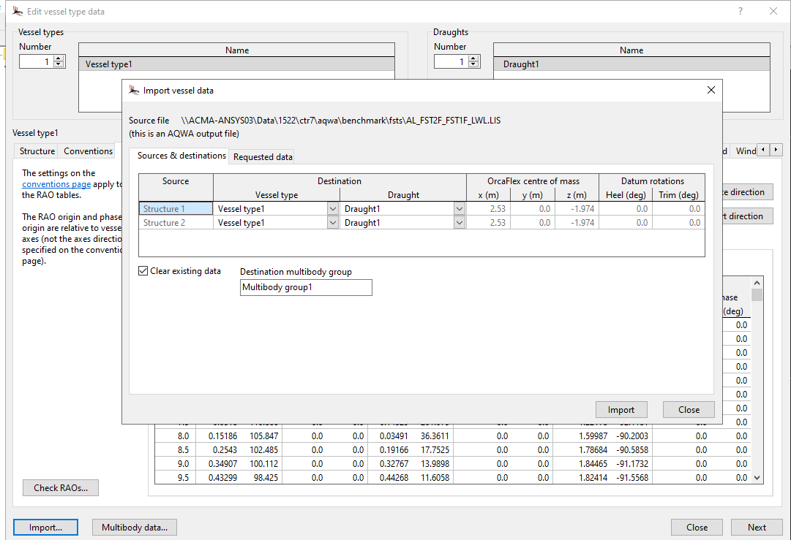
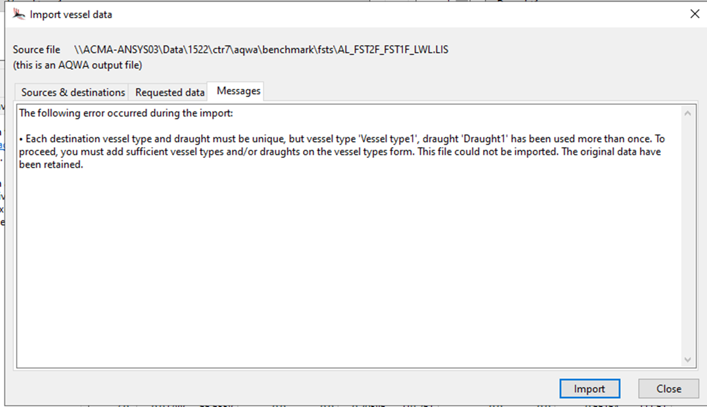

## Summary

- Set the vessel local Origin and the Center of mass before importing the data.
- SumFrequencyQTFs are not populated. Added .QTF AQWA output file to get this data populated.
- FST Drawings mesh is erased. Do not check "Clear existing data" when importing vessel data.

Files needed:
- .DAT
- .LIS
- .QTF

## Process

- add a new vessel
- Open import vessel

Select the vessel data to import.

Add 2 vessels to the model.

- DO not check "Clear exsiting data" as existing drawing data is cleared.
- 

The requested data were imported, but with the following warnings:

- The symmetry convention has not been modified. Please ensure this is set to a value appropriate for the imported data.

- The QTF data source frame of reference convention has not been modified. Please ensure this is set to a value appropriate for the imported data.
- Duplicate displacement RAO data were found – only the last set of data in the file has been imported. This can occur if AQWA has reprocessed its hydrodynamic database, since the results are output repeatedly to the .lis file.
- The QTF data source RAO rotation conventions have not been modified. Please ensure these choices are appropriate for the imported data.
- Duplicate load RAO data were found – only the last set of data in the file has been imported. This can occur if AQWA has reprocessed its hydrodynamic database, since the results are output repeatedly to the .lis file.
- Hydrostatic datum position Z has been imported for structure 1, but heel and trim are not provided, and are unchanged from the values present before the import.
- Hydrostatic datum position Z has been imported for structure 2, but heel and trim are not provided, and are unchanged from the values present before the import.
- The imported multibody added mass matrices were 1% asymmetric.
- The imported multibody damping matrices were 5% asymmetric.

The requested data were imported, but with the following warnings:

• The symmetry convention has not been modified. Please ensure this is set to a value appropriate for the imported data.
• The QTF data source frame of reference convention has not been modified. Please ensure this is set to a value appropriate for the imported data.
• Duplicate displacement RAO data were found – only the last set of data in the file has been imported. This can occur if AQWA has reprocessed its hydrodynamic database, since the results are output repeatedly to the .lis file.
• The QTF data source RAO rotation conventions have not been modified. Please ensure these choices are appropriate for the imported data.
• Duplicate load RAO data were found – only the last set of data in the file has been imported. This can occur if AQWA has reprocessed its hydrodynamic database, since the results are output repeatedly to the .lis file.
• Hydrostatic datum position Z has been imported for structure 1, but heel and trim are not provided, and are unchanged from the values present before the import.
• Hydrostatic datum position Z has been imported for structure 2, but heel and trim are not provided, and are unchanged from the values present before the import.
• The imported multibody damping matrices were 5% asymmetric.

## Missing FULL QTFs

Alistair,

Before, I only copied the .LIS file and imported it and I do not get the full QTFs option at all. 

I seem to get the option to import “Full QTFs” if I import it from the AQWA analysis folder directly? OrcaFlex also seem to utilize the .QTF AQWA output file to import the data.

Recommend OrcaFlex program to clearly mention this so that non-naval-architectural users can just  zoom ahead with their analysis. 

Thank you for the important reminder. I am also setting the vessel local Origin and the Center of mass. 

 

Thank you again for the attention.
Vamsee

From: Orcina <orcina@orcina.com> 
Sent: Thursday, March 20, 2025 9:23 AM
To: Vamsee Achanta <vamseea@acma-inc.com>
Cc: Scott McClure <scottm@acma-inc.com>
Subject: RE: OrcaFlex Vessel Data | AQWA vs. OrcaWave Interface

Dear Vamsee,

I’ve tried to import the .lis file you sent.  During that process, OrcaFlex parses the data to interrogate which data are present.  The result of that can be viewed using a tabbed sheet on the importation wizard (please see the image attached).  I’m afraid that only the so-called Newman q.t.f. data are present, in addition to the r.a.o’s, added-mass & damping and hydrostatic stiffness.  The full set  of q.t.f. data, in which sum-frequency q.t.f’s would reside, are not present.  

Sum-frequency q.t.f. data are important (necessary really) for modelling floating objects such as tension-leg platforms.  Because the loading is at a frequency which is the sum of a pair of frequencies, they have important implications for ‘ringing’ vibration of t.l.p. tethers.  Your model seems to be a barge though.  Were you thinking that you need them?  
 
I have another comment relevant to the process of importing diffraction data.  You will need to know the distances (in vessel local co-ordinates) between the local drawing origin chosen for the OrcaFlex vessel (the red x, y & z axes frame) and the location of the centre-of-mass of the actual vessel.  Those data must be specified before importing any diffraction data.

I hope that explains what you were wondering about?

Yours sincerely,
Alistair Arnott
