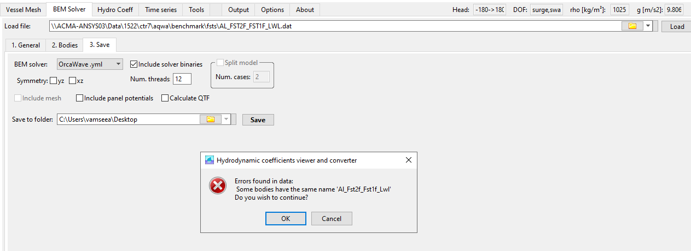
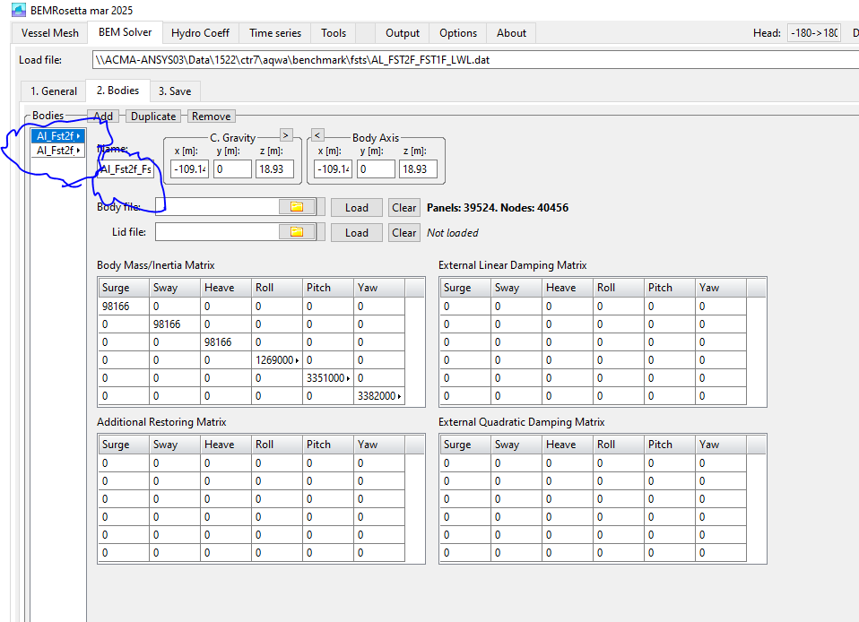

In order to compare results, you can generate the case in one solver, and convert it into the other solver's format. Since ANSYS AQWA has a mesh solver but OrcaWave does not, and given how especially picky AQWA is with meshes, I advise you to do the following:
- Open the AQWA model in the ‘BEM Solver’ tab. Both .LIS and .DAT must be valid.
- Check that the values are correct, and in the ‘BEM Solver/Save’ tab, choose the OrcaWave .YML format, and save it in a folder.
- In the folder you will find the .YML obtained, and a .BAT with the commands to run OrcaWave from BEMRosetta. This way you can run many cases at once in an automated way. Otherwise, you can simply open the .YML created with OrcaWave and launch it.

There are currently no open formats in place. To my liking HAMS and Nemoh have complicated formats, although Capytaine's .nc format could be promising, but it has not been promoted as a standard, so I only include it as read. BEMIO's .h5 format I include as read and write, but it is not a standard either. People tend to massively use the Wamit .1, .3, etc. format, which, although sparse, is complete. For my studies I use Wamit's .out format, which is compact, although unfortunately the excitation and diffraction are not broken down.

Multiple bodies cannot be imported? 

Waiting on response from Inaki

### UI Tab-General

\\ACMA-ANSYS03\Data\1522\ctr7\aqwa\benchmark\fsts\AL_FST2F_FST1F_LWL.dat

Choose the folder location.
Else: will be saved to the same folder as .exe

### UI Tab-Bodies

For multiple bodies:

- Rename bodies in the "Bodies" tab.

### UI Tab-Save

Continue to the "Save" tab. 
Data will be saved irrepective of the renaming of bodies in "Tab: Bodies".

