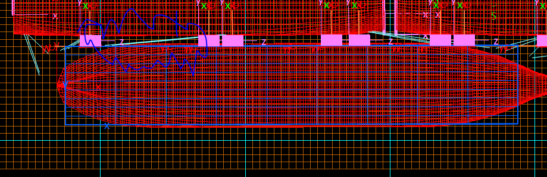

To make a multiple mooring-fender model converge and get the right tensions

a/ Define approximate fixed length on 1 mooring. This single moooring should be picked in the middle of the ship. This will be the reference mooring.

- Stage 1 analysis:
    1/ Run the model with the reference mooring with set length. This will give you the reference tensions.

- Stage 2 analysis:

    2/ Run the model with the reference mooring and the other moorings. This will give you the tensions on the other moorings.
    3/ Run the model with the reference mooring and the other moorings. This will give you the tensions on the other moorings.

